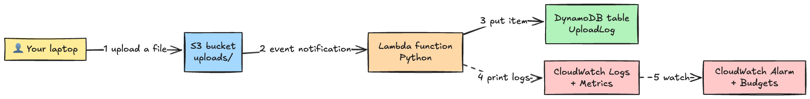
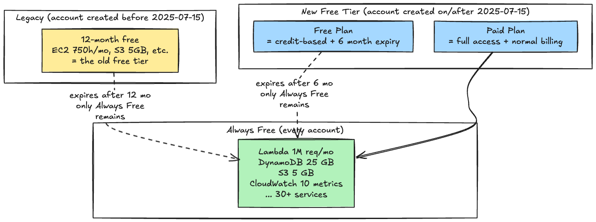
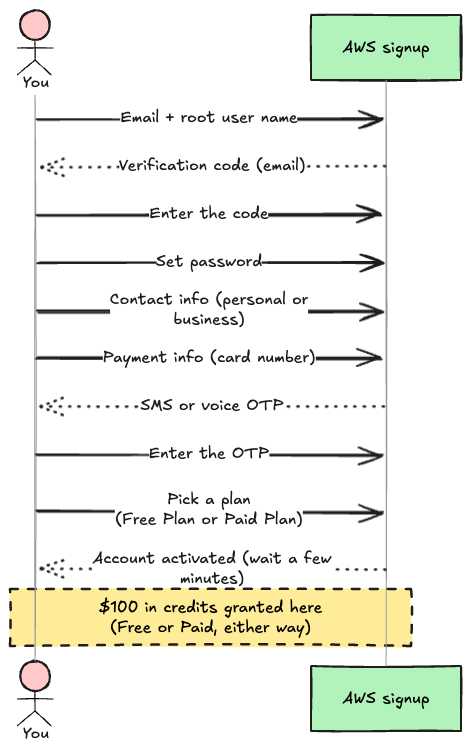
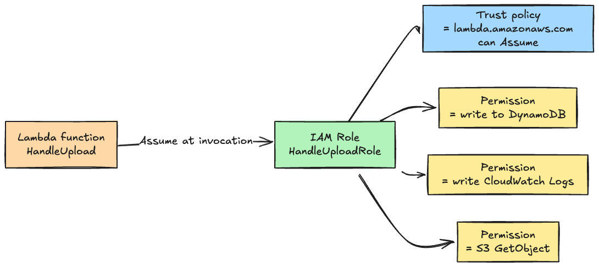
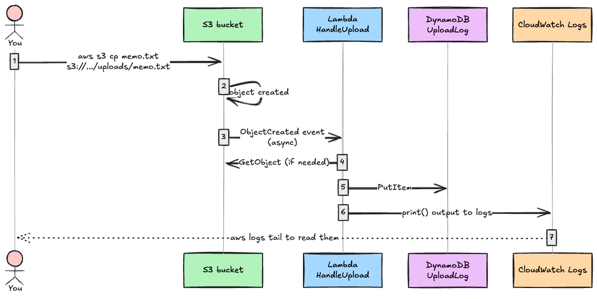

## Introduction

This is for the "I want to try AWS but I'm scared of the bill" and "I made an account once and never did anything with it" crowd. By the end of the next 30 minutes you'll have something running, and you'll have actually touched the parts of AWS that matter.

The finished pipeline:



What you touch by building it:

- **S3**: the cloud object store
- **Lambda**: a serverless runtime where you just put code and it runs
- **DynamoDB**: managed NoSQL database
- **IAM**: permission management for everything (the hidden main character of this article)
- **CloudWatch**: logs, metrics, alarms
- **AWS Budgets**: monthly cost alerts
- **AWS CLI**: the command-line interface for talking to AWS from your machine

And **the core stays inside the Always Free tier**. The S3 usage in this hands-on is tiny (a few dozen bytes, a handful of requests), so even if S3 isn't strictly "Always Free" for your account type, the credit consumption is effectively $0. No surprise charges 6 months from now either.

The plan:

1. The 2026 AWS free tier, what it actually is (misread this and you get charged)
2. Account creation and four safety setups for the first 10 minutes
3. Install AWS CLI locally
4. Create an S3 bucket and put something in it
5. Create a DynamoDB table
6. Prepare an IAM Role for Lambda
7. Write a Lambda function and say hello world
8. Wire S3 to invoke Lambda automatically
9. Watch logs and metrics in CloudWatch
10. Tear it all down (this matters the most)

---

## The finished version is on GitHub

The article walks through every command by hand. The same setup is also on GitHub as a repo where **`scripts/setup.sh` brings everything up in one shot, and `scripts/cleanup.sh` tears it down in one shot.**

**[0-draft/awscape](https://github.com/0-draft/awscape)**

> Escape AWS bills. A 30-minute hands-on that builds S3 → Lambda → DynamoDB inside the AWS Always Free tier.

What's in it:

- `lambda-src/handler.py`: the same Lambda code you'll write in Step 7
- `policies/trust-policy.json`: the trust policy from Step 6
- `scripts/setup.sh`: runs Step 4 through Step 9 end-to-end (after you edit `config.env`)
- `scripts/cleanup.sh`: idempotent teardown for Step 10 (safe to re-run if something errors midway)
- README is English by default, Japanese version is included

Read it through and type each command, or clone and run the scripts and then read the code. Either way works.

---

## 1. The 2026 AWS free tier, what it actually is

Get this part wrong and you're going to be unhappy later. Read it carefully.

The AWS free tier was **overhauled on 2025-07-15**. Accounts created on or after that date follow the new rules. The word "free" now covers three different things.



Breakdown.

### A. Free Plan (new accounts, on/after 2025-07-15)

- **$100 in credits** at signup, plus up to **another $100** through **5 specific activities (launch EC2, configure RDS, build a Lambda, prompt Bedrock, set up Budgets) at $20 each**. Maximum total: **$200**
- Expires at **6 months** or when credits are gone, whichever comes first
- When it expires the **account is automatically closed**. You then have **90 days to upgrade to Paid Plan** to keep the account and data; otherwise data is permanently deleted
- Services that "would burn through the credits in a heartbeat" (Savings Plans, Reserved Instances, certain AWS Marketplace offers, etc.) aren't available on the Free Plan. The core services this hands-on uses (Lambda / DynamoDB / S3 / CloudWatch) work fine

### B. Paid Plan (the other option on/after 2025-07-15)

- Same up to **$200 in credits** at signup
- No expiry, full access to all services, pay-as-you-go after credits are gone
- For production workloads or anyone who wants to keep learning past 6 months

### C. Legacy Free Tier (accounts created before 2025-07-15)

- "12 months free" applies for **12 months from account creation**: EC2 **t2.micro or t3.micro (region-dependent)** 750h/mo, S3 5 GB + 20,000 GET + 2,000 PUT, RDS 750h, etc.
- After 12 months only Always Free remains (the account stays open)

### D. Always Free (every plan, no expiry)

- No clock, resets monthly, never goes away
- This is what this hands-on relies on

**The Always Free monthly quotas worth knowing about in 2026 (per each service's official pricing page).**

| Service                         | Always Free per month                                                                                  |
| ------------------------------- | ------------------------------------------------------------------------------------------------------ |
| **AWS Lambda**                  | 1M requests + 400,000 GB-seconds of compute                                                            |
| **DynamoDB**                    | 25 GB storage + 25 RCU + 25 WCU (**provisioned, Standard table class only**, on-demand is not covered) |
| **CloudWatch metrics + alarms** | 10 custom metrics, 10 alarms (Standard Resolution), 1M API requests                                    |
| **CloudWatch Logs**             | Ingestion + archive + Logs Insights scan **share a single 5 GB quota** (not 5 GB each)                 |
| **SNS**                         | 1M publishes (commonly cited figure; not on the official pricing page directly)                        |
| **SQS**                         | 1M requests                                                                                            |

**A note on S3.** The "5 GB + 20,000 GET + 2,000 PUT" figure is documented as the **Legacy 12-month free tier** (for accounts created before 2025-07-15). For new Free Plan accounts, S3 usage draws from the $200 credit pool. AWS says "over 30 always-free services" but doesn't explicitly clarify whether S3 is in that list for new plans. Either way, this hands-on uses only a few dozen bytes and a handful of requests, so the practical cost is $0.

That's enough room to put a small prototype together with effectively no cost.

### Which plan does this hands-on use

- **Brand new** to AWS: pick the **Free Plan**. The core stays in Always Free and the S3 use is so small that credit consumption is effectively zero
- Already have a legacy account: use that
- Worried about the 6-month auto-close: switch to **Paid Plan** before the expiry, and the account stays

---

## 2. Prerequisites

What you need:

- **An email address** (ideally separate from your daily one, for the root user)
- **A credit or debit card** (the Free Plan still wants one for identity verification; just registering won't charge it)
- **A phone number** (for SMS or voice OTP)
- **A notebook and a password manager** (for storing everything you set up)

Set aside 30 to 60 minutes of focused time.

---

## 3. Step 1: create an account

Open <https://aws.amazon.com/> and click "Create an AWS Account." The flow:



- **Account alias**: shows up in the IAM sign-in URL later. Pick something easy to remember and unrelated to anything sensitive
- **Plan**: pick **Free Plan** the first time. You can switch to Paid Plan later
- Wait for the **"Your account is ready"** email before moving on

---

## 4. Step 2: four safety setups for the first 10 minutes

The instant the account is live, do these four things. Skip them and you're one leaked root credential away from the kind of bill that ends up on Twitter.

1. Add MFA to the root user
2. Set up an AWS Budgets alert
3. Create an IAM admin user
4. Log out of root, log in as the IAM user

### a) Add MFA to the root user

1. Top-right of the console, click your account name, then "Security credentials"
2. "Multi-factor authentication (MFA)" then "Assign MFA device"
3. Scan the QR code with an **Authenticator app** (Google Authenticator / 1Password / Authy etc.)
4. Type two consecutive 6-digit codes to confirm

If the root user somehow has any access keys, delete them now. **The root user must never own access keys.**

### b) AWS Budgets alert

For catching "I did something I shouldn't have" early.

1. Search "Budgets" in the console
2. Create budget, pick the **Zero spend budget** template ("notify if any charge appears")
3. Enter your email and save

If you ever step outside Always Free, you get notified **the next day or so** (Budgets' billing data aggregates with an 8 to 24 hour lag, so it's not literally instant, just very prompt).

### c) Create an IAM admin user

The root user is not for daily work. Create one IAM user for that.

1. Search "IAM" in the console, then "Users", then "Create user"
2. Username: `admin-cli` or similar
3. Check "Provide user access to the console", auto-generate password, force change on first login
   1. "Attach policies directly", pick `AdministratorAccess` (full permissions, for learning; never do this in production)
4. On the success screen, download the .csv and bookmark the sign-in URL
5. Add **MFA** to this user too (same flow as root, separate entry in your authenticator)

### d) Log out of root, sign in as the IAM user

The sign-in URL is `https://<account-id>.signin.aws.amazon.com/console`. Use that going forward. Only switch back to root for special tasks like changing billing info.

---

## 5. Step 3: AWS CLI setup

You'll drive AWS from your local machine. Install the CLI.

### Install

```bash
# macOS (Homebrew)
brew install awscli

# Linux (official)
curl "https://awscli.amazonaws.com/awscli-exe-linux-x86_64.zip" -o "awscliv2.zip"
unzip awscliv2.zip && sudo ./aws/install

# Windows: grab the official MSI
# https://awscli.amazonaws.com/AWSCLIV2.msi

# Verify
aws --version
# aws-cli/2.x.x Python/3.x.x ...
```

### Issue an access key for the CLI

The IAM user needs its own access key for CLI use.

1. IAM, then user `admin-cli`, then the "Security credentials" tab
2. "Create access key"
3. For the use case, pick **"Command Line Interface (CLI)"**
4. Copy both the Access Key ID and the Secret Access Key (the secret is shown **once and never again**)

### `aws configure`

```bash
aws configure
# AWS Access Key ID: AKIA...
# AWS Secret Access Key: ...
# Default region name: ap-northeast-1
# Default output format: json
```

Confirm.

```bash
aws sts get-caller-identity
# {
#     "UserId": "AIDA...",
#     "Account": "123456789012",
#     "Arn": "arn:aws:iam::123456789012:user/admin-cli"
# }
```

Your username should show up in `Arn`. That's the green light.

---

## 6. Step 4: create an S3 bucket and put something in it

S3 (Simple Storage Service) is one of the oldest AWS services (2006). For now, think of it as "near-infinite cloud storage that you talk to over HTTPS."

### Quick refresher

- **Bucket**: the container for objects. Names are **globally unique across all of AWS**
- **Object**: an individual file in a bucket. Identified by a **key** (the filename, roughly)
- **Region**: a bucket lives in one Region. This hands-on uses `ap-northeast-1` (Tokyo) everywhere

### Create the bucket

Bucket names are globally unique, so add some entropy. Replace `<your-name>` with your handle or a date.

```bash
BUCKET="aws-handson-<your-name>-2026"
aws s3 mb "s3://${BUCKET}" --region ap-northeast-1
# make_bucket: aws-handson-...
```

### Check Block Public Access

New buckets should have all public access blocked by default. Verify it:

```bash
aws s3api get-public-access-block --bucket "${BUCKET}"
# {
#   "PublicAccessBlockConfiguration": {
#     "BlockPublicAcls": true,
#     "IgnorePublicAcls": true,
#     "BlockPublicPolicy": true,
#     "RestrictPublicBuckets": true
#   }
# }
```

All four `true` is the safe state. If any are `false`, force them all on:

```bash
aws s3api put-public-access-block --bucket "${BUCKET}" \
    --public-access-block-configuration "BlockPublicAcls=true,IgnorePublicAcls=true,BlockPublicPolicy=true,RestrictPublicBuckets=true"
```

### Drop a file in

```bash
echo "Hello AWS" > hello.txt
aws s3 cp hello.txt "s3://${BUCKET}/uploads/hello.txt"
# upload: ./hello.txt to s3://aws-handson-.../uploads/hello.txt

aws s3 ls "s3://${BUCKET}/uploads/"
# 2026-05-14 12:34:56         10 hello.txt
```

That's "putting a file in cloud storage." Always Free covers 5 GB of standard storage plus 2,000 PUT and 20,000 GET per month.

---

## 7. Step 5: create a DynamoDB table

DynamoDB is the managed NoSQL database. Create one table, then later Lambda will write to it.

### Vocab

- **Table**: a collection of schemaless items
- **Partition key**: the unique key for an item (close to a primary key in RDBMS)
- **Capacity mode**: "Provisioned" (reserve capacity in RCU/WCU) or "On-demand" (`PAY_PER_REQUEST`, per-request billing)

### Pick provisioned mode to stay on Always Free

This part trips people up. DynamoDB's Always Free covers **provisioned (Standard class), 25 WCU + 25 RCU + 25 GB only**. On-demand (`PAY_PER_REQUEST`) is **outside the free tier** and charges per request.

For learning, reserve 25 WCU / 25 RCU on provisioned mode (provisioning that much still costs nothing).

```bash
aws dynamodb create-table \
    --table-name UploadLog \
    --attribute-definitions AttributeName=ObjectKey,AttributeType=S \
    --key-schema AttributeName=ObjectKey,KeyType=HASH \
    --billing-mode PROVISIONED \
    --provisioned-throughput ReadCapacityUnits=25,WriteCapacityUnits=25 \
    --table-class STANDARD \
    --region ap-northeast-1

# Give it a moment
aws dynamodb describe-table --table-name UploadLog \
    --query 'Table.TableStatus'
# "ACTIVE"
```

25 WCU lets you write 25 items per second (1 KB each), roughly 65 million writes per month. You'll never come close in a hands-on.

---

## 8. Step 6: prepare an IAM Role for Lambda

Time for the IAM piece. The two-line version:

- **Lambda doesn't carry credentials of its own.** When you create a function you specify "the IAM Role this function runs as"
- Every time the function runs, the Lambda service **assumes** that Role to get temporary credentials, and your code (`boto3` etc.) uses those to call other AWS services

So the Role needs two policies. A **trust policy** that says "the Lambda service is allowed to assume me," and **permission policies** describing what the function can do once it has.



### Trust policy file

Lets the Lambda service assume the Role.

```bash
cat > trust-policy.json <<'EOF'
{
  "Version": "2012-10-17",
  "Statement": [{
    "Effect": "Allow",
    "Principal": { "Service": "lambda.amazonaws.com" },
    "Action": "sts:AssumeRole"
  }]
}
EOF
```

### Create the Role

```bash
aws iam create-role \
    --role-name HandleUploadRole \
    --assume-role-policy-document file://trust-policy.json
```

### Attach the AWS managed policy

The standard one for log writes.

```bash
aws iam attach-role-policy \
    --role-name HandleUploadRole \
    --policy-arn arn:aws:iam::aws:policy/service-role/AWSLambdaBasicExecutionRole
```

### Add DynamoDB and S3 permissions (inline policy)

Following least privilege, scope it to exactly this table and this bucket.

```bash
ACCOUNT_ID=$(aws sts get-caller-identity --query Account --output text)

cat > inline-policy.json <<EOF
{
  "Version": "2012-10-17",
  "Statement": [
    {
      "Effect": "Allow",
      "Action": "dynamodb:PutItem",
      "Resource": "arn:aws:dynamodb:ap-northeast-1:${ACCOUNT_ID}:table/UploadLog"
    },
    {
      "Effect": "Allow",
      "Action": "s3:GetObject",
      "Resource": "arn:aws:s3:::${BUCKET}/*"
    }
  ]
}
EOF

aws iam put-role-policy \
    --role-name HandleUploadRole \
    --policy-name HandleUploadInline \
    --policy-document file://inline-policy.json
```

---

## 9. Step 7: write and deploy the Lambda function

Lambda is the serverless runtime where you upload code plus a runtime spec, and AWS handles starting and stopping the process for you.

### The Python code

A heads-up on the libraries used:

- **`boto3`**: the AWS SDK for Python. **Already bundled with the Lambda Python runtime**, so no pip install needed
- **`urllib.parse.unquote_plus`**: object keys in S3 events come URL-encoded (spaces become `+`, Japanese characters become `%E3%83%...`). This function decodes them back

```bash
mkdir -p lambda-src && cat > lambda-src/handler.py <<'EOF'
import json
import urllib.parse
from datetime import datetime, timezone

import boto3

dynamodb = boto3.resource("dynamodb")
table = dynamodb.Table("UploadLog")


def lambda_handler(event, context):
    # Pull info out of the S3 event
    record = event["Records"][0]
    bucket = record["s3"]["bucket"]["name"]
    # S3 URL-encodes the object key in events; decode it
    key = urllib.parse.unquote_plus(record["s3"]["object"]["key"])
    size = record["s3"]["object"]["size"]

    print(f"Got upload: bucket={bucket} key={key} size={size}")

    # Write to DynamoDB
    table.put_item(Item={
        "ObjectKey": key,
        "Bucket": bucket,
        "Size": size,
        "UploadedAt": datetime.now(timezone.utc).isoformat(),
    })

    return {"statusCode": 200, "body": json.dumps({"ok": True, "key": key})}
EOF

# Zip it up
cd lambda-src && zip ../function.zip handler.py && cd ..
```

### Create the Lambda function

```bash
ROLE_ARN=$(aws iam get-role --role-name HandleUploadRole --query 'Role.Arn' --output text)

aws lambda create-function \
    --function-name HandleUpload \
    --runtime python3.13 \
    --role "${ROLE_ARN}" \
    --handler handler.lambda_handler \
    --zip-file fileb://function.zip \
    --region ap-northeast-1
```

If you just created the Role, you might get an "IAM Role hasn't propagated yet" error. Wait 10 seconds and retry.

### Smoke test (manually invoke with a fake S3 event)

```bash
cat > test-event.json <<EOF
{
  "Records": [{
    "s3": {
      "bucket": {"name": "${BUCKET}"},
      "object": {"key": "uploads/hello.txt", "size": 10}
    }
  }]
}
EOF

aws lambda invoke \
    --function-name HandleUpload \
    --payload fileb://test-event.json \
    --cli-binary-format raw-in-base64-out \
    response.json

cat response.json
# {"statusCode": 200, "body": "{\"ok\": true, \"key\": \"uploads/hello.txt\"}"}
```

Check that DynamoDB picked it up:

```bash
aws dynamodb scan --table-name UploadLog
# Items should include a hello.txt record
```

---

## 10. Step 8: have S3 invoke Lambda automatically

Up to here we've been calling the function explicitly. Next, wire it so that **a file landing in S3 triggers the Lambda by itself**.



### Allow S3 to invoke the function

For S3 to call Lambda, Lambda needs a resource-based policy granting that permission.

```bash
aws lambda add-permission \
    --function-name HandleUpload \
    --statement-id AllowS3Invoke \
    --action lambda:InvokeFunction \
    --principal s3.amazonaws.com \
    --source-arn "arn:aws:s3:::${BUCKET}"
```

### Configure the S3 event notification

```bash
LAMBDA_ARN=$(aws lambda get-function --function-name HandleUpload --query 'Configuration.FunctionArn' --output text)

cat > notification.json <<EOF
{
  "LambdaFunctionConfigurations": [{
    "LambdaFunctionArn": "${LAMBDA_ARN}",
    "Events": ["s3:ObjectCreated:*"],
    "Filter": {
      "Key": {
        "FilterRules": [{ "Name": "prefix", "Value": "uploads/" }]
      }
    }
  }]
}
EOF

aws s3api put-bucket-notification-configuration \
    --bucket "${BUCKET}" \
    --notification-configuration file://notification.json
```

### Upload a file and watch it fire

```bash
echo "auto-trigger test" > memo.txt
aws s3 cp memo.txt "s3://${BUCKET}/uploads/memo.txt"

# Wait a few seconds, then check DynamoDB
sleep 5
aws dynamodb scan --table-name UploadLog --query 'Items[?ObjectKey.S == `uploads/memo.txt`]'
```

If `memo.txt` shows up in the scan, the S3 → Lambda → DynamoDB pipeline is wired up.

---

## 11. Step 9: logs and metrics in CloudWatch

Lambda automatically pushes stdout (`print` or `console.log`) to **CloudWatch Logs**. Execution count, error count, duration, all of it lands in **CloudWatch Metrics** automatically too.

### Read the logs

```bash
aws logs tail /aws/lambda/HandleUpload --since 10m
# 2026-05-14T12:34:56 START RequestId: ...
# 2026-05-14T12:34:56 Got upload: bucket=aws-handson-... key=uploads/memo.txt size=18
# 2026-05-14T12:34:56 END RequestId: ...
```

### View metrics in the console

1. Console → CloudWatch → Metrics → Lambda
2. Look at `Invocations` (run count), `Errors` (failures), `Duration` (how long it took)

### Set up an alarm

Email yourself when Lambda errors. The alarm itself just holds state; for actual email delivery you need an **SNS (Simple Notification Service) topic with your email subscribed.**

```bash
# 1. Create an SNS topic
TOPIC_ARN=$(aws sns create-topic --name lambda-alarms --query 'TopicArn' --output text)

# 2. Subscribe your email
aws sns subscribe \
    --topic-arn "${TOPIC_ARN}" \
    --protocol email \
    --notification-endpoint your-email@example.com
# AWS sends you a confirmation email shortly. Click the Confirm link in it.

# 3. Create the CloudWatch alarm and point it at the SNS topic
aws cloudwatch put-metric-alarm \
    --alarm-name HandleUpload-Errors \
    --metric-name Errors \
    --namespace AWS/Lambda \
    --statistic Sum \
    --period 60 \
    --evaluation-periods 1 \
    --threshold 1 \
    --comparison-operator GreaterThanOrEqualToThreshold \
    --dimensions Name=FunctionName,Value=HandleUpload \
    --treat-missing-data notBreaching \
    --alarm-actions "${TOPIC_ARN}"
```

**Click the Subscribe confirmation email.** Without it the topic accepts messages but nothing reaches your inbox.

Everything stays inside the Always Free quota of 10 alarms and 1M SNS publishes. To test it, raise an exception in the Lambda code and within about a minute the alarm goes ALARM and you get the email.

---

## 12. Step 10: tear it all down (this matters the most)

When you're done, **delete every resource you created.** Anything left over is one slip away from surprise billing. Everything here should fit inside Always Free, but **build the habit of deleting** anyway.

Order of teardown:

1. Empty the S3 bucket, then delete it
2. Delete the Lambda function
3. Delete the DynamoDB table
4. Delete the CloudWatch alarm
5. Delete the CloudWatch log group
6. Delete the SNS topic
7. Delete the IAM Role

**Leave AWS Budgets in place** (you want it to keep watching going forward).

### One-shot teardown

```bash
# S3
aws s3 rm "s3://${BUCKET}" --recursive
aws s3 rb "s3://${BUCKET}"

# Lambda
aws lambda delete-function --function-name HandleUpload

# DynamoDB
aws dynamodb delete-table --table-name UploadLog

# CloudWatch
aws cloudwatch delete-alarms --alarm-names HandleUpload-Errors
aws logs delete-log-group --log-group-name /aws/lambda/HandleUpload

# SNS
aws sns delete-topic --topic-arn "${TOPIC_ARN}"

# IAM Role
aws iam delete-role-policy --role-name HandleUploadRole --policy-name HandleUploadInline
aws iam detach-role-policy --role-name HandleUploadRole \
    --policy-arn arn:aws:iam::aws:policy/service-role/AWSLambdaBasicExecutionRole
aws iam delete-role --role-name HandleUploadRole
```

Last step: open Billing → Bills in the console and confirm the current month shows `$0.00`. Done.

> If you cloned [0-draft/awscape](https://github.com/0-draft/awscape), `./scripts/cleanup.sh` does all of the above in one go. It's idempotent, so re-running after a partial failure is safe.

---

## 13. What you actually touched

The seven services here cover most of the fundamental building blocks of AWS.

| Category          | What you used                           | What you got out of it                                      |
| ----------------- | --------------------------------------- | ----------------------------------------------------------- |
| **Auth**          | IAM User / Role / Policy / Trust Policy | The basics of separating "who can access what"              |
| **Storage**       | S3 + Block Public Access                | Cloud object storage and how access control works           |
| **Compute**       | Lambda + IAM Role wiring                | Serverless execution, and how one AWS service calls another |
| **Database**      | DynamoDB (provisioned)                  | The feel of NoSQL and reading/writing from Lambda           |
| **Event-driven**  | S3 → Lambda notifications               | How AWS services trigger each other loosely-coupled         |
| **Observability** | CloudWatch Logs / Metrics / Alarms      | "Is it actually running" plus paging when it isn't          |
| **Cost**          | AWS Budgets + Always Free               | The baseline for not getting a surprise bill                |

The shape (S3 catches input, Lambda processes, DynamoDB stores, CloudWatch watches) shows up everywhere in real systems. From here, the natural next moves are adding API Gateway for a REST API, fanning out with SQS or EventBridge, or rolling all of it into CloudFormation / CDK as infrastructure-as-code.

---

## 14. Common mistakes

| Symptom                                          | Cause                                                          | Fix                                                                       |
| ------------------------------------------------ | -------------------------------------------------------------- | ------------------------------------------------------------------------- |
| `AccessDenied` everywhere                        | Logged out of root but the IAM user has too-narrow permissions | Confirm you attached `AdministratorAccess` in Step 2c (only for learning) |
| `s3 mb` fails with name conflict                 | S3 bucket names are global                                     | Add more entropy (date, random suffix)                                    |
| `InvalidParameterValueException` creating Lambda | IAM Role hasn't propagated yet                                 | Wait 10 seconds and retry                                                 |
| S3 upload works but Lambda doesn't fire          | Missing `add-permission`, or wrong prefix in the notification  | Re-run Step 10                                                            |
| Lambda runs but DynamoDB write fails             | Inline policy is missing `dynamodb:PutItem`                    | Re-apply inline-policy.json                                               |
| Surprise charge next month                       | Forgot to clean up                                             | Open Cost Explorer to find what's still running                           |
| Account vanished at the 6-month mark             | Free Plan expired                                              | Upgrade to Paid Plan before that date, or start a new account             |

---

## Wrap-up

- The 2026 AWS free tier is four things: **Free Plan (6-month, new), Paid Plan (new), Legacy 12-month (old), Always Free (forever)**
- Always Free alone (Lambda 1M req / DynamoDB 25 GB / S3 5 GB / CloudWatch 10 metrics) is enough to actually build something
- Four things to do **immediately** after account creation: root MFA, Budgets, IAM admin user, log out of root
- S3 + Lambda + DynamoDB + CloudWatch + IAM is the foundational pattern; once you've wired it once by hand, the rest of AWS reads as variations on this
- When you're done, **delete the resources.** Keep Budgets
- Watch the Free Plan 6-month clock. Switch to Paid Plan before the expiry if you want to keep the account

## References

- [AWS Free Tier (official)](https://aws.amazon.com/free/)
- [AWS Free Tier update: $200 credits and 6-month plan](https://aws.amazon.com/blogs/aws/aws-free-tier-update-new-customers-can-get-started-and-explore-aws-with-up-to-200-in-credits/)
- [AWS Free Tier FAQs](https://aws.amazon.com/free/free-tier-faqs/)
- [Choosing an AWS Free Tier plan](https://docs.aws.amazon.com/awsaccountbilling/latest/aboutv2/free-tier-plans.html)
- [Getting Started with AWS Lambda (Hands-On)](https://aws.amazon.com/getting-started/hands-on/run-serverless-code/)
- [Tutorial: Using an Amazon S3 trigger to invoke a Lambda function](https://docs.aws.amazon.com/lambda/latest/dg/with-s3-example.html)
- [Amazon DynamoDB Getting Started](https://docs.aws.amazon.com/amazondynamodb/latest/developerguide/GettingStartedDynamoDB.html)
