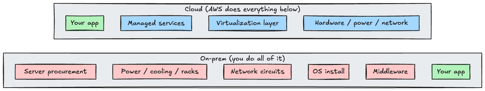
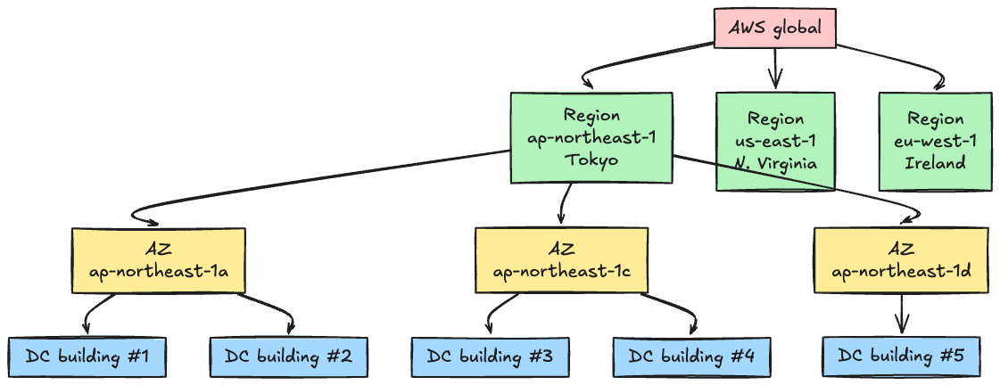
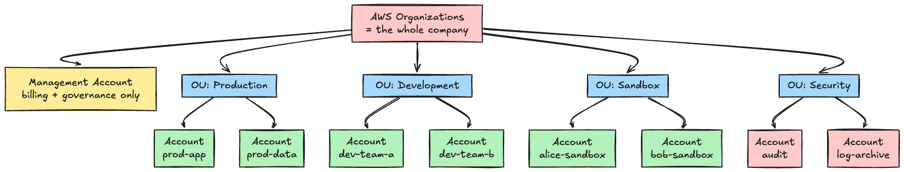
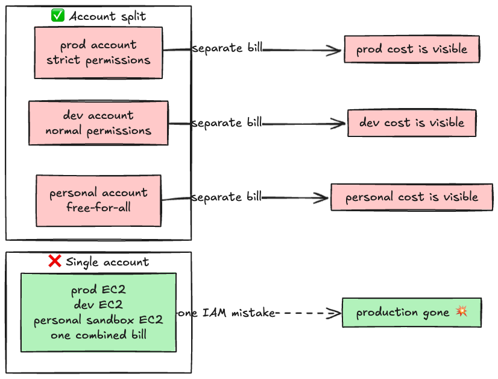
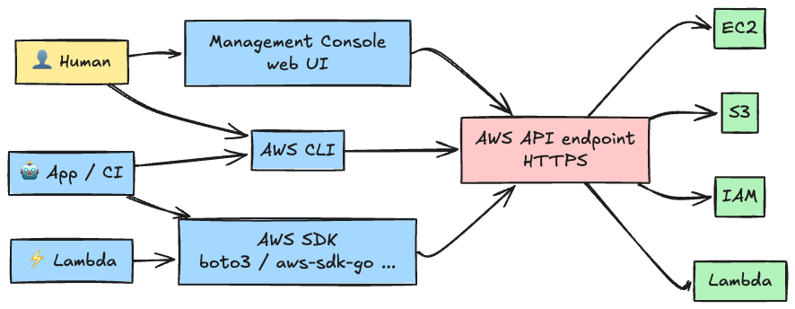
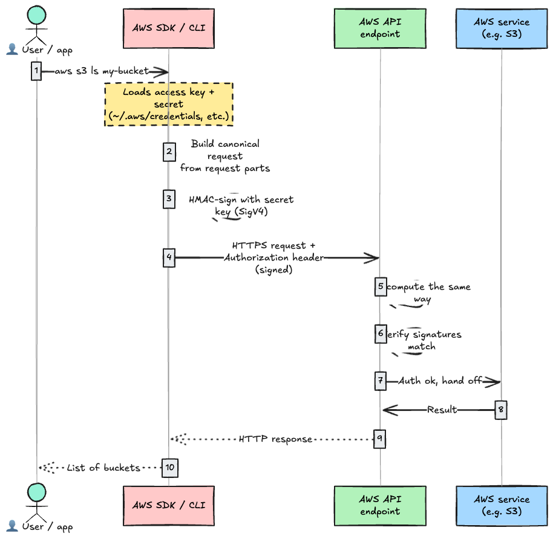
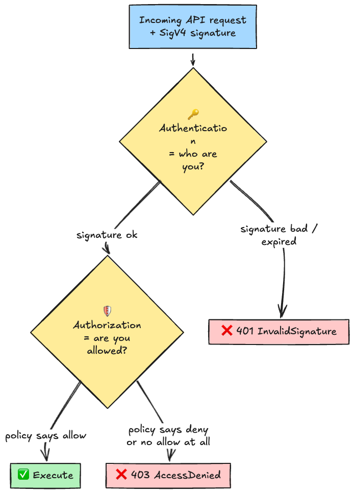

## Introduction

Before you can honestly say you "get AWS," you need a plain-language answer to one question: what is it, really? **Where does it physically run, how does the bill actually arrive, and how do you talk to it?** Skip that and every IAM policy you write is just vibes.

By the end of this you should be able to answer all of these without hesitation:

- What's the actual difference between a Region and an Availability Zone?
- An AWS account is just an email address, right?
- Why does every senior engineer insist on splitting production and staging into separate accounts?
- When you click around in the console vs. typing into the CLI, what's actually happening underneath?

---

## 1. The 30-second version of "the world before the cloud"

The fastest way to appreciate the cloud is to remember what it replaced.

You buy a physical server. You rent rack space in a data center. You sign contracts for power and network. You install an OS. Finally, your app runs. That's on-premises, "on-prem" for short.

The problem with all of that: **it's slow, paid up front, and a pain to scale**. If marketing tells you traffic is going to be 10x next week, you can't just go buy 10x the hardware.

The cloud rents you everything from "physical box up to just-below-your-app." All of it. **One API call, available right now.**

The green box is the only thing you actually wrote. With the cloud, that's the only part you have to care about.

AWS (Amazon Web Services) is the biggest cloud provider out there with 200+ services. EC2 (virtual machines), S3 (object storage), RDS (managed databases), Lambda (serverless runtime), IAM (auth). Those are just AWS's internal code names for things you probably already know.

---

## 2. The physical layout: Region, AZ, data center

The cloud isn't magic. It runs on physical servers somewhere on Earth, and AWS arranges those servers in a strict hierarchy.

Three terms, three different scopes.

| Term                       | What it is                                         | Example                | Isolation                                                                                                                                            |
| -------------------------- | -------------------------------------------------- | ---------------------- | ---------------------------------------------------------------------------------------------------------------------------------------------------- |
| **Region**                 | A geographic chunk of the planet                   | ap-northeast-1 (Tokyo) | Regions are fully independent. An S3 bucket in Tokyo is invisible from Virginia.                                                                     |
| **Availability Zone (AZ)** | A physically isolated set of DCs inside one Region | ap-northeast-1a        | Independent power, cooling, and network. One AZ failing doesn't take down the others.                                                                |
| **Data center (DC)**       | The actual building                                | (omitted)              | AWS officially says "an AZ is **one or more** discrete DCs." In any serious Region the AZs are multiple buildings (the diagram above is conceptual). |

Three classic beginner mistakes.

1. **Putting EC2 in a single AZ**: that AZ goes down, your service goes down. Production should always span at least 2 AZs.
2. **Working in the wrong Region**: thinking you're in the US, racking up bills in Tokyo. Happens more than you'd expect.
3. **"We're using Tokyo, so the data stays in Japan"**: the AWS control plane (IAM user info and the like) is global. Data residency and governance need explicit design, not a Region picker.

### "Same services everywhere" is a myth

New services almost always launch in us-east-1 first and roll out to other Regions over months or years. There are always features Tokyo doesn't have yet. If you just want to play with the latest thing, us-east-1 is the fast lane.

---

## 3. The logical layout: AWS accounts and Organizations

This part is harder to picture than the physical layout. An AWS **account** is not a Twitter account or a GitHub account.

An AWS account is **a container for resources and money**. Every EC2 instance, every S3 bucket, every resource you create lives inside exactly one account. Billing is also per account.

The relationships in one table:

| Concept                      | Role                                | What to remember                                                        |
| ---------------------------- | ----------------------------------- | ----------------------------------------------------------------------- |
| **AWS account**              | The unit of resources and billing   | One account is one "box." Everything inside is self-contained.          |
| **Organizations**            | Trees multiple accounts together    | If you're a company, use it.                                            |
| **Management Account**       | The root of the tree                | Billing aggregation and governance only. **Do not run workloads here.** |
| **OU (Organizational Unit)** | A folder-like grouping for accounts | Split by Production / Development / Security and similar lines.         |

### Why split accounts

"We're one company, why do we need more than one account?" People say this until they've operated a real system. Then they stop saying it.

Account separation buys you:

1. **Physical isolation of permissions**: one botched IAM policy can't reach into a different account.
2. **Visible costs**: glance at the bill and you know which environment is spending what.
3. **Clear ownership**: "this account belongs to Team A" is now a sentence you can say.
4. **Bounded blast radius**: when something blows up, it blows up inside one account, not across everything.

That's why every senior engineer ends up saying "production and staging belong in different accounts."

### The Management Account is sacred

The Management Account (the one at the top of the tree) is for **billing and governance, period.** Don't run apps in it. If that account is compromised, every account below it is at risk by definition.

In real organizations almost no human ever needs to log in to the management account.

---

## 4. Every path into AWS ends at the same HTTPS API

Humans, CI runners, Lambda functions, Terraform: when they touch AWS, there's exactly one path under the hood. **HTTPS API.**

Worth letting that sink in. Clicking around in the console? That's hitting the same HTTPS API. CLI? Same API. CloudFormation, CDK, Terraform? Same API.

So when people talk about AWS security, the whole problem reduces to **who can call which HTTPS API, and with what permissions**. The thing that answers both questions is **IAM (Identity and Access Management)**.

### Every API request carries a signature

Unlike most REST APIs, AWS doesn't use `Authorization: Bearer <token>`. It uses its own signing scheme: **SigV4 (Signature Version 4)**.

The shape of it: hash the request (URL, headers, body), sign that hash with your secret key, attach the signature to the request. The server reproduces the same calculation. If the signatures match, the request is authentic and unmodified.

The thing to take away: **the secret key itself never goes over the wire.** Only the signature derived from it does. Even if someone snoops on the request, they can't recover the secret.

---

## 5. Authentication vs. authorization in AWS

So far: everything is an API, and every request is signed. Once the request lands, AWS asks itself two separate questions.

| Kind                       | Question                    | How AWS answers it                                                  |
| -------------------------- | --------------------------- | ------------------------------------------------------------------- |
| **Authentication (AuthN)** | Who are you?                | SigV4 signature check + access key or temporary credentials         |
| **Authorization (AuthZ)**  | Are you allowed to do this? | IAM policy, SCP, resource policy, permissions boundary, and friends |

These are not the same thing. Having a valid signature (you authenticated) doesn't mean the action is allowed. The reverse is also true: being broadly allowed to do something is meaningless if your signature is wrong.

Authorization in AWS gets interesting because **multiple policy types are combined** to produce the final yes-or-no. That deserves its own write-up, and AWS's IAM docs are the place to go for the details.

---

## 6. The money question: pay-as-you-go and guardrails

AWS is **pay-as-you-go, billed after the fact**. At the end of the month, you get a bill for what you used.

This is where new users get burned. The classic blunders:

- Spin up an EC2 instance for a test, forget to stop it, head into a long weekend, next month's bill is $400.
- Stuff a bucket full of logs and forget about them. Six months later you have tens of GB at a few dollars a month and never noticed.
- Assume data transfer (egress) is free. It is not. Big transfers add up fast.
- Leave a NAT Gateway running in a VPC you no longer use. That's about $30 a month for nothing.

Cloud pricing usually breaks down into **compute, storage, data transfer, and request counts**. Services that look cheap on the sticker can get expensive once request charges or retrieval fees pile on. (Glacier's "cheap to store, expensive to retrieve" trap is famous for a reason.)

Bare-minimum guardrails:

1. **Set up AWS Budgets**: a monthly budget with email alerts at, say, $100. You can wire it up to actually disable IAM users at higher thresholds if you want.
2. **Open Cost Explorer regularly**: a quick daily glance catches abnormal trends within a week.
3. **Keep personal experiments in their own account**: mixed in with work stuff, weird charges go unnoticed.

---

## 7. Wrap-up

- AWS rents you everything from hardware up to just below your app, and bills you for what you used.
- Physical hierarchy: Region > AZ > DC. Always span multiple AZs in production.
- Logical hierarchy: Organizations > OU > account. Production and staging go in separate accounts.
- Every operation, no matter how it's triggered, ends up as an HTTPS API call signed with SigV4.
- Authentication (who?) and authorization (allowed?) are separate questions. IAM handles both.
- Pay-as-you-go means you need Budgets and Cost Explorer in place from day one.

**"AWS is a collection of HTTPS APIs, and IAM stands at the door."** Keep that one line in your head and you won't get lost when a new service shows up.

## References

- [AWS Identity and Access Management Best Practices](https://aws.amazon.com/iam/resources/best-practices/)
- [AWS Signature Version 4 for API requests](https://docs.aws.amazon.com/IAM/latest/UserGuide/reference_sigv.html)
- [AWS Organizations: Service control policies (SCPs)](https://docs.aws.amazon.com/organizations/latest/userguide/orgs_manage_policies_scps.html)
