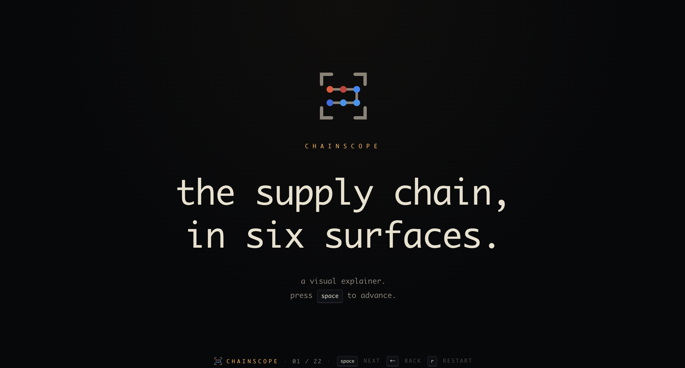
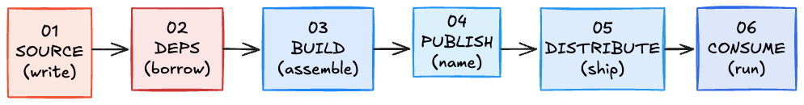

# Introduction

On 2025-03-14, the GitHub Action `tj-actions/changed-files` was hijacked. CVE-2025-30066. The blast radius: 23,000 repositories, 15 hours.

When a workflow says `uses: tj-actions/changed-files@v44`, that `v44` is a **tag**. A tag is just a label pointing at a commit SHA, and on git, **tags are rewritable**. With the maintainer's GitHub Token in hand, the attacker **rewrote every tag from `v1` through `v45`** to point at a single malicious commit.

Any CI that wrote `uses: ...@v44` started running the malicious Action on its very next run, without changing anything on its side. The Action scraped AWS / GitHub / PyPI tokens out of the runner's memory and dumped them, base64-encoded, into the **public job log**. Public GitHub Actions logs are world-readable, so the leak was complete right there.

The headlines say "another supply chain attack". But put this next to the 2024 xz-utils backdoor and the spot that got hit, and the defense that actually works, are nothing alike.

I tried to fit that difference into one diagram, failed, and ended up making slides. That became [**chainscope**](https://0-draft.github.io/chainscope).



---

## Background

A few terms up front make the rest go faster.

- **Mutable tag**: a git tag is a label pointing at a commit SHA, and it can be moved later. The `v1` in `uses: org/action@v1` resolves to **whatever SHA it points at right now** when CI runs. A pinned commit SHA (`@a284dc1aef...`) is immutable.
- **postinstall script**: an npm package can run any shell command listed in `package.json`'s `scripts.postinstall`, fired immediately after `npm install`. Lockfile hashes pin the tarball, but they say nothing about what postinstall does.
- **OIDC Trusted Publisher**: PyPI / npm gating publishing on a GitHub Actions workflow's execution identity (OIDC token). **Stealing the maintainer's password gets you nothing if you can't publish from their workflow.**
- **Sigstore**: signature verification for published artifacts, backed by OIDC identity and a transparency log (Rekor). Used via `cosign verify-blob` and friends.
- **Admission Controller (e.g. Kyverno)**: enforces policy at the moment a container image lands on a Kubernetes cluster. "Refuse to start unless the expected signature is present" is exactly its job.

---

## The software supply chain is not a single line

From source to production, an artifact passes through 6 stages.



Colors are lifted straight from each stage's flagship tool: `source = #f05032` (Git orange), `deps = #cb3837` (npm red), `build = #2088ff` (GitHub Actions blue), `consume = #326ce5` (Kubernetes blue). Idea being, the color alone tells you which stage you're looking at.

Attackers only need to own one of the six. Defenders need a separate layer at every one, or they lose somewhere. chainscope calls them "surfaces".

---

## 6 incidents

One real incident per stage. Goal: next time the news breaks, you can immediately shelve it as "oh, that's a 03 one".

### 01 SOURCE: xz-utils backdoor (2024-03-29)

CVE-2024-3094, CVSS 10.0. "Jia Tan" spent 2 years working their way into a maintainer slot on xz and, in the end, planted a backdoor **only in the release tarballs, never in the Git tree**. The trick: hiding the payload inside test fixtures so the sshd backdoor wired itself in only at build time. Andres Freund (a PostgreSQL core dev) caught it by accident, from `valgrind` noise.

What works here is **commit signing plus reproducible builds, together**. `gitsign`-style commit signing pins commits to a real OIDC identity. Reproducible builds let you check bit-for-bit equality between the tarball built from the Git tree and the official release tarball. Without the latter, the "plant it only in the tarball" trick from xz walks right through.

### 02 DEPS: Shai-Hulud npm worm (2025-09-14)

The first **self-propagating worm** on a public registry. The attacker phished npm maintainers with mail dressed up as "npm security alert" and grabbed their credentials. With the stolen npm tokens, they pushed malicious packages.

When a dev ran `npm install` and pulled one of those in, **postinstall** fired: it lifted local `NPM_TOKEN` / `GH_TOKEN` / `~/.pypirc`, then **injected the same malicious code into every package that dev owned and republished the lot**. Every victim launched the next wave. No human in the loop, just lateral spread. By 2025-09-16 over 180 packages had been hit. On 2025-11-24 Shai-Hulud 2.0 turned up, dragging in nearly 800 packages (20 million weekly downloads combined).

What works: **a hash-pinned lockfile plus SBOM diffing**. Use `npm ci` (which fails when hashes don't match the lockfile) instead of `npm install` (which re-resolves), emit an SBOM every build, diff against the previous one. Code that's been silently swapped shows up as something foreign, not as an update. Turning postinstall off with `--ignore-scripts` is also worth wiring in as the CI default.

### 03 BUILD: tj-actions/changed-files (2025-03-14)

The one from the intro. The **tag** in `uses: tj-actions/changed-files@v44` got moved to point at a malicious commit. 23,000 repos ran it for 15 hours, and CI secrets were base64-spilled into public logs. CVE-2025-30066.

What works: **pin by commit SHA, plus SLSA Provenance**.

```yaml
- uses: tj-actions/changed-files@a284dc1aef0bee7  # full SHA, not @v44
```

A commit SHA can't move, so "quietly retag" attacks don't land. Layer SLSA Provenance on top and you get a signed attestation of **which commit, which builder, which inputs, which environment** produced the artifact. Consumers verify it with `slsa-verifier verify-artifact`.

### 04 PUBLISH: TeamPCP / LiteLLM (2026-03-24)

The PyPI package for LiteLLM (an LLM proxy doing 95 million downloads a month) got compromised. The path in is the clever part. The crew, TeamPCP, **had already compromised Trivy** (the vulnerability scanner) earlier on, and LiteLLM's CI pulled poisoned Trivy in through `apt install trivy` (no version pin). The poisoned Trivy then exfiltrated the runner's `PYPI_PUBLISH` token.

With the stolen token they pushed `litellm 1.82.7` (10:39 UTC) and `1.82.8` (10:52 UTC). Those sat on PyPI for about 40 minutes before quarantine. Payload: credential stealer, lateral movement into Kubernetes, persistent backdoor. Stolen data POSTed to `models.litellm.cloud` (not the real domain).

What works: **Sigstore plus Trusted Publisher (OIDC)**. Signing and publishing are bound to the GitHub Actions workflow run ID, so **a stolen token can't publish from anywhere else**.

```sh
$ cosign verify-blob litellm-1.82.8.tar.gz \
    --certificate-identity-regexp \
    'https://github.com/BerriAI/litellm/.github/workflows/publish.yml@.*' \
    --certificate-oidc-issuer https://token.actions.githubusercontent.com
```

And: **pin every tool CI uses by SHA or version**. Just refusing to run bare `apt install foo` would have shut the entry point for this one.

### 05 DISTRIBUTE: pgserve / CanisterSprawl (2026-04-21)

The maintainer account for `pgserve` (a PostgreSQL helper for Node.js) got compromised. **Not typosquatting: the real, official package** was shipped as a malicious version (StepSecurity tracks it as "CanisterSprawl"). First malicious version at 22:14 UTC, two more on the same day.

The postinstall hook, on every `npm install`, hoovered up everything in reach: `NPM_TOKEN` / `GH_TOKEN` / SSH keys / cloud credentials / Kubernetes config / Docker config, plus LLM-platform keys. It also **republished every package the victim could publish to, spreading itself** (same pattern as Shai-Hulud). If it landed Python-side credentials, a `.pth`-based payload pivoted onto PyPI as well. Unusual detail: alongside the regular webhook, stolen data was POSTed to an ICP (Internet Computer) canister, `cjn37-uyaaa-aaaac-qgnva-cai`.

What works: **registry-side Sigstore Attestation verification** plus **postinstall off**.

```sh
$ npm install pgserve --ignore-scripts
$ npm audit signatures
  -> attestation issuer != expected workflow
  -> install rejected
```

Since 2024, npm has been distributing Sigstore Attestations through the registry, and `npm audit signatures` checks at install time whether the package was signed by the expected GitHub workflow ID. With Trusted Publisher mandated, a stolen maintainer password alone doesn't let you publish. `--ignore-scripts` (postinstall off) sits on the **damage-after-entry** side, and is worth making the CI default.

### 06 CONSUME: SUNSPOT / SolarWinds (2020-12-13)

Older, but it anchors the shape of the problem. Attackers got onto the **build server** for SolarWinds Orion and planted a tool (SUNSPOT) that swapped sources only at the moment of build. The resulting binary went through the legitimate pipeline, signed with the legitimate key, and shipped via auto-update to thousands of customers. The payload was the SUNBURST malware. FireEye disclosed on 2020-12-13.

This happens even with a perfectly legitimate signature attached. What works: **cosign verify plus admission policy plus VEX**. Not "signed by someone somewhere" but "**signed by the expected OIDC subject (e.g. our specific workflow)**", enforced at admission time by a Kubernetes admission controller (Kyverno or similar).

```yaml
apiVersion: kyverno.io/v1
kind: ClusterPolicy
spec.rules[0].verifyImages:
  imageReferences: ['*']
  attestors[0].entries[0].keyless.subject:
    'https://github.com/me/repo/.github/workflows/ci.yml@*'
```

---

## A single mapping table

| #   | Stage      | Incident                 | Effective defense                       |
| --- | ---------- | ------------------------ | --------------------------------------- |
| 01  | source     | xz-utils backdoor        | gitsign + reproducible builds           |
| 02  | deps       | Shai-Hulud worm          | npm ci + SBOM diff + --ignore-scripts   |
| 03  | build      | tj-actions/changed-files | SHA pin + SLSA Provenance               |
| 04  | publish    | TeamPCP / LiteLLM        | Sigstore + Trusted Publisher (OIDC)     |
| 05  | distribute | pgserve / CanisterSprawl | npm audit signatures + --ignore-scripts |
| 06  | consume    | SUNSPOT / SolarWinds     | cosign + Kyverno admission policy       |

Attackers win by breaking any one of the six. Defenders need a separate layer at every one, or they lose somewhere.

---

## Try it

[https://0-draft.github.io/chainscope](https://0-draft.github.io/chainscope)

`space` to advance, `←` to go back, `r` to restart. 22 slides, one lap in 5 minutes.

Got an incident I should add, or a difference I called wrong? File on [GitHub Issues](https://github.com/0-draft/chainscope/issues) or drop a comment.

---

## References

- [Andres Freund disclosure (xz-utils CVE-2024-3094)](https://www.openwall.com/lists/oss-security/2024/03/29/4)
- [Russ Cox xz reconstruction](https://research.swtch.com/xz-script)
- [Unit 42: Shai-Hulud npm worm](https://unit42.paloaltonetworks.com/npm-supply-chain-attack/)
- [CISA: Shai-Hulud alert](https://www.cisa.gov/news-events/alerts/2025/09/23/widespread-supply-chain-compromise-impacting-npm-ecosystem)
- [CISA: tj-actions/changed-files (CVE-2025-30066)](https://www.cisa.gov/news-events/alerts/2025/03/18/supply-chain-compromise-third-party-tj-actionschanged-files-cve-2025-30066-and-reviewdogaction)
- [Wiz: tj-actions analysis](https://www.wiz.io/blog/github-action-tj-actions-changed-files-supply-chain-attack-cve-2025-30066)
- [Datadog Security Labs: TeamPCP / LiteLLM](https://securitylabs.datadoghq.com/articles/litellm-compromised-pypi-teampcp-supply-chain-campaign/)
- [LiteLLM official security update (March 2026)](https://docs.litellm.ai/blog/security-update-march-2026)
- [StepSecurity: pgserve / CanisterSprawl](https://www.stepsecurity.io/blog/pgserve-compromised-on-npm-malicious-versions-harvest-credentials)
- [The Hacker News: self-propagating npm worm (pgserve)](https://thehackernews.com/2026/04/self-propagating-supply-chain-worm.html)
- [CrowdStrike: SUNSPOT analysis](https://www.crowdstrike.com/blog/sunspot-malware-technical-analysis/)
- [CISA: SolarWinds advisory](https://www.cisa.gov/news-events/cybersecurity-advisories/aa20-352a)
