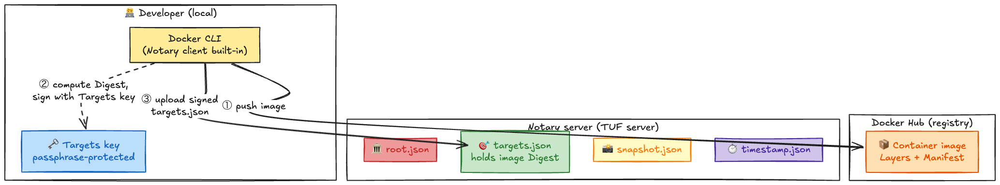
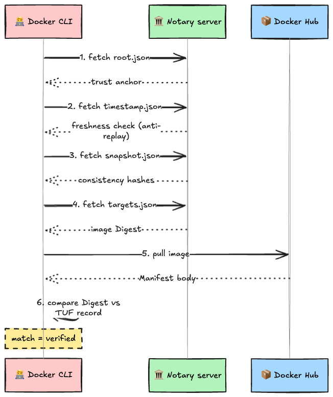
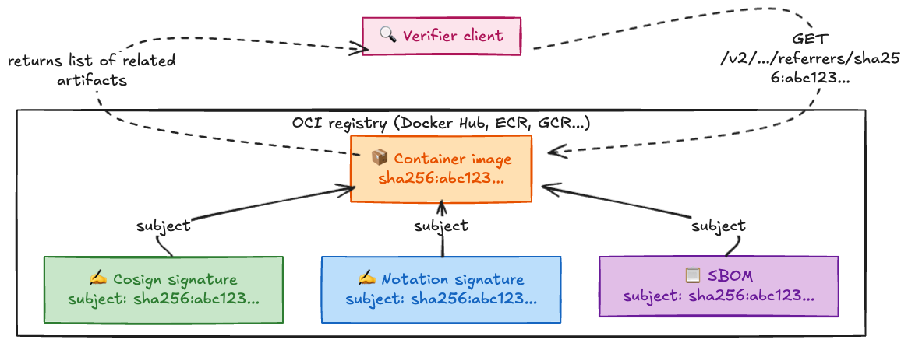
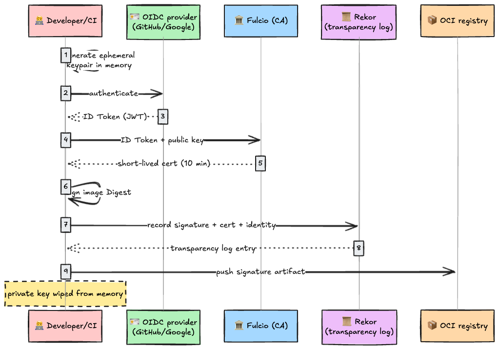
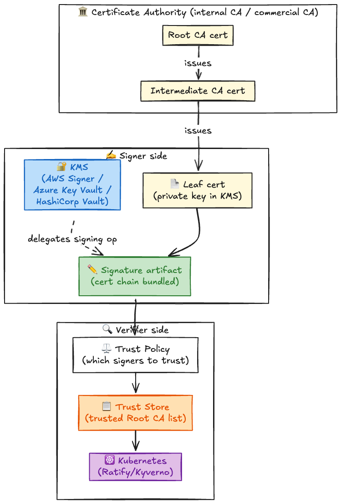

# Introduction

While doing a deep dive on Sigstore and TUF, a question hit me out of nowhere.

**"OK, but how exactly are container images protected from tampering?"**

If you understand TUF, you'd guess: "You write the container image hash into `targets.json`, sign it with an offline key, done." And in 2015, that's exactly how it worked.

But today, that mental model is **completely outdated**.

The container signing architecture in the Docker world has gone through a turbulent decade: **"They tried to do it the TUF way, developers refused to play along, the whole thing imploded, and the industry pivoted to a totally different approach."** And that "different approach" turned out to be **two competing approaches** released around the same time, both fighting for dominance. Trying to keep up with this is exhausting.

---

## Background: What "Signing a Container Image" Actually Means

Before diving into history, we need to nail down what "signing a container image" actually does. If this is fuzzy, the rest of the story will be too.

### Structure of a Container Image

A container image is not just a tar file. A JSON file called the **Manifest** holds the **hashes (digests)** of each layer (filesystem diff) and config file that make up the image.

```text
┌───────────────────────────────────────┐
│  Image Manifest (JSON)                │
│                                       │
│   config:  sha256:abc123...           │
│   layers:                             │
│     - sha256:def456... (base OS)      │
│     - sha256:789ghi... (app code)     │
│                                       │
│  ─ ─ ─ ─ ─ ─ ─ ─ ─ ─ ─ ─ ─ ─ ─ ─ ─ ─ ─│
│  Manifest's own Digest:               │
│    sha256:xxxxxx...                   │
│  → This is the "image fingerprint"    │
└───────────────────────────────────────┘
```

If even 1 bit of the image content changes, the Manifest's Digest changes completely. **If we can guarantee just this Digest is correct, we can detect any tampering of the entire image.**

### "Signing" = Detached signature on the Digest

The intuitive idea is "embed the signature data inside the image," but that's impossible. If you change the image to insert a signature, the Digest changes, and the signature becomes invalid. Chicken-and-egg problem.

So container signatures are always **Detached Signatures**. Sign the Manifest's Digest from outside, and store the signature **somewhere separate** from the image itself.

So where is "somewhere separate"? **This is the question that has been violently re-litigated for ten years.**

---

## Timeline: A Decade of Container Signing

Let's lay out the full picture first. Each entry will be expanded in later sections.

| Year        | Event                                                                                                                                                                                         |
| :---------- | :-------------------------------------------------------------------------------------------------------------------------------------------------------------------------------------------- |
| **2015.08** | Docker Content Trust (DCT) released with Docker Engine 1.8. Notary v1, running underneath, is a pure TUF implementation. Signatures stored on a **separate Notary server, not the registry**. |
| **2017.10** | CNCF accepts Notary and TUF as Incubating projects.                                                                                                                                           |
| **2019.11** | Notary v2 discussions kick off at KubeCon NA (San Diego). The following month, a kickoff meeting is held at Amazon's Seattle office with Docker, Microsoft, Amazon, Google, Red Hat, etc.     |
| **2021.06** | Sigstore holds its first Root Key Ceremony (6/18). TUF is used only for "distributing root certificates."                                                                                     |
| **2023.08** | Notary v2 (Notation) v1.0.0 released (8/15). **TUF completely dropped.** Same month, Harbor 2.9.0 **fully removes Notary v1** (deprecation began in 2.6.0).                                   |
| **2024.02** | OCI Image/Distribution Specification v1.1.0 officially released. **Referrers API** standardized, formalizing in-registry signature storage.                                                   |
| **2025.03** | Azure Container Registry begins DCT deprecation (full removal scheduled for 2028.03).                                                                                                         |
| **2025.08** | Docker Official Images' DCT signing certificate expires (8/8). `DOCKER_CONTENT_TRUST=1` pulls start failing. DCT is effectively dead. Usage was **less than 0.05%** of all pulls.             |

---

## Generation One: Notary v1 (Going All-In on TUF, 2015〜2025)

### Architecture: A TUF Server "Next To" the Registry

In August 2015, Docker released Docker Content Trust (DCT). Setting `DOCKER_CONTENT_TRUST=1` makes `docker push` automatically sign images and `docker pull` automatically verify them.

Underneath was **Notary v1**. It was a textbook TUF implementation: a Notary server running at a **separate URL** from Docker Hub, holding the full set of TUF metadata. Quick recap of the four roles:

| Role        | File             | Purpose                                                          | Key location             |
| :---------- | :--------------- | :--------------------------------------------------------------- | :----------------------- |
| 🏛️ Root      | `root.json`      | Anchor of trust. Declares public keys for the other 3 roles.     | **Offline** (in a vault) |
| 🎯 Targets   | `targets.json`   | Records and signs the digests of images you want to protect.     | **Offline**              |
| 📸 Snapshot  | `snapshot.json`  | Guarantees consistency across metadata (prevents mix-and-match). | Online                   |
| ⏱️ Timestamp | `timestamp.json` | Freshness guarantee (prevents replay). Short expiration.         | Online                   |

An "offline key" is a key kept on an air-gapped machine or in a physical vault; an "online key" is one that lives on a server for automated updates. **Keeping the Targets key offline** is the foundation of TUF's security model. This is exactly where things later explode.

#### Push Flow



The CLI computes the Manifest's Digest, signs an updated `targets.json` with the local Targets key, and uploads it. Step ② is an internal "use the key" operation (dotted line), not a network transfer.

#### Pull Verification Flow



Walk Root → Timestamp → Snapshot → Targets, then compare the actual image's Digest from the registry against the record in `targets.json`. All four TUF roles in full motion: a spec-faithful architecture.

### Why It Imploded

A theoretically correct architecture collapsed completely in practice.

**1. It forced developers to manage signing keys**

Every `docker push` prompted for the local Targets key passphrase. Maybe tolerable for solo developers, but for the modern "automate the push from CI/CD" workflow, this was fatal.

To wire it into CI, you had to put the Targets key (which was supposed to live offline in a vault) into the CI's secret store. **"Putting the offline key online"**: a contradiction. This breaks the foundation of TUF's security model.

**2. Lose the key = repository death**

If you lose the Targets key, you can never sign images for that repository again. Key rotation must follow the TUF spec exactly, and the handoff overhead in team development was a nightmare.

**3. Mismatch with the reality of distributed registries**

This was the deepest structural problem. Container images don't deploy only to Docker Hub. AWS ECR, GCP Artifact Registry, Azure Container Registry, GitHub Container Registry, internal Harbor instances... registries are scattered everywhere.

In the Notary v1 model, every registry needed its own Notary server. Copy an image between registries, and the signature doesn't follow. The industry looked at that operational cost and said "no."

### The Death of DCT: The Numbers Tell the Story

In the end, fewer than **0.05%** of all Docker Hub pulls had DCT enabled.

On August 8, 2025, the oldest DCT signing certificates for Docker Official Images (`nginx`, `ubuntu`, etc.) expired. Users with `DOCKER_CONTENT_TRUST=1` could no longer pull even the official images. Docker's response: "Please disable the `DOCKER_CONTENT_TRUST` environment variable." DCT quietly died.

Azure Container Registry began DCT deprecation in March 2025, with full removal scheduled for March 2028. Harbor moved earlier, fully removing Notary v1 in v2.9.0 back in 2023.

---

## Generation Two: The OCI Registry-Native Era (2023〜present)

### The Pivot: Put Signatures "Inside the Registry"

What the industry learned from Notary v1's failure: **"Standing up a separate server just for signing doesn't work operationally."**

The answer: store signature data directly in the same OCI registry as the image, **as another OCI artifact** (a blob conforming to the OCI spec). No extra registry to run. Copy the image between registries, and the signature comes along.

The **OCI Distribution Specification v1.1.0**, released in February 2024, formally standardized this approach. It introduced the **Referrers API** (`GET /v2/<name>/referrers/<digest>`), letting clients list all related artifacts (signatures, SBOMs, vulnerability scan results) attached to a given image's Digest.



Each artifact (signature, SBOM, etc.) points back to the parent image via a `subject` field. Verifier tools call the Referrers API to enumerate them and pick what they need to verify. No separate Notary server required.

Note: in production you usually pick **either Cosign or Notation, not both** (drawing them side-by-side just shows that both ride on the same spec). On top of this foundation, two signing projects are now competing for dominance.

### Sigstore (cosign): The "Selective Bite" of TUF

Sigstore made a clean call. **Stop using TUF's `targets.json` to manage image hashes. But don't throw TUF away entirely.**

Sigstore uses TUF in exactly one place: **safely distributing the root certificate of Fulcio (the signing CA) and the public key of Rekor (the transparency log) to clients.** The first time you run `cosign`, a TUF client behind the scenes walks `root.json` → `timestamp.json` → `snapshot.json` → `targets.json` to fetch the certificates and public keys you should trust.

The heavy use case TUF was originally built for, "managing hashes of hundreds of thousands of packages," was abandoned. Sigstore kept only the lightweight role TUF excels at: "safely distributing root certificates."

Sigstore also gave a fundamental answer to the "key management is unbearable" problem that killed Notary v1: **don't make developers hold private keys at all (keyless signing).**

You authenticate via an OIDC (OpenID Connect, the standard protocol for ID token issuance) provider (GitHub, Google, etc.), Fulcio issues a short-lived certificate that expires in 10 minutes, and you sign with that certificate. The fact of signing is permanently recorded in Rekor's transparency log. The private key exists for a few seconds in memory and disappears. There is no key to manage in the first place.



The revolutionary move: abandon the very idea of "protect the key" and replace it with "sign with a short-lived key, and leave only the signing trace in a public log forever."

### Notary v2 (Notation): Total Abandonment of TUF

The next-generation Notary project, led by Docker and Microsoft. v1.0.0 released in August 2023. Active development continues as a CNCF Incubating project.

Notary v2 **completely dropped the TUF specification**. The four-role structure of Root, Targets, Snapshot, Timestamp is not used at all. Instead, it builds trust on **X.509 certificate chains** (the same mechanism as HTTPS certificates: trust propagates hierarchically from CA to intermediate CA to leaf certificate), a mechanism battle-tested for decades on the Web.

The mechanics are identical to SSL/TLS certificate verification. Signers hold X.509 certificates issued by a Certificate Authority (CA). Verifiers maintain a trust store (a list of CAs they trust) and walk the certificate chain attached to the signature to decide whether to trust it. TUF's complex chain of metadata is replaced with existing PKI infrastructure.



You don't need to hold keys locally. Plugins connect to cloud KMS services like AWS Signer, Azure Key Vault, or HashiCorp Vault, delegating the signing operation. It also integrates with Kubernetes admission controllers (Ratify, Kyverno) so signature verification can be wired into deployment gates.

### Comparing the Three Approaches

|                       | **Notary v1 (DCT)**            | **Sigstore (cosign)**              | **Notary v2 (Notation)**   |
| :-------------------- | :----------------------------- | :--------------------------------- | :------------------------- |
| **Use of TUF**        | Full implementation (4 roles)  | Root certificate distribution only | Not used                   |
| **Signature storage** | Notary server (separate infra) | Inside OCI registry                | Inside OCI registry        |
| **Key management**    | Developer manages locally      | None (keyless signing)             | Delegated to cloud KMS     |
| **Trust model**       | TUF Root of Trust              | TUF + transparency log (Rekor)     | X.509 certificate chain    |
| **CI/CD fit**         | ❌ Requires passphrase entry    | ✅ Fully automated via OIDC         | ✅ Automated via KMS plugin |
| **Status (2026)**     | ❌ Archived                     | ✅ Adopted by npm, PyPI, Maven      | ✅ CNCF Incubating          |

---

## Sidebar: Why Does TUF Work for PyPI?

If you've read this far, this question should be nagging you.

Notary v1 imploded over "key management is too hard." So how does Python's PyPI, which hosts over 500,000 packages, manage to make TUF (PEP 458) actually work?

The answer comes down to two structural differences.

### 1. Developers don't sign anything

PyPI's TUF deployment (PEP 458) is designed to protect the channel **between the PyPI servers and the `pip` command**. Developers just upload packages to PyPI as before. PyPI's backend automatically computes hashes and **signs `targets.json` using PyPI's own online keys**.

Developers don't even need to know TUF exists. This is the polar opposite of Notary v1, which forced developers to hold TUF's offline keys.

### 2. Centralized vs. distributed

Python packages all converge on a **single central server**: `pypi.org`. Run one TUF server, and you cover all 500,000 packages.

Container image registries, by contrast, are **distributed across many places**: Docker Hub, ECR, GCR, ACR, Harbor... Notary v1 required a TUF server per registry, and operational costs exploded.

|                     | **PyPI**                   | **Container ecosystem**                   |
| :------------------ | :------------------------- | :---------------------------------------- |
| **Registry**        | One: `pypi.org`            | Docker Hub, ECR, GCR, ACR, Harbor...      |
| **Who manages TUF** | PyPI server (automatic)    | Developers themselves (Notary v1)         |
| **Result**          | ✅ Developers don't see TUF | ❌ Developers burned out on key management |

PyPI also spent years exploring "end-to-end signing by developers themselves" as **PEP 480**. But ultimately it gave up on forcing TUF-based key management onto developers and pivoted to **Trusted Publishers** (launched April 2023) using GitHub Actions OIDC. This is the same "OIDC + short-lived tokens" approach as Sigstore.

Docker, PyPI, npm: they all converged on the same conclusion. **"Making developers manage private keys does not work."** Notary v1's death is a lesson the entire industry has internalized.

---

## Conclusion

"How do you protect the hash of a container image with TUF's Targets?"

In the old days, you protected it with `targets.json` (Notary v1). But in a distributed container ecosystem, the model that asks developers to manage offline keys completely fell apart. Today, instead of managing the image Digest directly with TUF, signatures are stored directly in the OCI registry (Sigstore / Notary v2).

Security that nobody uses is not security. The decade of Notary v1 proved that.

---

## References

- [Docker Blog: Retiring Docker Content Trust](https://www.docker.com/blog/retiring-docker-content-trust/)
- [InfoQ: Docker Retires Docker Content Trust with Less Than 0.05% of Image Pulls Using DCT](https://www.infoq.com/news/2025/08/docker-content-trust-retirement/)
- [Microsoft: Deprecation of Docker Content Trust on Azure Container Registry](https://learn.microsoft.com/en-us/azure/container-registry/container-registry-content-trust)
- [Docker Blog: Notary v2 and Signing Requirements (Dec 2019 kickoff)](https://www.docker.com/blog/notary-v2-and-signing-requirements/)
- [Harbor: Notary v1 Removal (v2.9.0)](https://github.com/goharbor/harbor/wiki/Harbor-Notary-v1-Migration-Guide)
- [OCI Distribution Specification v1.1.0](https://github.com/opencontainers/distribution-spec/releases/tag/v1.1.0)
- [Notary Project (Notation)](https://notaryproject.dev/)
- [Sigstore](https://www.sigstore.dev/)
- [Sigstore Blog: Root Key Ceremony (June 18, 2021)](https://blog.sigstore.dev/sigstore-root-key-ceremony/)
- [PEP 458: Secure PyPI downloads with signed repository metadata](https://peps.python.org/pep-0458/)
- [PEP 480: Surviving a Compromise of PyPI](https://peps.python.org/pep-0480/)
- [PyPI Blog: Trusted Publishers](https://blog.pypi.org/posts/2023-04-20-introducing-trusted-publishers/)
