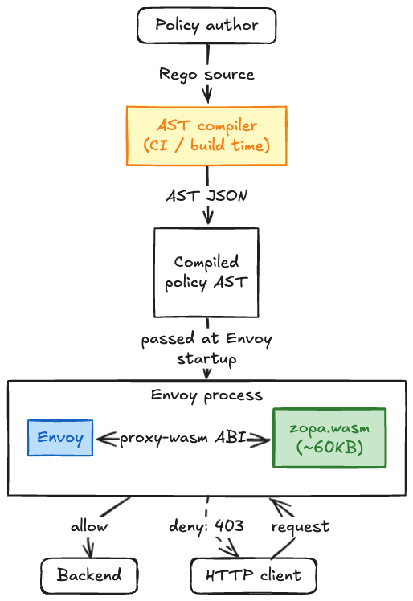
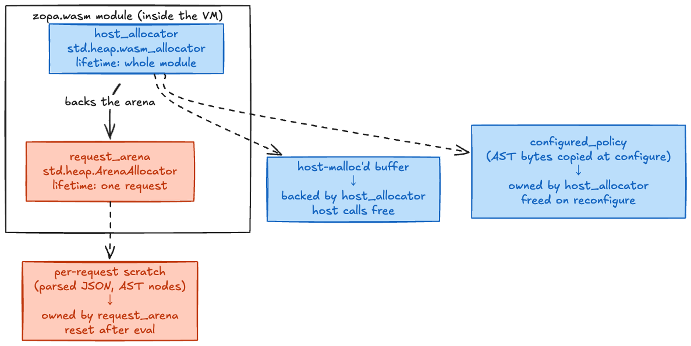
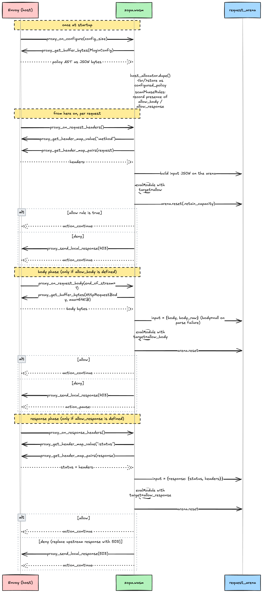

There are plenty of times you want to delegate "let this request through, or block it" to a wasm filter inside Envoy. API gateways, service mesh boundaries, L7 checkpoints. The default move is to use OPA's wasm build.

The trouble is OPA-as-wasm is heavy. The Go runtime, the Rego parser, and the evaluator are all in there. You only want to return allow/deny at the edge, but you ship something many times the size of the evaluator. Cedar and Casbin don't ship official wasm builds (as of May 2026). The slot for "drop-in proxy-wasm authorization filter" is empty.

[zopa](https://github.com/0-draft/zopa) is what I built to fill that slot. A Zig `wasm32-freestanding` binary, ~60 KB at release. No GC; memory turns over on a per-request arena. It runs on any host that implements proxy-wasm 0.2.1 (Envoy / wasmtime / wamr / v8).

## Big picture

Zopa assumes you separate **where you write policy** from **where you evaluate it**.



Policy authors write rules in Rego (OPA's policy language; a declarative DSL in the Datalog family). The CI converts that to AST (Abstract Syntax Tree) JSON. At Envoy startup the AST is handed to the wasm module as plugin config; on each incoming request, zopa evaluates and returns 1 or 0.

There's exactly one design call here: **don't ship a language compiler inside the wasm module**. OPA wasm is large because the Rego parser and evaluator are bundled together. Zopa pushes the parser out of the wasm (into a CI job) and keeps the wasm module focused on evaluation. That alone moves the binary size by orders of magnitude.

## proxy-wasm refresher

proxy-wasm is the ABI spec for "filters in wasm" used by Envoy and friends. Most famous in Envoy, but anything embedding wasmtime / wamr / v8 can host it.

Three points cover the host/wasm relationship:

1. The host calls into wasm exports at request milestones (`proxy_on_request_headers` etc.).
1. The wasm pulls header values back through host imports (`proxy_get_header_map_value`).
1. Allow does nothing (Envoy continues). Deny asks the host to call `proxy_send_local_response(403)`.

Zopa implements proxy-wasm 0.2.1. Spec body: [proxy-wasm/spec](https://github.com/proxy-wasm/spec).

## Why it fits in 60 KB

The build:

```bash
zig build --release=small
ls -lh zig-out/bin/zopa.wasm
# -rw-r--r-- 1 you staff 60K  zopa.wasm
```

Three things drive the size:

1. **`wasm32-freestanding` target.** No WASI (the wasm syscall spec). No OS, no syscalls, only a thin slice of stdlib. `freestanding` drops every file I/O / network stub.
1. **No GC.** Zig has no garbage collector (like Rust, ownership is explicit and memory is hand-managed). The GC code and management metadata simply don't exist.
1. **Zero deps.** Nothing outside Zig stdlib. The JSON parser is hand-rolled (recursive descent) in `src/json.zig`, surrogate-pair handling included, in a few hundred lines.

OPA's wasm is large because it carries the Go runtime (with GC), the Rego parser, and the evaluator. Zopa took the opposite call on every point. The result is 60 KB.

## Memory model

Zopa's heart is the memory layout. Two allocators, with different lifetimes and roles.



`host_allocator` is Zig stdlib's `std.heap.wasm_allocator`, a freelist-style allocator. It backs every buffer that crosses the host boundary. Lifetime: the whole module.

`request_arena` is `std.heap.ArenaAllocator`. Per-request scratch space. We call `reset(.retain_capacity)` at the end of `evaluate()`.

An arena means "alloc as much as you want; everything goes away at the end". No individual `free` calls. With `retain_capacity`, the wasm linear memory pages aren't returned, so the next request reuses the existing capacity.

Net effect: after warmup, `memory.grow` (the wasm heap-grow instruction) stops firing. Throughput goes up; memory stays roughly flat. That's the source of that property.

The single rule that ties it together: **a pointer minted by one allocator must only be released by the matching free path**. The proxy-wasm shim returns host-malloc'd buffers via the host's free; the evaluator never calls `free` directly and instead leans on the arena reset.

## Three-phase target rules

Zopa makes the decision independently in three HTTP phases. Each phase is bound to **a different target rule name**; if your policy contains a rule with that name, the phase fires; if not, the phase passes through silently.

| Phase                       | Target rule      | Input shape                     | On deny     |
| --------------------------- | ---------------- | ------------------------------- | ----------- |
| `proxy_on_request_headers`  | `allow`          | `{method, path, headers}`       | 403         |
| `proxy_on_request_body`     | `allow_body`     | `{body, body_raw}`              | 403 + Pause |
| `proxy_on_response_headers` | `allow_response` | `{response: {status, headers}}` | 503         |

The key point: a policy with only an `allow` rule sails past the body and response phases untouched. At configure time we parse the policy JSON and remember whether `allow_body` / `allow_response` rules exist as bools; if they don't, the matching callbacks return `Continue` directly.

## What happens during one request

When Envoy hands a single request to zopa, this is the timeline inside.



Three takeaways:

- The policy AST is **handed to us once at startup** and copied into host_allocator. We don't re-receive it per request.
- Every phase ends with `arena.reset`. Zopa carries no data across phase or request boundaries.
- The body and response phases only run eval **when the matching rule exists**. The policy opts each phase in by writing a rule with that name.

`evaluate()` returns a plain `i32`:

| Return | Meaning                                                     |
| ------ | ----------------------------------------------------------- |
| `1`    | allow. The target rule fired with a truthy value.           |
| `0`    | deny. No rule fired and no truthy default rule was present. |
| `-1`   | error. Parse failure, unknown node, recursion cap, etc.     |

The proxy-wasm shim treats `-1` the same as deny (broken policies block by default).

## Policy AST

Zopa's input isn't Rego source; it's AST-shaped JSON. The supported nodes mirror a subset of Rego.

"`role` equals `admin` → allow" looks like:

```json
{
  "type": "module",
  "rules": [
    {
      "type": "rule",
      "name": "allow",
      "default": true,
      "value": { "type": "value", "value": false }
    },
    {
      "type": "rule",
      "name": "allow",
      "body": [
        {
          "type": "eq",
          "left":  { "type": "ref", "path": ["input", "user", "role"] },
          "right": { "type": "value", "value": "admin" }
        }
      ]
    }
  ]
}
```

The evaluation rule is "OR every rule whose `name` is `"allow"`". If any body holds, `allow=true`. A `default=true` rule's value is the fallback for when nothing else fires.

Supported node types:

| Node      | Use                                                                |
| --------- | ------------------------------------------------------------------ |
| `value`   | Literal (any JSON value)                                           |
| `ref`     | Path lookup, e.g. walking `input.user.role`                        |
| `compare` | Binary compare. `eq` / `neq` / `lt` / `lte` / `gt` / `gte`         |
| `not`     | Logical negation                                                   |
| `set`     | Set literal                                                        |
| `some`    | Existential quantifier: "some element x makes body true"           |
| `every`   | Universal quantifier: "every element x makes body true"            |
| `call`    | Builtin function call.                                             |
| `module`  | A set of rules. Optional `package` field carries the package name. |
| `modules` | Module bundle: multiple packages co-resident in a single VM.       |
| `rule`    | A single rule with `body` (AND) and `value`.                       |

`call` ships with these four builtins:

| Name         | Args                            | Returns |
| ------------ | ------------------------------- | ------- |
| `startswith` | (string, string)                | bool    |
| `endswith`   | (string, string)                | bool    |
| `contains`   | (string, string)                | bool    |
| `count`      | (array / set / object / string) | number  |

`some` / `every` also iterate over JSON objects: pick `kind: "keys"` (default) or `kind: "values"`.

Zopa doesn't reach the full Rego (user-defined functions, `with` clauses, partial evaluation, imports, etc.). The scope is "decide allow/deny at the edge". Full reference: [`docs/ast.md`](https://github.com/0-draft/zopa/blob/main/docs/ast.md).

## Try it

### Build

You need Zig 0.16.0:

```bash
brew install zig
git clone https://github.com/0-draft/zopa
cd zopa
zig build --release=small
```

### Drive it directly (Node.js)

Call `evaluate(input, ast)` without going through proxy-wasm. Useful as a smoke test before standing up Envoy.

```javascript
import { readFileSync } from 'node:fs';

const { instance } = await WebAssembly.instantiate(
  readFileSync('zig-out/bin/zopa.wasm'),
  { env: {
      proxy_log: () => 0,
      proxy_get_buffer_bytes: () => 1,
      proxy_get_header_map_pairs: () => 1,
      proxy_get_header_map_value: () => 1,
      proxy_send_local_response: () => 0,
  }},
);
const { malloc, free, evaluate, memory } = instance.exports;

const enc = new TextEncoder();
function write(obj) {
  const bytes = enc.encode(JSON.stringify(obj));
  const ptr = malloc(bytes.length);
  new Uint8Array(memory.buffer, ptr, bytes.length).set(bytes);
  return [ptr, bytes.length];
}

const [ip, il] = write({ user: { role: 'admin' } });
const [ap, al] = write({
  type: 'compare', op: 'eq',
  left:  { type: 'ref',   path: ['input', 'user', 'role'] },
  right: { type: 'value', value: 'admin' },
});

console.log(evaluate(ip, il, ap, al)); // 1 (allow)
free(ip); free(ap);
```

The `proxy_*` stubs in `env` are there because proxy-wasm imports must resolve before the wasm module instantiates. `evaluate` itself doesn't call into them, so dummies are fine.

### As an Envoy proxy-wasm filter

Drop the wasm into `http_filters`. Two important fields: `vm_config` and `configuration`.

```yaml
http_filters:
  - name: envoy.filters.http.wasm
    typed_config:
      "@type": type.googleapis.com/envoy.extensions.filters.http.wasm.v3.Wasm
      config:
        configuration:
          "@type": type.googleapis.com/google.protobuf.StringValue
          value: |
            {"type":"module","rules":[
              {"type":"rule","name":"allow","default":true,
               "value":{"type":"value","value":false}},
              {"type":"rule","name":"allow","body":[
                {"type":"eq",
                 "left":{"type":"ref","path":["input","method"]},
                 "right":{"type":"value","value":"GET"}}]}
            ]}
        vm_config:
          runtime: envoy.wasm.runtime.v8
          code:
            local:
              filename: /etc/zopa/zopa.wasm
```

`configuration.value` is the policy AST as JSON. The example reads "GET passes; everything else denies".

A complete end-to-end sample lives in [`examples/envoy/`](https://github.com/0-draft/zopa/tree/main/examples/envoy); `zig build test-envoy` runs curl assertions against a real Envoy. CI exercises Node, wasmtime, and a real Envoy on every commit.

### Container image

There's also a distroless OCI image. Multi-arch (amd64 / arm64) and cosign keyless-signed.

```bash
docker pull ghcr.io/0-draft/zopa:v0.2.0
docker run --rm --entrypoint=ls ghcr.io/0-draft/zopa:v0.2.0 -lh /zopa.wasm
```

The intended use is staging `/zopa.wasm` from an initContainer into the Envoy sidecar pod.

### Latency

`zig build bench` runs a zopa-only latency benchmark. On a local M-series Mac with `--release=small`:

```text
fixture                 |    p50 |    p95 |    p99 |   mean
------------------------+--------+--------+--------+-------
01_static               |  1.79  |  2.96  |  3.46  |  1.73  (μs)
02_header_eq            |  4.42  |  4.96  |  5.17  |  4.48  (μs)
```

Literal `true` policy: 1.79 μs at p50. A simple `input.method == "GET"` style compare: 4.42 μs at p50. Wall-clock direct measurement, 10 000 iterations after 1 000 warmup. No head-to-head against OPA / Cedar yet; cross-engine numbers wait until the conformance corpus is wide enough to honestly assert "same answer".

## Where it sits relative to alternatives

| Item              | OPA            | Cedar        | Casbin       | zopa              |
| ----------------- | -------------- | ------------ | ------------ | ----------------- |
| Language          | Go             | Rust         | Go (+ ports) | Zig               |
| Wasm distribution | Yes (heavy)    | No           | No           | Yes (~60KB)       |
| Memory model      | GC             | RC + arenas  | GC           | per-request arena |
| proxy-wasm        | Side project   | No           | No           | First-class       |
| Policy input      | Rego source    | Cedar source | CSV / source | Compiled AST      |
| Maturity          | CNCF Graduated | Stable       | Mature       | Alpha             |

Zopa isn't a replacement for OPA when you need full Rego, the management plane, bundle distribution, partial evaluation, or the state API. Use OPA for those. Zopa solves a narrow case: "I can compile the policy elsewhere and just want to evaluate at the edge". For that case, the wasm binary is two orders of magnitude smaller than OPA's.

It fits when "Rego-ish syntax, but OPA is too heavy" and "Cedar / Casbin can't go to wasm" line up at the same time.

## Try it and tell me

Zopa's source is 8 files under `src/`, no deps outside stdlib, readable top to bottom. Sized so that if you want to change something, you can fork and rewrite.

Feedback I'd love:

- "`tools/rego2ast.py` rejects my policy with Unsupported on this node, please add it"
- "proxy-wasm host X (Istio / Kong / APISIX) worked / didn't work like this"
- "Cases I'd add to the conformance corpus"
- "The `allow_body` 64 KiB cap is too small / too large"

## Reference

- Repo: <https://github.com/0-draft/zopa>
- Issues: <https://github.com/0-draft/zopa/issues>
- v0.2.0 release: <https://github.com/0-draft/zopa/releases/tag/v0.2.0>
- OCI image: `ghcr.io/0-draft/zopa:v0.2.0`
- proxy-wasm spec: <https://github.com/proxy-wasm/spec>
