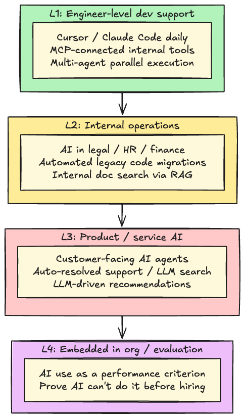
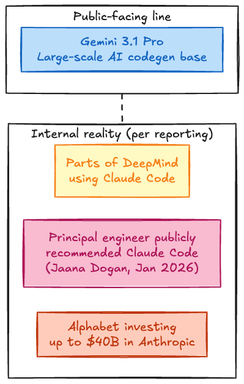
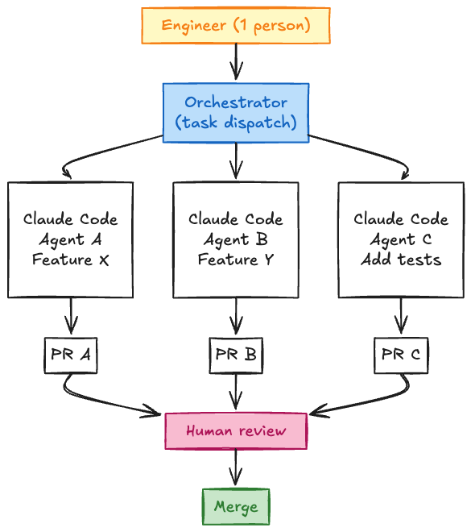
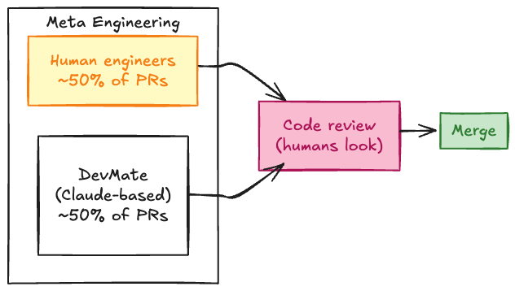
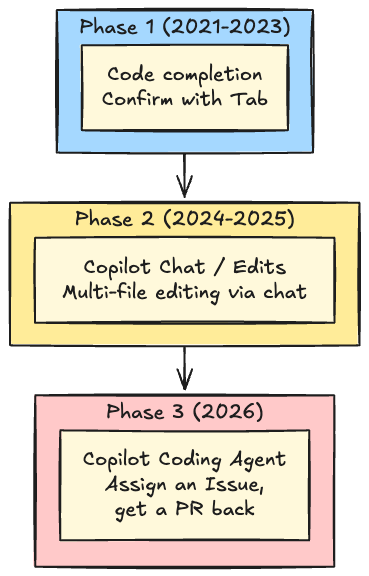
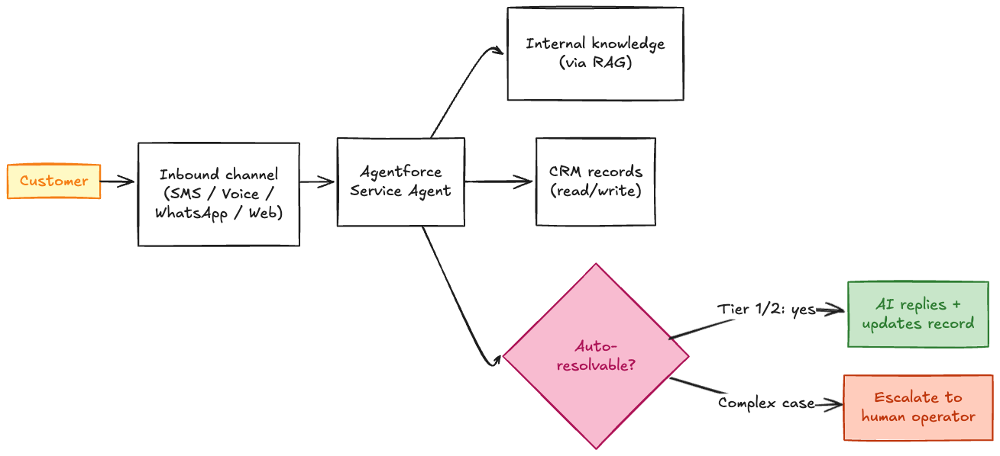
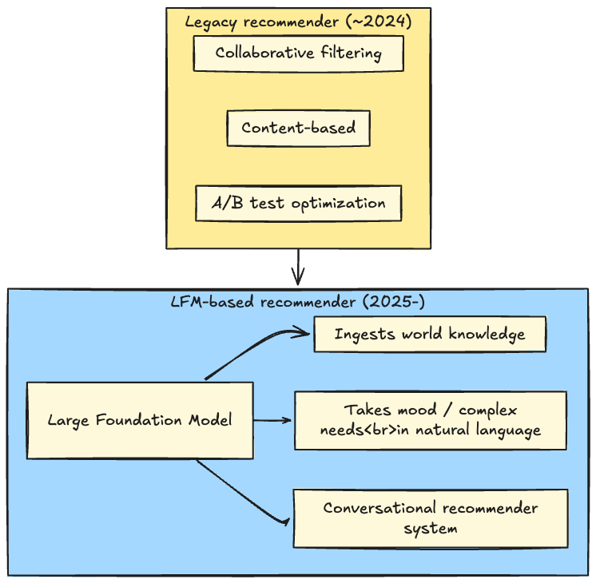
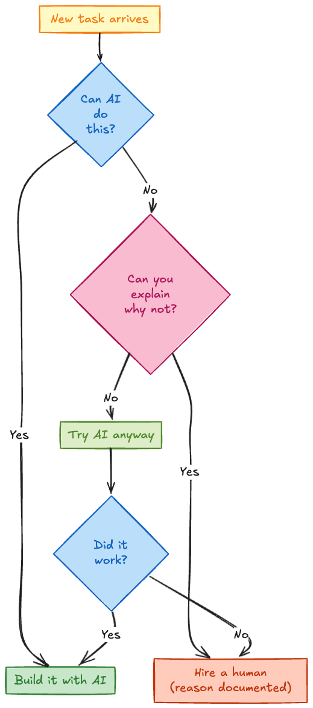
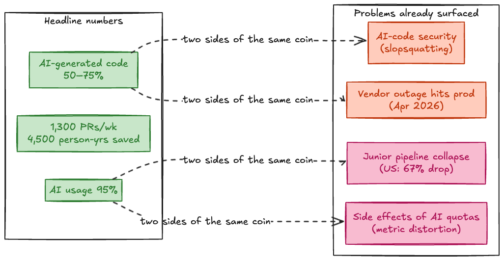
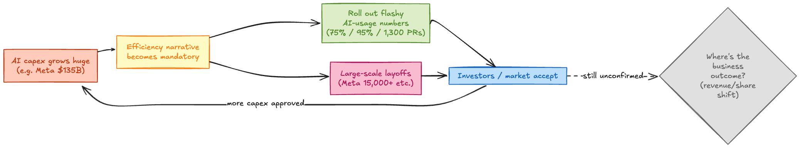

## Intro: why "are you using AI?" is suddenly hard to answer honestly

I keep having this conversation lately, both inside and outside work.

"How are you using AI?"
"Mostly Claude Code and Cursor. Hooked our internal wiki up over MCP too."
"Yeah, same here."

That's where it stops. We can both say "the tools are installed" without flinching. But beyond that, the second you ask **what actually changed, or how it shows up in any organizational number**, the answers thin out fast. Every engineer I know is using AI day to day, yet I rarely get the feeling that it's translated into anything visible at the team or company level.

Meanwhile, when you read the news about companies that everyone agrees are good at this, the numbers are on a different scale. Google says **75% of new code is AI-generated**. Stripe's internal coding agents merge **1,300+ PRs a week**. Mercari reports **95% of employees actively use AI tools** and that **per-engineer output is up 64% year over year**.

What's behind that gap? What are these companies concretely doing, and what do they have that the rest of us don't? I went through the major IT companies (US and Japan) end to end and pulled this together as a single map.

Everything below leans on first-party sources: official blogs, CEO statements, internal memos that went public, research workshop materials. Where I'm guessing, I say so. Where I don't know, I leave it out.

### One thing to set up first: in 2026, Claude is the de facto standard for coding

Before getting into individual companies, here's a piece of context worth front-loading. As of May 2026, **Claude (Anthropic) dominates the coding-tool space by a wide margin**. The Pragmatic Engineer survey from February 2026 makes this concrete:

| Tool           | Share naming it the "most loved coding tool" |
| -------------- | -------------------------------------------- |
| Claude Code    | **46%**                                      |
| Cursor         | 19%                                          |
| GitHub Copilot | 9%                                           |

The latest SWE-bench Verified numbers tell the same story: Claude Sonnet 4.6 sits at **82.1%**, while Gemini 3 is at 63.8%, an 18-point spread. Meta's DevMate (covered later) runs on Claude. Reporting suggests even some Google engineers reach for Claude Code internally.

OpenAI's **Codex** hit **3 million weekly active users** by March 2026, so it has the biggest base by raw user count. But the same surveys put it below Claude Code, Cursor, and Copilot when you ask developers what they actually love using. **Wide reach (Codex / ChatGPT)** and **high agent-quality reputation (Claude Code)** are running on different metrics in 2026. ChatGPT and Gemini are roughly tied for general-purpose chat, but for coding agents specifically, Claude is clearly out in front.

---

## 0. Glossary: terms used throughout

Skip this section if you already know all of these. I'm trying to avoid arguments downstream.

### 0.1 The four generations of coding AI

The shape of coding AI has shifted a lot over the past few years. As of May 2026, we're at generation 4.

| Generation | Name                               | What it does                                         | Representative tools                                             |
| ---------- | ---------------------------------- | ---------------------------------------------------- | ---------------------------------------------------------------- |
| Gen 1      | Code completion                    | Suggest the next tokens, accept with Tab             | GitHub Copilot (2021)                                            |
| Gen 2      | Chat / inline edits                | Edit multiple files via natural language             | Cursor / Copilot Chat / ChatGPT                                  |
| Gen 3      | Agent                              | Take an Issue and produce a PR autonomously          | Claude Code / Codex (OpenAI) / Copilot Coding Agent / Devin      |
| Gen 4      | Multi-agent / autonomous execution | Run agents in parallel, human approves at key points | Claude Code Auto Mode / Codex Cloud / Copilot subagent / Minions |

Gen 3 means: hand the agent an Issue or ticket, and it plans, implements, runs tests, and opens a PR. It runs `npm install` and `pytest` itself. The "internal agents" you'll see throughout this article are mostly Gen 3.

Gen 4 layers something on top: **one engineer running multiple agents in parallel, only stepping in to approve key decisions**. That's how Anthropic itself works internally, and it's the direction every company in this article is pushing toward.

### 0.2 Tools by name

Quick orientation on the tools that come up below.

- **GitHub Copilot**: Microsoft / GitHub's AI coding assistant. Started as Gen 1 completion in 2021; in 2026 it has a Gen 3 "Coding Agent" too.
- **Cursor**: AI-first editor forked from VS Code. The flagship of Gen 2 (chat-driven multi-file editing). Spread fast as the day-to-day editor at Stripe, Shopify, Salesforce, and others.
- **Claude Code**: Anthropic's CLI coding agent. The textbook Gen 3 tool: it edits files, runs commands, and runs tests from your terminal.
- **Codex (OpenAI)**: OpenAI's coding agent, relaunched in May 2025. Available across ChatGPT, a CLI, a desktop app, and IDE integrations. Runs on GPT-5.5-Codex. **3 million weekly actives as of March 2026** make its base the largest, but it trails Claude Code in pure coding-quality reputation (more on this later).
- **Amazon Q Developer**: AWS's coding/operations AI. Strong at large migrations like Java 8 to Java 17.
- **DevMate / Minions / Agentforce**: internal agents at Meta, Stripe, and Salesforce respectively. Detailed below.

### 0.3 MCP (Model Context Protocol)

A protocol Anthropic published at the end of 2024 for **letting LLMs call external tools (your wiki, Slack, Jira, databases, the file system) in a standardized way**. Think of it as "tool use, open-standardized." Cursor, Claude Code, Copilot, and basically every major tool can read MCP servers now. As of May 2026, "expose our internal tools as MCP servers so the agents can hit them" is a normal weekly task. That's what the opening conversation in this article was referring to.

### 0.4 RAG (Retrieval-Augmented Generation)

The technique for getting an LLM to answer using information it never saw during training (your internal docs, basically). When a question comes in, you retrieve relevant documents first, then pass them along to the LLM. Whenever I write "LLM-ifying internal search," that's what I mean.

### 0.5 Tier 1/2 support

Customer-support shorthand. Tier 1 handles simple FAQ-level questions, Tier 2 needs subject-matter expertise, Tier 3 escalates to engineering. This comes up in the Salesforce section.

---

## 1. The four layers of "AI use"

People say "AI use" like it's one thing. In practice, what companies are doing splits cleanly into four layers. If you have this map in mind, the rest of the article reads in a straight line.

Most companies are stuck at L1. **Cursor and Claude Code are deployed company-wide, but no organizational number reflects it yet**, that situation. "People are using it daily" is true, but no bridge has been built into L2 (operations) or L3 (customer-facing product). The 11 companies below have all pushed into L2, L3, and even L4. That's the gap.

From here I walk through each company in shallow-to-deep layer order (L1 first, then L1+L2, then L3, then L4). Every section says up front which layer that company is in.

---

## 2. Companies pushing hardest at L1

Four companies that have driven AI-generated code share to the extreme.

### 2.1 Google: 75% of new code is AI-generated

> Layer focus: **L1**

This is the number Sundar Pichai went public with at Google Cloud Next 2026 in April:

- October 2024: ~25% of new code AI-generated
- Fall 2025: 50%
- April 2026: **75%**

3x in 18 months. Officially, the in-house base model for this is **Gemini 3.1 Pro**, which engineers use for generation, refactoring, and migrations. "AI-generated" here means "AI-suggested code that humans approved or edited." Every commit still goes through human review and automated tests. AI isn't deploying anything on its own.

Pichai also pointed at a concrete example: a complex code migration (large internal refactor) that engineers and agents did together finished **6x faster** than the same kind of work would have taken engineers alone a year before.

The shape of engineering work is shifting. Less typing. More reviewing and design judgment.

#### But Google's internal reality is a Gemini/Claude two-tier setup

Here's where it gets interesting. Multiple public sources show that **a non-trivial number of Google engineers are actually using Claude Code internally**.

- On January 3, 2026, **Jaana Dogan, a principal engineer on Google's Gemini API team, posted publicly on X** that Claude Code reproduced a complex distributed-systems design her team had spent a year on, in **about an hour**. The post got 5.4M views in 24 hours
- BusinessToday reported in April 2026 that **parts of Google DeepMind have official access to Claude Code**
- Steve Yegge (well-known ex-Googler) posted on X, citing anonymous Googler sources, that the company has a **two-tier internal world**: DeepMind people use Claude, and other engineers get pushed into in-house Gemini-based tools
- Alphabet has announced an investment of up to **$40B in Anthropic** ($10B cash plus $30B tied to milestones). It reads as Alphabet trying to buy its way into Anthropic's lead on coding agents at the corporate level

So the "75% AI-generated" claim is real, but **the AI on the other side of that number isn't all Gemini**. There are clearly engineers reaching for Claude Code inside Google. The shift to review-and-judgment work is happening across the company, but underneath that, a quieter selection process is going on for which model is actually best at the job. That's the May 2026 picture.

### 2.2 Anthropic: "most of the code is written by Claude Code"

> Layer focus: **L1**

Anthropic's own internal setup is the most extreme thing publicly documented. Their published material ("How Anthropic teams use Claude Code") says outright that the bulk of internal code is now written by Claude Code itself.

Engineers' actual jobs have collapsed into three things:

1. **Architecture**: deciding the overall structure
2. **Product thinking**: deciding what to build
3. **Orchestration**: running agents in parallel and steering them

In practice, one engineer runs several Claude Code agents on separate tasks and reviews the PRs they come back with.

In May 2026, Anthropic shipped **Claude Code Auto Mode**, which exposes that exact workflow externally. Approval gates stay, but the agent drives the task forward on its own. The human just signs off at key points.

### 2.3 Meta: DevMate is filing about half of all code changes

> Layer focus: **L1 and L4**

Meta has been pushing an "AI-Native" stance hard since 2025. In December 2025, Mark Zuckerberg said outright that AI is now "core to how work happens."

Two main internal tools:

- **DevMate**: an internal coding agent built on Anthropic's Claude
- **Metamate**: a general-purpose assistant for everyone in the company

The number that stands out, from LinearB's reporting: **DevMate already submits roughly 50% of all code changes at Meta**. The other 50% is human-written, and both go through review before merging.

The interesting part is that Meta isn't holding itself to its own model (Llama). It's running **Claude and Gemini inside its workflows**. They've explicitly given up on "only our model" and gone with whichever is best per task.

Meta has also pushed into L4 (the evaluation layer). The Creation Org, which runs Facebook / WhatsApp / Messenger, set a target for the first half of 2026: **65% of engineers should write 75%+ of their code via AI**. Meta's PR position is that the metric is "outcomes from AI," not "amount of AI usage." Whether the field reads it that way is another question.

### 2.4 Microsoft / GitHub: Copilot moves from completion to agent

> Layer focus: **L1**

GitHub Copilot changed shape in 2026. One company is now carrying all three generations at once.

The center of the 2026 product is **Copilot Coding Agent**. Assign it an Issue, and it spins up in an isolated GitHub Actions runner, working only on `copilot/*` branches. It can't touch `main` or any protected branch. It writes code in that sandbox and ships you a PR.

In early 2026, Copilot also added a public preview that lets users invoke Anthropic's Claude Agent SDK from inside their Copilot subscription. Copilot users can now drive Claude-backed agents.

And starting June 2026, Copilot moves to **token-based usage billing**. Premium Request Units go away in favor of GitHub AI Credits. The product is shifting from "all-you-can-eat IDE helper" to something closer to an API service.

---

## 3. Companies that turned L1 + L2 into real numbers

Two companies that pushed past developer-side AI (L1) and started showing big numbers in **internal operations (L2)**.

### 3.1 Amazon: 4,500 person-years saved with Q Developer

> Layer focus: **L1 and L2**

Amazon's internal story is all about modernizing legacy applications.

| Metric                                  | Number                    |
| --------------------------------------- | ------------------------- |
| Amazon-internal Q Developer queries     | **1M+** in roughly a year |
| Engineering effort saved (internal use) | **4,500 person-years**    |
| Cost equivalent                         | **$260M+**                |
| Hours saved                             | 450,000+                  |
| Production apps migrated                | tens of thousands         |

The actual workload was things like "Java 8 to Java 17": large language/framework upgrades pushed through agents instead of humans. For a company with AWS-scale legacy code, this is the highest-value AI work they could be doing.

A note on timing: AWS is **stopping new Q Developer signups on May 15, 2026** and consolidating their coding-AI products under **Kiro** (one week from when this article was written). The product is shrinking, but the internal payoff (4,500 person-years) is locked in. Still the largest known L2 result so far.

### 3.2 Stripe: Minions merge 1,300+ PRs a week

> Layer focus: **L1 and L2**

Stripe's internal coding agent system is called **Minions**.

- **PRs merged per week**: 1,300+
- **Use cases**: API integration generation, docs, tests, refactors
- **Public benchmark**: Stripe integration benchmark (an agent benchmark that mirrors a production-like API integration setup)

Minions is built around the idea of a "one-shot, end-to-end agent." Instead of letting a human jump in mid-task, it runs from Issue to PR in one go. If it fails, it retries itself. To make this reliable, Stripe wrote its own **agent harness**: the runtime that handles environment setup, tool exposure, retries, and state, all in one place.

For day-to-day editor use, Stripe's adoption of Cursor went from **single-digit percent to over 80% in a short window**, per co-founder Patrick Collison (it's quoted on Cursor's own customer page). Stripe has roughly 3,000 engineers, so that's at least 2,400 people now coding daily in Cursor.

---

## 4. Companies that put AI into the customer-facing product

L1 and L2 are still inside the org. From here, **the product itself starts being run by AI** (L3).

### 4.1 Salesforce: Agentforce saved $100M internally and put 18k engineers on Cursor

> Layer focus: **L3 and L1**

Salesforce's AI agent platform is **Agentforce**. Internally, they pointed it at **their own customer support** first. The numbers Fortune put in print:

- Customer conversations handled (internal use): **3 million**
- Cost reduction: **$100M+**
- Sales opportunities influenced: 3,200+
- Paid Agentforce deals as of March 2026: 6,000+

Mechanically: a customer hits Agentforce in natural language, and it answers and updates records by reading the knowledge base and the CRM. Only the cases it can't resolve get escalated.

The whole design has shifted: **AI handles Tier 1/2 autonomously, humans only see the complex cases**. AI isn't sitting alongside the human anymore. It's the first responder.

On the developer side, Salesforce moved **90% of its 20,000 engineers onto Cursor** (per Cursor's own numbers). After rollout, the company says cycle time, PR velocity, and code quality each improved by double digits. So they're hitting both L1 and L3 hard.

### 4.2 Netflix: rebuilding the recommender on Large Foundation Models

> Layer focus: **L3**

Netflix is interesting less for coding and more as an example of AI inside the product core.

The direction they laid out at the **Personalization, Recommendation and Search Workshop (PRS 2025)** in May 2025: replace the existing recommender with one built on **Large Foundation Models (LFMs)**. LFMs are internet-scale pretrained models in the same family as the things behind ChatGPT.

Concretely, you'll be able to say "something light and funny under 90 minutes for a Friday night" in plain language, and the system will interpret that and serve the right suggestions. This is the conversational recommender direction. The recommendation cards and search bar move toward a chat-style UI.

Netflix has also been open about cost. They use a two-stage training setup: first stage pretrains a policy without specific reward optimization, second stage adds engineered proxy rewards. Pre-processing and model-training pipeline volume came down by **about 70%**. "How to run AI cost-efficiently" is going to be the next axis of competition.

---

## 5. Companies that pushed AI into the org itself (L4)

The last layer. **Embedding AI into evaluation criteria and org design itself**.

### 5.1 Shopify: Reflexive AI usage as a baseline expectation

> Layer focus: **L4 (and L1 across the board)**

The internal memo Tobi Lütke (Shopify CEO) sent in April 2025 is the canonical example of this layer. He posted it publicly himself, so it's not really an internal memo anymore.

> "Reflexive AI usage is now a baseline expectation at Shopify."

What that actually does to day-to-day work:

Three concrete things this implies:

1. Before requesting any new headcount, you have to document **why AI can't do this job**
2. Product designers are required to use AI for **all** new feature prototypes
3. AI use is part of **performance reviews**

This is the textbook L4 move. Lütke wrote it for the outside world, on purpose, and the framing has been picked up explicitly in moves at Meta and Mercari. "Can you actually use AI" has been promoted to a baseline engineering skill.

---

## 6. Japan: Mercari and CyberAgent

Two Japanese companies that are far enough out front to deserve their own section. They both span L1 to L4, so I'm grouping them by country rather than by layer.

### 6.1 Mercari: AI-Native at 95% adoption, plus the ASDD methodology

> Layer focus: **L1 to L4 (everything)**

Mercari's numbers are out in the open on their engineering blog.

| Metric                                      | Number                                |
| ------------------------------------------- | ------------------------------------- |
| Employee AI-tool usage                      | 95%                                   |
| AI-generated code share in product dev      | 70%                                   |
| Per-engineer output (year over year)        | +64%                                  |
| AI Task Force size                          | 100+ (40 of them full-time engineers) |
| Workflows targeted for AI-Native conversion | ~4,000                                |

The org structure is the unusual part. The "AI Task Force" they kicked off in July 2025 is staffed across 33 domains (legal, finance, HR, and more), with engineers and PMs assigned per domain. **Internal operations (L2) are being rebuilt by full-time engineers, one domain at a time.**

The piece that's distinctly Mercari is **Agent-Spec Driven Development (ASDD)**, published in December 2025. Three points:

- **Specification format gets standardized first** so AI agents have the right context
- With the right prompt and spec, less-experienced engineers can drive the agents
- Specialist tacit knowledge gets externalized into something the agents can read

It's not "make coding faster." It's **rewriting the way design and specs are written so that agents can drive them**, which is the L1-through-L4 move.

### 6.2 CyberAgent: in-house Japanese LLM and the AI Operations Office

> Layer focus: **L2 and L3**

CyberAgent is unusual for being in on LLM development itself.

- **May 2023**: built a Japanese-language LLM (13B parameters), then released a 6.8B commercially-licensable version
- **October 2023**: stood up an "AI Operations Office"
- **2026 target**: cut existing operations volume by **roughly 60%**
- **All-employee reskilling**: ~6,200 staff went through "Generative AI Comprehensive Understanding" reskilling

The most successful business application has been bolting LLMs onto an existing AI product: their ad-effectiveness prediction system "Kyoku-Yosoku AI" got an LLM upgrade for accuracy. **It wasn't "use LLMs from scratch." It was "use LLMs to extend an existing AI asset"**, which is generally the realistic order.

---

## 7. The whole map: 11 companies plotted on the four layers

Pulling back: **L1 AI-generated-code share has settled into 50–75% as the new floor**. L2 is producing real numbers in the thousands-of-person-years range. L3 is moving from "augment" to "replace": existing product features are being rebuilt on LLMs. L4 is still rare (Shopify, Meta, Mercari) but spreading.

One more cross-cutting fact that's worth saying out loud: **the companies actually getting results from coding AI are using Claude**. Anthropic obviously, Meta's DevMate is Claude-based, Google itself has multiple reports of internal Claude Code use, and Alphabet is putting up to $40B into Anthropic. Reaching for Cursor or Claude Code in May 2026 isn't just a tooling preference. It's also the rational model choice.

---

## 8. The catches: four problems every company in this article is sitting on

So far I've been describing the side that's pushing forward. If you push this hard and this fast, the side effects show up. Four of them are already visible in May 2026.

### 8.1 Security flaws in AI-generated code, and "slopsquatting"

Security was the first thing to break the surface. The 2026 numbers across various security reports:

| Metric                                                 | Number  |
| ------------------------------------------------------ | ------- |
| AI-generated codebases with at least one critical vuln | **92%** |
| Gartner: AI-generated code with some kind of vuln      | 48%     |
| Rate at which LLMs recommend nonexistent packages      | ~20%    |

A new attack surface that came with all this: **slopsquatting**. The LLM tells you "run `npm install` of this library," but **the package literally doesn't exist**. Attackers register the name the LLM hallucinates first, in the actual registry. The agent installs without a second thought.

A real example: in January 2026, Aikido Security researcher Charlie Eriksen registered an LLM-hallucinated npm package named `react-codeshift` (for research). It propagated into **237 GitHub repositories**. CSO Online has also called out the practice of copy-pasting MCP server configs from READMEs as a new attack vector ("MCP tool poisoning").

### 8.2 When the model vendor breaks, prod breaks

Anthropic's postmortem on April 23, 2026 (`anthropic.com/engineering/april-23-postmortem`) was a big talking point among teams that depend on Claude Code in production:

- **Three bugs overlapped, and Claude Code quality degraded for ~6 weeks**
- Cause 1: reasoning effort silently downgraded from high to medium (Mar 4 to Apr 7)
- Cause 2: a caching bug in chain-of-thought pruning (Mar 26 to Apr 10)
- Cause 3: a system-prompt change to reduce verbosity (Apr 16 to Apr 20)
- Result: power users canceled subscriptions, and security folks publicly warned about "dangerously degraded code quality"

If your org has gone "most of our code is written by Claude Code," you've also signed up for "**a vendor-side internal tweak can drag our quality down for six weeks**." Internal AI breaking and internal dev grinding to a halt is no longer hypothetical in 2026. Anthropic reset usage limits after the incident and signed a SpaceX compute-capacity deal to absorb demand, but the structural vendor dependency stays.

### 8.3 The collapse of the junior hiring pipeline

This is industry-wide, not specific to one company. Once "prove AI can't do it before hiring" (Shopify's memo) gets copied around, **junior listings dry up**.

| Metric                                              | Number    |
| --------------------------------------------------- | --------- |
| Entry-level hiring at top 15 tech firms (2023→2024) | **-25%**  |
| US junior engineer postings (since early 2024)      | **~-67%** |
| UK entry-level tech postings (2024)                 | -46%      |
| Employment for ages 22-25 in AI-exposed roles       | -6%       |
| Employment for ages 35-49 in the same roles         | **+9%**   |

The structural problem is the obvious one: **senior engineers were once junior engineers**. The pipeline that turns 0-year-experience people into 5-10-year people is being shut off right now. Stack Overflow's December 2025 "AI vs Gen Z" piece raised the same alarm directly. "Cut the work AI can do" sounds rational on its own, but the same logic causes a senior shortage in 3 to 5 years.

### 8.4 Side effects of "AI usage as a quota"

Meta is the canonical case. "65% of Creation Org engineers should write 75%+ of their code via AI" is **functionally a quota at the floor level**, even if it's framed otherwise. The same period Meta has been pushing layoffs of up to 15,000 (~20% of headcount), with reports of a Reality Labs unit (~1,000 people) restructured into new roles ("AI Builder," "AI Pod Lead," "AI Org Lead").

Metric distortion is the failure mode here. If you optimize "amount of AI used," people **route work through AI even when it doesn't help**, just to hit the target. The thing you actually wanted to measure was "AI improved quality or speed," and that's a much harder number. Meta's PR position is that the framing is outcome-based, but the field-level risk of it being run as a literal quota gets flagged consistently.

### 8.5 Each company's specific pain, in one line

| Company            | Headline number     | What's going wrong underneath                                                                 |
| ------------------ | ------------------- | --------------------------------------------------------------------------------------------- |
| Google             | 75% AI-gen code     | Two-tier (official Gemini, internal Claude) needs to resolve somehow                          |
| Microsoft / GitHub | Coding Agent        | Token-based billing in June 2026 is unpopular and hard to budget for                          |
| Meta               | DevMate 50% PRs     | AI-usage targets are paired with massive layoffs, so the field reads it as a quota            |
| Amazon             | 4,500 person-yrs    | Q Developer signups stop May 15 2026, migration cost to Kiro for everyone (internal/external) |
| Anthropic          | Most code by Claude | The 6-week quality regression in Apr 2026, demand consistently outrunning compute             |
| Stripe             | 1,300 PRs/week      | Slopsquatting and quality bugs scale with PR throughput                                       |
| Salesforce         | $100M saved         | Tier 1/2 automation shrinks the human-operator career path                                    |
| Shopify            | Reflexive AI usage  | "Prove AI can't" closes the entry door for juniors                                            |
| Netflix            | Pipeline -70%       | The conversational UI shift may change how serendipitous discovery actually works             |
| Mercari            | 95% AI usage        | ASDD has to actually become the org-wide standard, plus 100-person Task Force overhead        |
| CyberAgent         | 60% workload cut    | In-house LLM upkeep cost; if the gap to foreign frontier models widens, what's plan B?        |

Behind every flashy number, a specific liability is accumulating. "Just bet everything on AI" is piling up other kinds of debt (junior pipeline, vendor lock-in, metric games), and you can see it in each company.

### 8.6 Output numbers are huge, outcome numbers aren't, people still get cut

This is the part that doesn't add up.

The flashy numbers from the 11 companies above are almost all on the **output side**: code generated, PRs filed, costs cut, usage rates. On the **outcome side** (revenue, market share, user satisfaction), it's much harder to point at an "the world has clearly shifted" example as of May 2026.

| Company    | Output (the loud number)  | Outcome (any clear, AI-attributable shift in business?)                            |
| ---------- | ------------------------- | ---------------------------------------------------------------------------------- |
| Google     | 75% AI-gen code           | AI Overviews CTR is trending down, ad revenue flat, antitrust suits ongoing        |
| Meta       | DevMate 50% PRs           | Stock pressured by AI capex worries, Reality Labs still bleeding                   |
| Microsoft  | Copilot Coding Agent      | Azure depends on OpenAI, Copilot revenue swinging on the billing-model change      |
| Amazon     | 4,500 person-years saved  | Q Developer is being shrunk and rolled into Kiro; product strategy keeps shifting  |
| Stripe     | 1,300 PRs/week            | IPO timing pushed back, no public number on revenue effect                         |
| Salesforce | $100M saved               | ARR growth has slowed; the stock moved on Agentforce expectations, not yet results |
| Mercari    | 95% adoption, +64% output | GMV growth and margin haven't shown the same kind of step change                   |

The only places I can point at as "actually transformed" are the **companies selling AI tools**. Cursor went from a few hundred million ARR to roughly $2B in a single year. Anthropic's revenue is on a similar curve. **Companies deploying AI inside their business** can't yet point at anything that obvious.

#### And yet the layoffs are at a scale we haven't seen before

That's the strange part. Outcomes aren't in, but headcount cuts are accelerating. Meta up to 15,000 (~20%), Microsoft 9,000 in 2025 alone, Salesforce, Amazon, Google all rolling.

I don't think there's one reason. Four motives are running simultaneously:

| Motive                                    | What it actually means                                                                                                              |
| ----------------------------------------- | ----------------------------------------------------------------------------------------------------------------------------------- |
| (1) Offsetting AI capex                   | Meta alone has $135B-scale AI capex plans. GPU/TPU power bills rival headcount cost. Something has to give                          |
| (2) Catch-up on prior overhiring          | The zero-interest-period headcount boom of 2022-2023 (Meta added tens of thousands in 2022) is now being unwound under an AI banner |
| (3) Efficiency narrative for shareholders | With capex this loud, you need a parallel story of "we're cutting costs" to keep investors comfortable                              |
| (4) A bet on three years out              | "When AI actually pays off, we don't want to be sitting on a high-cost org," so you cut now without waiting for outcomes            |

There's also the historical pattern. When productivity spikes, demand usually expands and **people end up needing more workers, not fewer** (steam engine, PCs, spreadsheets). That's Jevons Paradox. If AI plays out the same way, generating 3x more code should mean reviewers and architects become the bottleneck, not surplus. The current corporate moves either ignore that paradox or are betting on getting ahead of it.

That loop has been spinning since 2025. The "business outcome" box on the right, though, no one can answer yet (which company, what number, when). When you're reading the loud numbers in this article, keep in mind they're all **output** numbers. The outcome numbers haven't caught up.

---

## 9. What you can actually do at your shop

By the time you get here, the natural question is: "ok, what do I do tomorrow?" Here's what I'd order, by entry difficulty.

The 2026 baseline assumption is: **using Cursor / Claude Code / Copilot daily doesn't count as "pushing forward" anymore**. You need a step past that.

| Time horizon              | What to do                                                                                                                                          | Difficulty |
| ------------------------- | --------------------------------------------------------------------------------------------------------------------------------------------------- | ---------- |
| This week                 | Hook one internal tool (Slack / Jira / wiki / DB) up over MCP. Refresh `CLAUDE.md` / `AGENTS.md`. Try Auto Mode / subagents in parallel             | Low        |
| This quarter              | Stand up one production line where Copilot Coding Agent or Claude Code takes Issues and ships PRs. Ship one RAG-based internal search to production | Mid        |
| 6 months to 1 year        | Rewrite specs for agents (Mercari-style ASDD). Ship one L2 cost-saving number (a routine report, test backfill, etc.)                               | Mid-high   |
| Needs leadership decision | Wire AI usage into evaluations (Shopify-style). Stand up an AI Task Force-equivalent                                                                | High       |

In plain terms:

1. **Push L1 past where it's stuck**. Don't stop at "I use Cursor." This week: hook one internal tool over MCP, run subagents in parallel, kick the tires on Auto Mode. None of these need special permission and they're standard 2026 work
2. **Produce one L2 cost number**. Amazon's 4,500 person-years and Mercari's 4,000 workflows started from one item. "I agentized this routine report and it freed up 10 hours a week" reframes the conversation in your team
3. **Find one customer-facing thing to redo at L3**. Existing support, search, recommendations, form filling. Somewhere there's a place where "swap in an LLM" actually changes the experience. Salesforce's $100M didn't start at $100M. It started with one Tier 1 auto-response use case
4. **L4 needs leadership air cover**. Wiring AI use into evals is a leadership-level decision and you can't unilaterally do it as an engineer. What you can do is package the case ("Shopify and Mercari are headed here, why not us") with data and walk it upstairs

---

## Closing

The era where "are you using AI?" / "yes" was a complete answer is probably ending in 2026.

What ties the 11 companies in this article together is that they made **AI use a property of the organization, not a habit of an individual**. Google's 75%, Stripe's 1,300 PRs a week, Mercari's 95% are not the result of individuals working harder. They're the result of organizations making weird, expensive bets ("we're going to design code review around AI authoring," "we're putting 100 people on an AI Task Force," "we're rewriting how we write specs around ASDD"). None of those just happen.

The flip side: nothing in this article is reachable through "individuals trying harder." The question becomes where to plant a wedge in your org so the team can move the same direction. I hope this article works as a catalog for that.

If you can bring one small L2 number to your standup tomorrow, in addition to the usual L1 chatter, you'll change the frame of the conversation.

---

## Sources (first-party where possible)

- [AI Tooling for Software Engineers in 2026 (Pragmatic Engineer survey, Feb 2026)](https://newsletter.pragmaticengineer.com/p/ai-tooling-2026)
- [Sundar Pichai shares news from Google Cloud Next 2026](https://blog.google/innovation-and-ai/infrastructure-and-cloud/google-cloud/cloud-next-2026-sundar-pichai/)
- [Google engineers turn to Anthropic's Claude Code amid internal challenges (BusinessToday, Apr 2026)](https://www.businesstoday.in/technology/story/google-engineers-turn-to-anthropics-claude-code-amid-internal-challenges-526856-2026-04-22)
- [Google chief engineer publicly praises Claude Code (Jaana Dogan post, Jan 2026)](https://news.aibase.com/news/24207)
- [Anthropic expands partnership with Google and Broadcom (Anthropic)](https://www.anthropic.com/news/google-broadcom-partnership-compute)
- [How Anthropic teams use Claude Code (PDF)](https://www-cdn.anthropic.com/58284b19e702b49db9302d5b6f135ad8871e7658.pdf)
- [Inside Claude Code Auto Mode (InfoQ, May 2026)](https://www.infoq.com/news/2026/05/anthropic-claude-code-auto-mode/)
- [Meta builds the agentic infrastructure that drives 50% of its code changes (LinearB)](https://linearb.io/blog/meta-ai-control-plane-james-everingham-guildai)
- [Build an agent into any app with the GitHub Copilot SDK (GitHub Blog)](https://github.blog/news-insights/company-news/build-an-agent-into-any-app-with-the-github-copilot-sdk/)
- [GitHub Copilot is moving to usage-based billing (GitHub Discussions)](https://github.com/orgs/community/discussions/192948)
- [April 2025: A month of innovation for Amazon Q Developer (AWS)](https://aws.amazon.com/blogs/devops/april-2025-amazon-q-developer/)
- [Amazon Q Developer end-of-support announcement (AWS)](https://aws.amazon.com/blogs/devops/amazon-q-developer-end-of-support-announcement/)
- [Stripe Minions: one-shot, end-to-end coding agents Part 2](https://stripe.dev/blog/minions-stripes-one-shot-end-to-end-coding-agents-part-2)
- [Cursor: Stripe customer story](https://cursor.com/blog/stripe)
- [Tobi Lütke: Reflexive AI usage at Shopify (X)](https://x.com/tobi/status/1909251946235437514)
- [Salesforce Agentforce: Fortune coverage (Apr 2026)](https://fortune.com/2026/04/18/salesforce-agentforce-ai-efficiency-revenue-growth/)
- [Netflix Personalization, Recommendation and Search Workshop 2025](https://prs2025.splashthat.com/)
- [Mercari Engineering: pj-double, ASDD and the AI-Native shift](https://engineering.mercari.com/blog/entry/20251201-pj-double-towards-ai-native-development/)
- [Mercari Engineering: choosing AI-Native](https://engineering.mercari.com/blog/entry/20251225-mercari-ai-native-company/)
- [CyberAgent: launching the AI Operations Office](https://www.cyberagent.co.jp/news/detail/id=29442)
- [Anthropic: an update on recent Claude Code quality reports (Apr 23 postmortem)](https://www.anthropic.com/engineering/april-23-postmortem)
- [AI hallucinations create "slopsquatting" supply chain threat (Infosecurity Magazine)](https://www.infosecurity-magazine.com/news/ai-hallucinations-slopsquatting/)
- [Supply-chain attacks take aim at your AI coding agents (CSO Online)](https://www.csoonline.com/article/4167465/supply-chain-attacks-take-aim-at-your-ai-coding-agents.html)
- [AI vs Gen Z: how AI has changed the career pathway for junior developers (Stack Overflow Blog)](https://stackoverflow.blog/2025/12/26/ai-vs-gen-z/)
- [Demand for junior developers softens as AI takes over (CIO)](https://www.cio.com/article/4062024/demand-for-junior-developers-softens-as-ai-takes-over.html)
- [Meta sets AI coding targets, with some teams aiming for 75% usage (People Matters)](https://www.peoplematters.in/news/ai-and-emerging-tech/meta-sets-ai-coding-targets-with-some-teams-aiming-for-75percent-usage-49016)
- [Introducing Codex (OpenAI)](https://openai.com/index/introducing-codex/)
- [Codex AI Coding Partner (OpenAI product page)](https://openai.com/codex/)
- [Introducing GPT-5.5 (OpenAI)](https://openai.com/index/introducing-gpt-5-5/)
