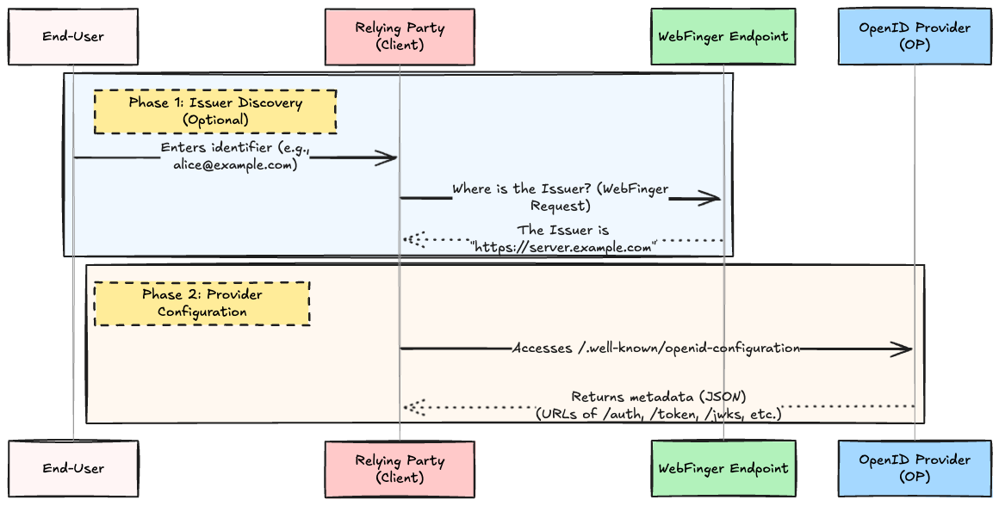

# Introduction

You probably use OIDC (OpenID Connect) every day to integrate Google Login or authentication flows into your applications. When doing so, have you ever experienced just setting `issuer: "https://accounts.google.com"` in your library initialization code, and it automatically resolves the Authorization Endpoint, Token Endpoint, and even the location of the public keys (JWKS)?

- "Why does just providing the Issuer URL reveal all the endpoints?"
- "How can it follow public key (JWKS) rotation without any downtime?"
- "In the first place, how does it identify the provider to authenticate with from an email-like ID such as `alice@example.com`?"

The answer to these questions is **OpenID Connect Discovery 1.0**.

In the past OAuth 2.0 world, it was common for developers to read the documentation and **manually configure (hardcode)** the URLs of each endpoint (such as `/authorize` and `/token`) of the Authorization Server into the client. However, this relies on client-side modifications whenever the provider changes URLs or rotates public keys, lacking in scalability.

OIDC Discovery 1.0 is a standardized **"mechanism for a client to dynamically discover and retrieve the configuration information (metadata) of an OpenID Provider (OP)"**.

In this article, based on the descriptions in the specification, we will dive deep into the mechanism of the two phases of OIDC Discovery (Issuer Discovery and Provider Configuration).

---

## 1. Overview of OIDC Discovery

OIDC Discovery is broadly divided into **two steps (phases)**.



1. **Issuer Discovery (Phase 1)**:
   This is the phase to discover "Who is the OpenID Provider (Issuer) that should authenticate this user?" based on an identifier input by the user, such as an email address. This is optional and is skipped if the Issuer is already known (e.g., when clicking the "Login with Google" button).
2. **Provider Configuration (Phase 2)**:
   This is the phase to query configuration information (metadata) to the identified Issuer, asking "Where is your Authorization Endpoint?" or "Where are your public keys (JWKS)?".

We will explain each of these in detail.

---

## 2. Phase 1: Issuer Discovery (Invocation of WebFinger)

If your app is dedicated to "Google Login", it's self-evident that the Issuer is `https://accounts.google.com`. However, what about cases like enterprise SaaS where you want to "dynamically switch the destination IdP based on the user's email domain (`@company.com`)"?

This is where a mechanism called **RFC 7033 WebFinger** is used.

### 2.1 Identifier Normalization

In the first place, the value input by the user varies from an email address format like `alice@example.com` to a URL format like `https://example.com/alice`. In OIDC Discovery, **Normalization Steps** are strictly defined to uniquely determine the Host to communicate with and the Resource to search for from the input value (User Input Identifier).

- **No Scheme**:
  - If it contains `@` like `joe@example.com` and has no path or port, it is interpreted as the **`acct:` scheme**. (e.g., `acct:joe@example.com`)
  - If it does not contain `@` like `example.com` or `example.com:8080`, it is interpreted as the **`https://` scheme**. (e.g., `https://example.com`)
- **Explicit Scheme**: If `https://`, `acct:`, etc., are explicitly entered, no special normalization is performed, and the value is adopted as is.
- **Removal of Fragment**: If there is a fragment (anything after `#`) at the end of the URL, it is always removed.

### 2.2 WebFinger Request Flow

Once normalized, the RP sends a request to the WebFinger endpoint as follows. (Consider the case where `joe@example.com` is entered and normalized to `acct:joe@example.com` as an example)

1. **Identifying the Host**: From the normalized result (`acct:joe@example.com`), extract `example.com`, which is the Authority part, as the Host.
2. **Specifying the Resource**: Use the entire normalized URI (`acct:joe@example.com`) as the `resource` parameter for WebFinger.
3. **Accessing the WebFinger Endpoint**: Perform an HTTP GET against `/.well-known/webfinger` of the extracted Host.

```http
GET /.well-known/webfinger?resource=acct%3Ajoe%40example.com&rel=http%3A%2F%2Fopenid.net%2Fspecs%2Fconnect%2F1.0%2Fissuer HTTP/1.1
Host: example.com
```

- `resource`: User identifier to be queried (URL encoded)
- `rel`: Specified as `http://openid.net/specs/connect/1.0/issuer`, conveying "I am asking for OIDC Issuer information".

### 2.3 WebFinger Response

The server of `example.com` returns the URL of the Issuer that should authenticate this user in a JSON format (JRD: JSON Resource Descriptor).

```json
HTTP/1.1 200 OK
Content-Type: application/jrd+json

{
  "subject": "acct:joe@example.com",
  "links": [
    {
      "rel": "http://openid.net/specs/connect/1.0/issuer",
      "href": "https://server.example.com"
    }
  ]
}
```

The `https://server.example.com` inside the `href` of this response will be the **URL of the Issuer (OP)** to communicate with next. This enables dynamic resolution of the communication destination from the user input.

---

## 3. Phase 2: Provider Configuration (Metadata Retrieval)

Once the Issuer's URL is known, the next step is to retrieve the "configuration information (metadata)" for interacting with that OP. This is the core feature of Discovery and is the mechanism running behind the scenes of various libraries on a daily basis.

### 3.1 Rules for .well-known/openid-configuration and Path Concatenation

In OIDC Discovery 1.0, it is mandated that the OP MUST expose the metadata in JSON format at **a path combining the Issuer's URL with `/.well-known/openid-configuration`**.

```http
GET /.well-known/openid-configuration HTTP/1.1
Host: server.example.com
```

**⚠️ Common Pitfall: When the Issuer Contains a Path**
While the `.well-known` directory is usually placed directly under the domain root in RFC 5785, OIDC Discovery has an exceptional concatenation rule for reasons such as multi-tenant support. If the Issuer contains a path like `https://example.com/tenant-1`, remove any trailing `/`, and then append `/.well-known/openid-configuration` right after it.
Therefore, the destination URL would be `https://example.com/tenant-1/.well-known/openid-configuration`. Beware of frequent implementation errors where it's mistakenly placed at the domain root instead.

### 3.2 Contents of OP Metadata (Self-Introduction Card)

The JSON (OP Metadata) returned from this endpoint comprehensively contains the features supported by the OP and the URLs of various endpoints. Let's look at the main ones.

```json
HTTP/1.1 200 OK
Content-Type: application/json

{
  "issuer": "https://server.example.com",
  "authorization_endpoint": "https://server.example.com/connect/authorize",
  "token_endpoint": "https://server.example.com/connect/token",
  "userinfo_endpoint": "https://server.example.com/connect/userinfo",
  "jwks_uri": "https://server.example.com/jwks.json",
  "response_types_supported": ["code", "id_token", "id_token token"],
  "subject_types_supported": ["public", "pairwise"],
  "id_token_signing_alg_values_supported": ["RS256", "ES256"],
  "token_endpoint_auth_methods_supported": ["client_secret_basic", "private_key_jwt"],
  "scopes_supported": ["openid", "profile", "email"],
  "claims_supported": ["sub", "iss", "name", "email"],
  "registration_endpoint": "https://server.example.com/connect/register"
}
```

Let's organize what these parameters mean. We have extracted the main ones here, but the actual specification defines even more metadata, including settings for screen display and localization.

| Parameter Name                              | Required/Optional | Description                                                                                                           |
| ------------------------------------------- | ----------------- | --------------------------------------------------------------------------------------------------------------------- |
| **`issuer`**                                | REQUIRED          | The OP's Issuer Identifier. The most important item used for TLS checks and validation of the `iss` in the ID Token.  |
| **`authorization_endpoint`**                | REQUIRED          | The authorization endpoint to redirect the user to.                                                                   |
| **`token_endpoint`**                        | REQUIRED (*)      | The endpoint to exchange the authorization code for tokens. (*Except for OPs dedicated to the Implicit Flow)          |
| **`jwks_uri`**                              | REQUIRED          | The URL where the public keys (JWK Set) for verifying the ID Token's signature are located.                           |
| **`response_types_supported`**              | REQUIRED          | The OIDC authentication flows supported by the OP (e.g., `code`, `id_token`).                                         |
| **`subject_types_supported`**               | REQUIRED          | Supported types of `sub` (identifiers). Whether it's `public` common across all RPs, or `pairwise` unique to each RP. |
| **`id_token_signing_alg_values_supported`** | REQUIRED          | The signature algorithm for the ID Token. `RS256` MUST be included.                                                   |
| **`token_endpoint_auth_methods_supported`** | OPTIONAL          | Client authentication methods at the token endpoint. (e.g., `client_secret_basic`, `private_key_jwt`)                 |
| **`scopes_supported`**                      | RECOMMENDED       | A list of scopes supported by the OP. (`openid` SHOULD be included)                                                   |
| **`claims_supported`**                      | RECOMMENDED       | A list of Claims that the OP can provide. (e.g., `name`, `email`, etc.)                                               |
| **`registration_endpoint`**                 | RECOMMENDED       | The endpoint for Dynamic Client Registration.                                                                         |

#### Especially Important: `jwks_uri`

`jwks_uri` is extremely important for security. By accessing this URL, you can retrieve the list of public keys (JWKS) currently used by the OP.
When performing key rotation, the OP issues signatures using a new key while simultaneously adding the new public key to this `jwks_uri`. By implementing a mechanism on the RP side to look at the ID of the signing key (the `kid` Header) upon verifying the ID Token, and fetching `jwks_uri` again if the corresponding key is missing from the local cache, **safe key rotation without downtime** becomes possible.

---

## 4. Security Considerations Supporting OIDC Discovery

Retrieving configurations dynamically means facing the threat of "What happens if a malicious server returns fake configurations?" (Impersonation Attacks).

The Discovery specification sets strict rules like the following.

### 4.1. Exact Match Requirement

> "The `issuer` value returned MUST be identical to the Issuer URL that was used as the prefix to `/.well-known/openid-configuration`" (OIDC Discovery §4.3)

The `issuer` value in the retrieved metadata MUST be **exactly identical (exact match)** to the base URL used when accessing it.
Also, it MUST **exactly match the `iss` Claim in the ID Token** subsequently issued by the OP (even the presence or absence of a trailing `/` is not tolerated).
This prevents one OP from pretending to be another OP and issuing ID Tokens.

### 4.2. Mandatory TLS (HTTPS)

> "Implementations MUST support TLS." (OIDC Discovery §7.1)

In both the WebFinger phase and the Provider Configuration phase, all communication MUST be done over TLS (HTTPS), and the RP MUST strictly verify the server certificate (RFC 6125). If the communication path is plaintext, a Man-In-The-Middle (MITM) could rewrite the `jwks_uri` to the attacker's server, allowing the attacker to freely issue forged ID Tokens.

---

## 5. Conclusion

The main points of OIDC Discovery 1.0 boil down to the following three points:

1. **Breaking away from hardcoding URLs**: By using `/.well-known/openid-configuration`, RPs can dynamically adapt to the OP's endpoints and supported features.
2. **Leveraging WebFinger**: It is possible to dynamically resolve the target Issuer from an identifier such as the user's email address (Phase 1).
3. **Automating Key Rotation**: By dynamically retrieving and updating public keys from `jwks_uri`, robust and seamless security operations are achieved.

Thanks to this mechanism, we developers only need to write a few lines of configuration code to transparently (and safely) handle complex OIDC protocol integrations and cryptographic key management. The next time you use an OIDC library, try to picture the request to `/.well-known/openid-configuration` running behind the scenes.

## References

- [OpenID Connect Discovery 1.0](https://openid.net/specs/openid-connect-discovery-1_0.html)
- [RFC 7033 - WebFinger](https://datatracker.ietf.org/doc/html/rfc7033)
- [RFC 5785 - Defining Well-Known Uniform Resource Identifiers (URIs)](https://datatracker.ietf.org/doc/html/rfc5785)
