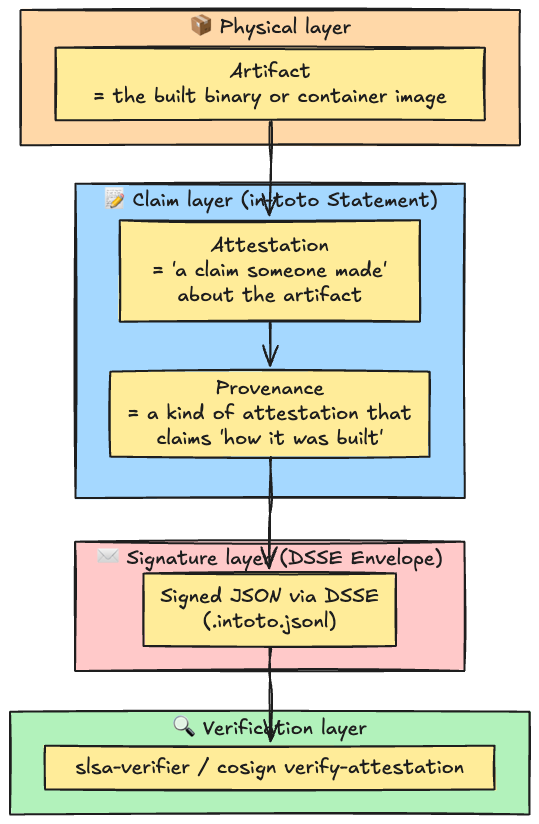
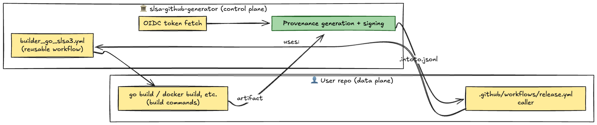
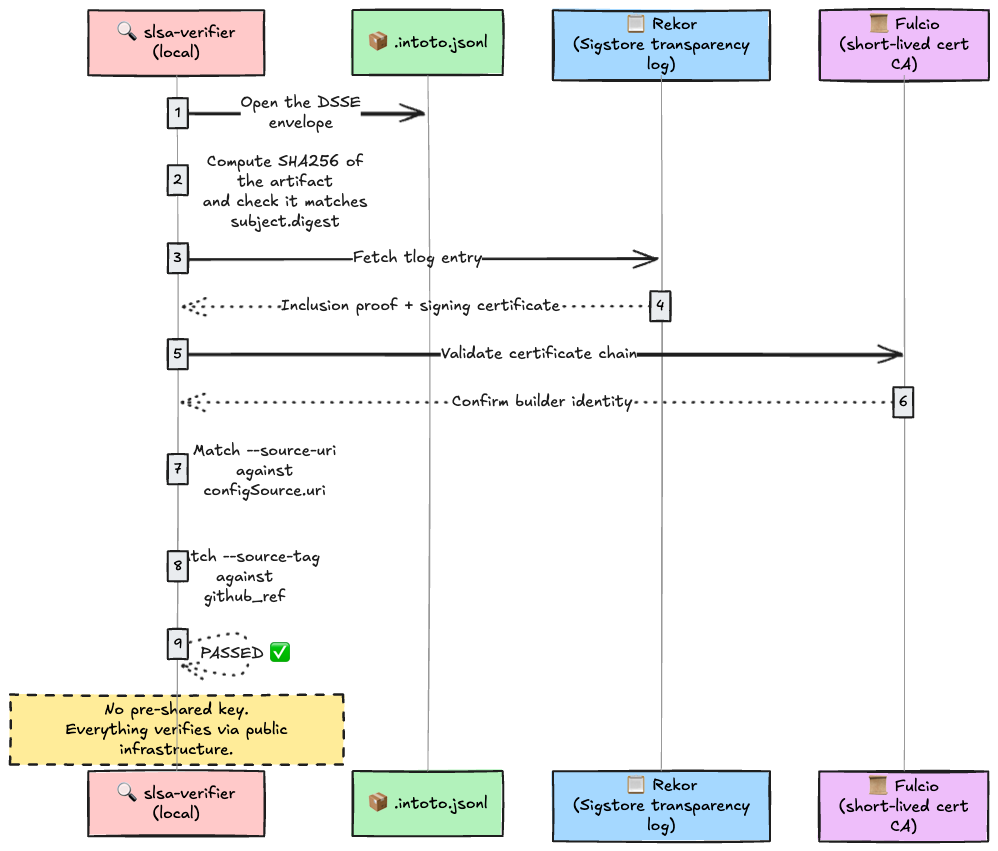
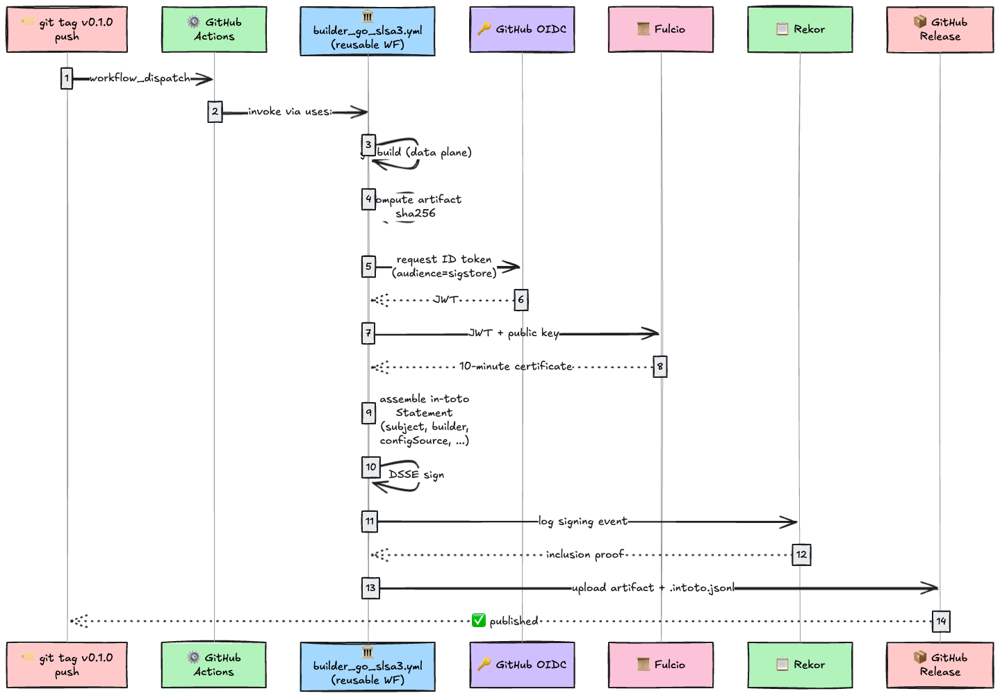
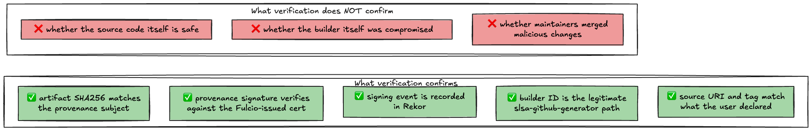
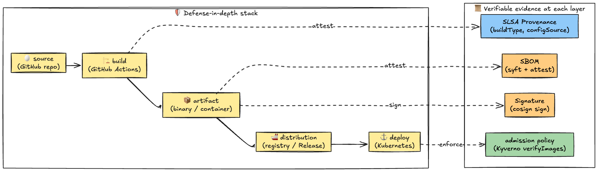

# Introduction

I wrote [Supply Chain Security: A Deep Dive into SBOM and Code Signing](https://dev.to/kanywst/supply-chain-security-a-deep-dive-into-sbom-and-code-signing-2n1l) earlier. That post pinned down "what's in it" via SBOM and "who signed it" via Cosign.

But even with both of those, there's still a hole.

SolarWinds' **SUNSPOT** was malware that lived on the build server, swapped the source code the moment a build started, and put it back when the build finished. The resulting binaries were signed with the legitimate certificate. Signatures: perfect. SBOMs: clean. And the world still got a backdoor distributed to it.

Why? Signatures only prove "I signed this with this key." SBOMs only describe "what was in the artifact at build time." **Nobody was verifying "was this really built from the right source, on an unaltered builder, following the steps it claims?"**

The thing that closes that hole is **Provenance**. SLSA (Supply-chain Levels for Software Artifacts) is a framework built around provenance, treating "from where (source), how (build), by what (builder)" as verifiable metadata.

I covered the spec in [SLSA Deep Dive](https://dev.to/kanywst/slsa-deep-dive-securing-the-supply-chain-using-verifiable-levels-klk). This is the follow-up: **actually generating SLSA L3 provenance and verifying it on real machines**.

What we're doing:

1. Verify a public `slsa-verifier` v2.7.1 release using its bundled provenance (and demonstrate tampering detection)
2. Plug `slsa-github-generator` into a Go project so that pushing a tag automatically emits SLSA L3 provenance
3. Read the JSON inside and understand exactly what is being attested

---

## Before you read on

### Provenance / Attestation / in-toto / DSSE

The terminology is slippery, so let's pin it down first.



- **in-toto Statement**: a JSON structure that says "for this subject (the artifact), I am stating this predicate (the claim)"
- **Attestation**: an in-toto Statement plus a signature. Any "signed claim about an artifact"
- **Provenance**: an attestation that specifically describes "how it was built" (`predicateType: https://slsa.dev/provenance/v1`)
- **DSSE (Dead Simple Signing Envelope)**: an envelope format for signed JSON. The payload is base64-wrapped on the inside, and the signature wraps the outside

So a SLSA Provenance is "an in-toto Statement whose predicate matches the SLSA spec, signed inside a DSSE envelope."

### SLSA Build Level cheat sheet

Just enough to keep us oriented. For the threat model, see [SLSA Deep Dive](https://dev.to/kanywst/slsa-deep-dive-securing-the-supply-chain-using-verifiable-levels-klk).

| Level | What it guarantees                             | Threats it stops                             |
| ----- | ---------------------------------------------- | -------------------------------------------- |
| L1    | Provenance exists                              | Almost nothing (essentially documentation)   |
| L2    | Provenance is signed                           | Detects tampering during distribution        |
| L3    | Generated by a tamper-resistant build platform | Stops everything short of builder compromise |

`slsa-github-generator`, the implementation we use here, is one of the few that actually clears L3. By leaning on GitHub's OIDC tokens and reusable workflows, it is structured so that user code cannot reach the builder's internal state.

### Why "reusable workflows" are the key to L3

A GitHub Actions `uses: org/repo/.github/workflows/foo.yml@vX` runs in a **separate process, separate shell, separate filesystem** from the caller. So whatever the calling repo's owner puts in their YAML, they cannot touch the signing keys or OIDC tokens that the builder workflow handles.

That structurally satisfies SLSA L3's requirement: **"separate user-defined build steps (data plane) from the provenance generation logic (control plane)."**



The user just calls in via `uses:`. They never touch the provenance assembly. That structural split is the heart of L3.

---

## 1. Verify a public artifact

Theory only goes so far. Let's verify a real provenance on your machine first. Subject of choice: the `slsa-verifier` release itself. Since `slsa-verifier` is **built with slsa-github-generator**, every release ships with `.intoto.jsonl` alongside the binary.

### Required tools

```bash
# macOS
brew install slsa-verifier jq

# version check
slsa-verifier version
# slsa-verifier: Verify SLSA provenance for Github Actions
# GitVersion:    2.7.1
# GitCommit:     Homebrew
# GitTreeState:  clean
# BuildDate:     2025-06-25T21:09:44Z
# GoVersion:     go1.25.5
# Compiler:      gc
# Platform:      darwin/arm64
```

### Step 1: Download the artifact and its provenance

A one-shot script that runs everything in this section lives at [`hello-slsa/verify-real-artifact/run.sh`](https://github.com/0-draft/hello-slsa/blob/main/verify-real-artifact/run.sh). If you just want to see the flow, clone the repo and run `./run.sh`.

```bash
mkdir slsa-hands-on && cd slsa-hands-on

# the artifact itself
curl -sLO https://github.com/slsa-framework/slsa-verifier/releases/download/v2.7.1/slsa-verifier-darwin-arm64

# its provenance (in-toto Statement, wrapped in a DSSE envelope)
curl -sLO https://github.com/slsa-framework/slsa-verifier/releases/download/v2.7.1/slsa-verifier-darwin-arm64.intoto.jsonl

ls -la
# -rw-r--r-- 1 user staff   32M slsa-verifier-darwin-arm64
# -rw-r--r-- 1 user staff  17K slsa-verifier-darwin-arm64.intoto.jsonl
```

### Step 2: Verification command

```bash
slsa-verifier verify-artifact slsa-verifier-darwin-arm64 \
  --provenance-path slsa-verifier-darwin-arm64.intoto.jsonl \
  --source-uri github.com/slsa-framework/slsa-verifier \
  --source-tag v2.7.1
```

Output:

```text
Verified signature against tlog entry index 253498016 at URL: https://rekor.sigstore.dev/api/v1/log/entries/108e9186e8c5677a2ae86cf78d97874465b3150b3a30474f101c0ca4f916e78cd89ab8dcf6f2c927
Verified build using builder "https://github.com/slsa-framework/slsa-github-generator/.github/workflows/builder_go_slsa3.yml@refs/tags/v2.0.0" at commit ea584f4502babc6f60d9bc799dbbb13c1caa9ee6
Verifying artifact slsa-verifier-darwin-arm64: PASSED

PASSED: SLSA verification passed
```

Let's unpack what just happened.



Two things to notice.

1. **No keys on your machine.** The verifier reaches Rekor (transparency log) and Fulcio (CA) to validate the certificate chain that was used at signing time. Same mechanism as Cosign keyless signing.
2. **`--source-uri` and `--source-tag` are inputs you provide.** "I want to trust this binary as coming from this repo at this tag" is a human-driven assertion, and it gets checked against what the provenance actually says.

To see what happens when the assertion is wrong, point `--source-tag` at a different tag.

```bash
slsa-verifier verify-artifact slsa-verifier-darwin-arm64 \
  --provenance-path slsa-verifier-darwin-arm64.intoto.jsonl \
  --source-uri github.com/slsa-framework/slsa-verifier \
  --source-tag v2.7.0      # ← wrong tag

# FAILED: SLSA verification failed:
#   expected tag 'v2.7.0', got 'v2.7.1':
#   tag used to generate the binary does not match provenance
```

### Step 3: Detect tampering

Mutate the artifact by a single byte and try again.

```bash
echo "broken" >> slsa-verifier-darwin-arm64

slsa-verifier verify-artifact slsa-verifier-darwin-arm64 \
  --provenance-path slsa-verifier-darwin-arm64.intoto.jsonl \
  --source-uri github.com/slsa-framework/slsa-verifier \
  --source-tag v2.7.1

# FAILED: SLSA verification failed:
#   expected hash '424efd44128c51af49affd87bd3f0476eaab0a3e77ed1fee0ca7186c569b5388' not found:
#   artifact hash does not match provenance subject
```

The hash mismatch fails immediately. SUNSPOT-style attacks ("swap the binary after the build finishes") die right here.

### Step 4: Look inside the provenance

`.intoto.jsonl` is a DSSE envelope; the payload is base64-encoded JSON. Pry it open with `jq`.

```bash
cat slsa-verifier-darwin-arm64.intoto.jsonl \
  | jq -r '.payload' \
  | base64 -d \
  | jq '{_type, predicateType, subject, predicate: {builder: .predicate.builder, buildType: .predicate.buildType, configSource: .predicate.invocation.configSource}}'
```

Trimmed output:

```json
{
  "_type": "https://in-toto.io/Statement/v0.1",
  "predicateType": "https://slsa.dev/provenance/v0.2",
  "subject": [
    {
      "name": "slsa-verifier-darwin-arm64",
      "digest": {
        "sha256": "39abfcf5f1d690c3e889ce3d2d6a8b87711424d83368511868d414e8f8bcb05c"
      }
    }
  ],
  "predicate": {
    "builder": {
      "id": "https://github.com/slsa-framework/slsa-github-generator/.github/workflows/builder_go_slsa3.yml@refs/tags/v2.0.0"
    },
    "buildType": "https://github.com/slsa-framework/slsa-github-generator/go@v1",
    "configSource": {
      "uri": "git+https://github.com/slsa-framework/slsa-verifier@refs/tags/v2.7.1",
      "digest": {
        "sha1": "ea584f4502babc6f60d9bc799dbbb13c1caa9ee6"
      },
      "entryPoint": ".github/workflows/release.yml"
    }
  }
}
```

What each field means:

- **`subject`**: "this provenance is making a statement about this binary." If the `name` and SHA256 don't match the artifact, verification fails.
- **`predicate.builder.id`**: who built it (which reusable workflow). The tag is included, so the builder version itself is pinned.
- **`predicate.buildType`**: build kind (Go binary, container, etc.).
- **`predicate.invocation.configSource`**: source repo plus the GitHub Actions workflow file that drove the build. `digest.sha1` pins the commit, so even an attack that rewrites the contents of the v2.7.1 tag after the fact does not slip through.

The `environment` block has an even finer fingerprint of where the build ran.

```bash
cat slsa-verifier-darwin-arm64.intoto.jsonl | jq -r '.payload' | base64 -d \
  | jq '.predicate.invocation.environment | {github_event_name, github_ref, github_repository_owner, github_run_id, github_sha1, os}'
```

```json
{
  "github_event_name": "push",
  "github_ref": "refs/tags/v2.7.1",
  "github_repository_owner": "slsa-framework",
  "github_run_id": "15930257685",
  "github_sha1": "ea584f4502babc6f60d9bc799dbbb13c1caa9ee6",
  "os": "ubuntu24"
}
```

- which GitHub event (`push`) fired the workflow
- which repo, owned by whom
- which GitHub Actions run id (this number is permanent)
- which OS image it ran on

With this much retained, "did a binary born from tag v2.7.1 actually come out of a GitHub-hosted runner running the legitimate workflow?" is fully reconstructable after the fact.

### Step 5: Look at `materials`

`materials` is "the list of build inputs": source code and the builder environment, side by side.

```bash
cat slsa-verifier-darwin-arm64.intoto.jsonl | jq -r '.payload' | base64 -d \
  | jq '.predicate.materials'
```

```json
[
  {
    "uri": "git+https://github.com/slsa-framework/slsa-verifier@refs/tags/v2.7.1",
    "digest": { "sha1": "ea584f4502babc6f60d9bc799dbbb13c1caa9ee6" }
  },
  {
    "uri": "https://github.com/actions/virtual-environments/releases/tag/ubuntu24/20250622.1.0"
  }
]
```

Combine this with the SBOM and the chain "source → builder → artifact → internal components" becomes verifiable end to end.

---

## 2. Issue SLSA L3 Provenance from your own repo

Verification works. Now flip to the producer side: build a Go hello-world and bolt `slsa-github-generator` onto it.

The finished version lives at [`github.com/0-draft/hello-slsa`](https://github.com/0-draft/hello-slsa). Type along by hand or `git clone`, whichever you prefer.

### Project layout

```text
hello-slsa/
├── main.go
├── go.mod
├── .slsa-goreleaser.yml          # builder configuration
└── .github/
    └── workflows/
        └── release.yml            # release on tag push
```

### Minimal code

`main.go`:

```go
package main

import (
    "fmt"
    "runtime"
)

const Version = "0.1.0"

func main() {
    fmt.Printf("hello-slsa %s (%s/%s)\n", Version, runtime.GOOS, runtime.GOARCH)
}
```

`go.mod`:

```text
module github.com/0-draft/hello-slsa

go 1.26
```

### `.slsa-goreleaser.yml`: the builder's configuration

The slsa-github-generator Go builder reads a `goreleaser`-compatible YAML. Nothing fancy.

```yaml
version: 1

env:
  - GO111MODULE=on
  - CGO_ENABLED=0

flags:
  - -trimpath

ldflags:
  - "-X main.Version={{ .Env.VERSION }}"
  - "-s -w"

goos: linux
goarch: amd64

binary: hello-slsa-{{ .Os }}-{{ .Arch }}
```

`-trimpath` and `CGO_ENABLED=0` are reproducibility incantations. The next post on Reproducible Builds digs into why these matter.

> [!IMPORTANT]
> Variable references like `{{ .Env.VERSION }}` only see env vars that the calling workflow explicitly injected via `evaluated-envs:`. The slsa-builder-go binary does not pass through the runner's environment (for reproducibility), so writing `{{ .Env.GITHUB_REF_NAME }}` will fail with `variable name empty`. That's why the next section sets `evaluated-envs: "VERSION:${{ github.ref_name }}"` to feed it in.

### `.github/workflows/release.yml`: the caller

This is the heart of it. `uses:` calls the slsa-github-generator reusable workflow.

```yaml
name: Release with SLSA L3 Provenance

on:
  push:
    tags:
      - "v*"

permissions: read-all

jobs:
  build:
    permissions:
      id-token: write    # required to mint OIDC tokens
      contents: write    # required to upload assets to the GitHub Release
      actions: read      # required to read workflow run metadata
    uses: slsa-framework/slsa-github-generator/.github/workflows/builder_go_slsa3.yml@v2.1.0
    with:
      go-version: "1.26"
      config-file: .slsa-goreleaser.yml
      evaluated-envs: "VERSION:${{ github.ref_name }}"
      upload-assets: true

  verify:
    needs: build
    runs-on: ubuntu-latest
    steps:
      - uses: slsa-framework/slsa-verifier/actions/installer@v2.7.1
      - uses: actions/download-artifact@v8
        with:
          name: ${{ needs.build.outputs.go-binary-name }}
      - uses: actions/download-artifact@v8
        with:
          name: ${{ needs.build.outputs.go-provenance-name }}
      - run: |
          slsa-verifier verify-artifact \
            "${{ needs.build.outputs.go-binary-name }}" \
            --provenance-path "${{ needs.build.outputs.go-provenance-name }}" \
            --source-uri "github.com/${{ github.repository }}" \
            --source-tag "${{ github.ref_name }}"
```

About the permissions:

- **`id-token: write`**: lets GitHub mint an OIDC ID token. That token is exchanged at Fulcio for a short-lived certificate, which signs the provenance.
- **`contents: write`**: needed when `upload-assets: true` to upload Release assets.
- **`actions: read`**: needed to read the workflow's own metadata (run id, sha, ref).

What happens when this fires:



The `build` job only compiles the user's code; it never participates in assembling or signing the provenance. Because `builder_go_slsa3.yml` runs as a **separate workflow**, no matter how dirty your user code is, it cannot reach the signing key. That's the L3 separation.

### Local check

Before pushing the tag, run the build locally to see it work.

```bash
git clone https://github.com/0-draft/hello-slsa
cd hello-slsa

go build -trimpath -ldflags "-s -w" -o hello-slsa .
./hello-slsa
# hello-slsa 0.1.0 (darwin/arm64)

shasum -a 256 hello-slsa
# 3258c85472175bdbfe0ef450402265ca118ed0c97a1ab4e8b96b5704e2f9a1d6  hello-slsa
```

When the same build runs in CI, that SHA256 is what ends up in `subject.digest.sha256` of the provenance, and `.intoto.jsonl` is uploaded alongside the binary. The hash will differ across environments and toolchains; the point is that the value you computed locally matches the value in the provenance subject.

> [!NOTE]
> `id-token: write` requires OIDC to be enabled on the repo. On github.com it is on by default. On GitHub Enterprise Server you have to configure it separately.

---

## 3. What can the verifier actually trust?

Provenance flows out the producer side. Back on the consumer side, what does `slsa-verifier verify-artifact` actually confirm?



**What it can do**: cryptographically prove "the binary at tag v2.7.1 really did come out of the legitimate GitHub Actions builder." SUNSPOT-style attacks (tampering during the build) and Codecov-style attacks (uploading without going through the build) stop here.

**What it cannot do**: if the source itself contains malicious changes, the provenance faithfully signs "we correctly took this malicious code as input." That needs a different layer: SLSA Source Track, four-eyes review, and so on.

In other words, provenance is the layer that detects build-path tampering but cannot detect human malice. Combine it with SBOM (transparency about contents) and Cosign (identity of the author), and only then do you get layered defense.

---

## 4. Layering SBOM + Cosign + Provenance

Final picture: lay all three side by side.

| What it proves         | Tool                  | predicateType                           |
| ---------------------- | --------------------- | --------------------------------------- |
| Ingredients (contents) | Syft + cosign attest  | `https://cyclonedx.org/bom`             |
| Identity (author)      | cosign sign           | (the signature itself, not a Statement) |
| Build path             | slsa-github-generator | `https://slsa.dev/provenance/v1`        |



Once "build path + contents + author" are all in place, the artifact has all-around evidence. If the Kubernetes admission layer can enforce `reject unless provenance, SBOM, and signature are all present`, the operator's trust boundary firms up considerably.

---

## Wrap-up

| What we did                                         | What we learned                                   |
| --------------------------------------------------- | ------------------------------------------------- |
| Verified a public artifact with `slsa-verifier`     | How to verify provenance without holding any keys |
| Mutated a single byte and watched verification fail | The point at which SUNSPOT-style attacks die      |
| Opened `.intoto.jsonl` with `jq`                    | What is actually recorded inside the provenance   |
| Wrote a `slsa-github-generator` workflow            | The "way to call in" that satisfies L3            |

Provenance, unlike SBOM or Cosign, isn't something you can produce locally with a one-shot CLI. **The builder itself has to be running in a place you trust**, which is why something like a GitHub Actions reusable workflow (with its structural separation) is non-negotiable. The flip side: if you have that environment, a single line of `uses:` carries you all the way to L3.

The next post moves to the operational headache that always shows up once SBOMs hit production: **"the vulnerability scanner threw 800 warnings, but only 5 are actually exploitable."** We pin that down with VEX. Where provenance is "authenticity of the build path", VEX is "authenticity of vulnerability triage."

## References

- [0-draft/hello-slsa](https://github.com/0-draft/hello-slsa) (the hands-on repo for this article)
- [slsa-framework/slsa-github-generator](https://github.com/slsa-framework/slsa-github-generator)
- [slsa-framework/slsa-verifier](https://github.com/slsa-framework/slsa-verifier)
- [SLSA v1.0 Provenance spec](https://slsa.dev/spec/v1.0/provenance)
- [in-toto Attestation Framework](https://github.com/in-toto/attestation)
- [DSSE (Dead Simple Signing Envelope)](https://github.com/secure-systems-lab/dsse)
