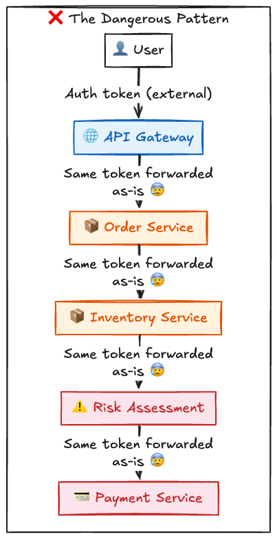
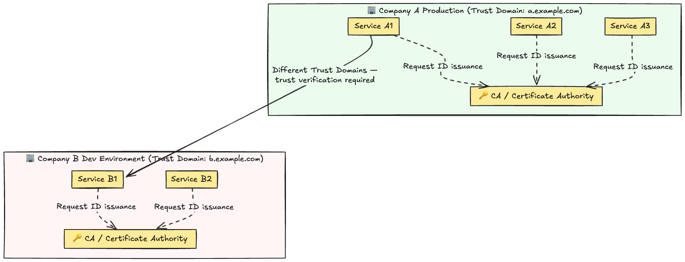
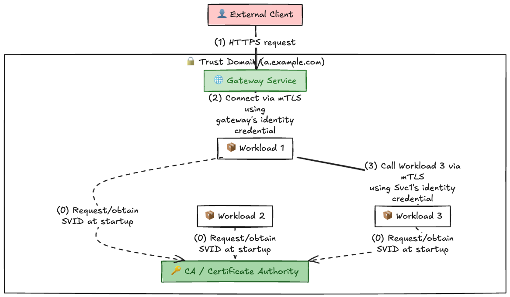
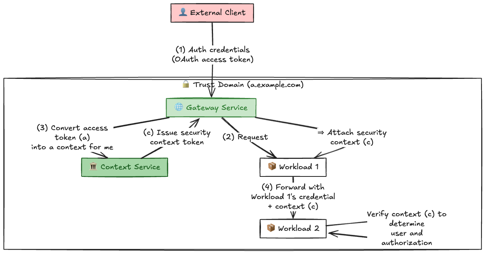
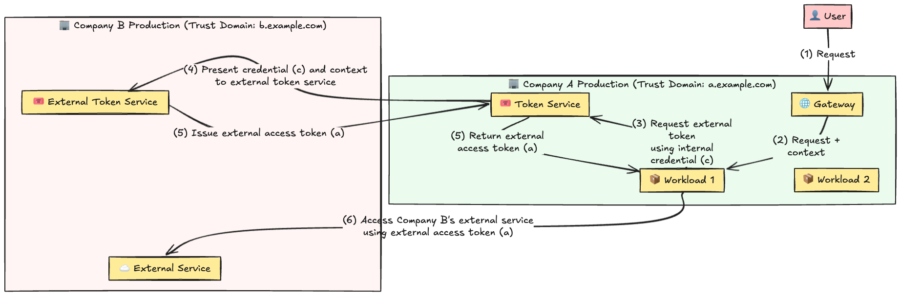
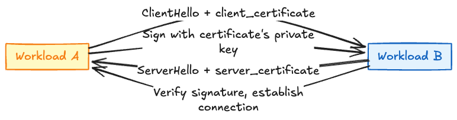

# Introduction

Modern systems are wild. A user clicks a single button, and behind the scenes, ten or twenty independent workloads — microservices, containers, functions — fire off in sequence.

Take an e-commerce site. When someone hits "Place Order," here's what actually happens:

1. The API gateway picks up the incoming request
2. The order service calls the inventory service to check stock
3. The inventory service hits the financial system for a risk assessment before payment
4. Once risk assessment clears, the payment service kicks in
5. After payment goes through, the notification service fires off a confirmation email

Now here's the real question.

**"What happens if you keep passing the user's original auth credentials through this entire request chain?"**



The problems stack up fast:

- **An external token is flowing across the entire internal network**: If that token gets stolen, every internal service is exposed
- **You lose track of who actually initiated the request**: Intermediate services can't tell whether a request genuinely came from a user or if someone is hitting them directly
- **Any service can impersonate another**: If the internal network gets compromised, a malicious workload can pretend to be a legitimate request and call other services
- **Token theft has a blast radius**: If the external token leaks, it opens up unauthorized access to external resources too

This is exactly the kind of "inter-workload authentication" problem that the IETF is tackling with **WIMSE (Workload Identity in Multi System Environments)**.

---

## What Is WIMSE?

In one sentence:

> **WIMSE is a standardized architecture for how workloads — microservices, containers, and the like — authenticate each other and propagate security context.**

It's defined in IETF Internet-Draft `draft-ietf-wimse-arch-07` (March 2026 edition). The authors are security engineers from CyberArk, Zscaler, and Hochschule Bonn-Rhein-Sieg.

What WIMSE is trying to standardize:

- **How workloads authenticate each other**: X.509 certificates? JWTs? What format?
- **How security context gets propagated**: How do you pass user info, authorization info, and audit data to downstream services?
- **Cross-domain communication**: When you need to talk to another organization's systems, how do you verify a workload is trustworthy?

Basically, it's an effort to take the scattered, bespoke implementations across different companies and projects, and unify them under one standard.

---

## Three Core Concepts of WIMSE

The WIMSE architecture is built on three pillars.

### 1. Trust Domain

**A trust domain is a group of systems that share common security policies and controls.**

Think of it as "all the workloads within a given organization's environment." For example:

- All microservices in Company A's production environment = one Trust Domain
- All containers in Company B's dev environment = a different Trust Domain



Trust Domains are typically **identified by a fully qualified domain name (FQDN)** — like `a.example.com` or `prod-us-west.mycompany.com`. This makes them globally unique.

### 2. Workload Identifier

**A workload identifier is an ID that uniquely identifies a single workload within a Trust Domain.**

It takes the form of a URI and includes the Trust Domain. For example:

```text
spiffe://a.example.com/paymentService
spiffe://a.example.com/orderService/v2
spiffe://prod-us-west.mycompany.com/ml-training-job-001
```

These often follow SPIFFE (Secure Production Identity Framework for Everyone), a spec that already has widespread adoption.

Key points:

- The same identifier value issued under **different Trust Domains is a completely different workload**
- An identifier can refer to a "logical workload" or a "specific workload instance" (like this particular container boot)
- Identifiers **must remain stable throughout the workload's lifetime**

### 3. Workload Identity Credentials

**Workload identity credentials are what a workload uses to prove "I am who I say I am."**

There are two main formats:

#### X.509 Certificate

```text
-----BEGIN CERTIFICATE-----
MIIDpzCCApugAwIBAgIBATANBgkqhkiG9w0BAQsFADAz...
...
-----END CERTIFICATE-----
```

The same certificate format used in TLS. **When you're doing Mutual TLS (mTLS), this is what gets used.** The client-side workload presents its certificate, and the server-side verifies it.

Strengths:

- Already supported by a huge number of systems
- Authentication completes at the TLS layer
- Strong cryptographic binding to the key

#### JWT / Workload Identity Token

Here's what a JWT SVID (Workload Identity Token) payload looks like — similar to what gets issued by something like SPIRE:

```json
{
  "iss": "https://a.example.com",
  "sub": "spiffe://a.example.com/orderService",
  "exp": 1710432000,
  "iat": 1710428400,
  "aud": "spiffe://a.example.com/paymentService"
}
```

This is an application-layer token. It usually travels in HTTP headers:

```http
Authorization: Bearer eyJhbGc...
```

Strengths:

- Easy to integrate when HTTP is your baseline
- You can pack arbitrary attributes into the token
- Great fit for microservices and API gateways

---

## Important: These Are Not Bearer Tokens

WIMSE authentication tokens are **not bearer tokens**. A bearer token means "whoever holds this token can use it." WIMSE tokens are different — **you need to prove you possess the private key that corresponds to the token's public component**.

With mTLS, for instance, the private key is used to create a signature during the TLS handshake. With JWTs, the WIMSE Workload Proof Token (WPT) mechanism has the workload sign the request message with its private key, proving possession.

In other words:

```text
Stolen token ≠ attacker can use it immediately

Private key is also required → proof of key possession is mandatory
```

This is one of WIMSE's real strengths.

---

## WIMSE Scenarios: How It Works in Practice

Let's look at how WIMSE actually functions in a real microservice environment across a few scenarios.

### Scenario 1: Basic Workload Identity System



Here's what's happening at each step:

**(1) Distributing workload identity credentials**

When a workload boots up, it first obtains its identity credential from the **CA / Certificate Authority**. This isn't a one-time thing — credentials get automatically renewed before they expire (auto rotation).

Short-lived credentials (say, valid for one hour) are used deliberately. If one gets stolen, the damage window is tiny.

**(2) Request from the external client**

A standard HTTPS request arrives from a user or application. The gateway handles it with normal Server Transport Authentication (STA).

**(3) Gateway to workload**

When the gateway forwards the request to Workload 1, it uses **mTLS (Mutual TLS)**. The gateway presents its own identity credential to prove "I'm the gateway," and Workload 1 verifies the gateway in return.

**(4) Workload-to-workload communication**

Workload 1 needs something from Workload 3, so it makes a call. Again, Workload 1 uses its own identity credential to connect. Workload 3 verifies that credential — confirms "this is coming from Workload 1" — and only then processes the request.

---

### Scenario 2: Security Context Propagation

So far we've only looked at **authentication** — workloads confirming each other's identities. But in the real world, you also need to pass along:

- **User info**: "Who originally made this request?"
- **Authorization info**: "What is this user allowed to do?"
- **Audit info**: "When did what happen?"

This is called **security context**.



The important bits:

- **External token (a) stops at the gateway**: It never enters the internal network
- **An internal context (c) is created instead**: A short-lived internal token containing user info and other details
- **Each workload checks (c)**: They use it to determine what the user is allowed to do

A common pattern here is for the gateway to receive an OAuth 2.0 access token and convert it into an internal **Transaction Token**. I want to do a separate deep dive on Transaction Tokens, but the gist is: think of it as "cryptographic proof of authorization context for this request chain."

---

### Scenario 3: Cross-Domain Communication

Scenarios 1 and 2 were both within a single Trust Domain. But in practice, you often need to talk to systems in different organizations or environments. How does that work?



Walking through the flow:

**(1)-(2) Normal flow within Company A**

A user request arrives, the gateway forwards it to Workload 1, passing along the context.

**(3) Workload 1 needs to reach an external service**

Workload 1 decides it needs to access Company B's service. But Company A's internal credentials won't cut it — it needs **a token in a format Company B trusts**.

So it asks Company A's token service for an externally-facing token, presenting **its own identity credential (c)**. This lets the token service verify that Workload 1 is actually Workload 1.

**(4)-(5) Cross-domain handshake**

The token service, armed with Company A's auth info, **reaches out to Company B's external token service**: "Company A's Workload 1 wants to access your external service."

Company B's token service evaluates whether Company A's Workload 1 can be trusted, based on policy. If it checks out, it issues an external access token (a) that Workload 1 can use within Company B.

**(6) Accessing the external service**

Workload 1 uses the token from Company B to access Company B's service. From Company B's service perspective: "This token is in a format we trust — access granted."

**Key takeaways**:

- Company A's workload credential (c) never reaches Company B
- Instead, it gets **converted into a token (a) that Company B understands**
- Workload 1's identity is preserved while being safely propagated across domains

> [!TIP]
> **Fun fact: Egress Identity Generalization**
> When crossing trust boundaries, exposing granular instance-level IDs (like `spiffe://a.example.com/order-service/pod-123`) to the outside would leak internal scaling and deployment details to potential attackers. That's why the token service (or gateway) is recommended to generalize the ID to something like `spiffe://a.example.com/order-service` before sending it externally. This technique is also recommended in the RFC (`draft-07`, section `3.3.8.1`).

---

## WIMSE Implementation Formats

The WIMSE architecture defines *what* authentication should look like, but **there are multiple ways to actually implement it**.

### Authentication Method 1: mTLS (Transport Layer)

Both sides present certificates during the TLS handshake.



Strengths:

- Everything stays in the TLS layer
- Wide existing support across systems

Weaknesses:

- If an intermediate proxy or load balancer terminates the TLS session, you lose the end-to-end guarantee
- Can get complicated in serverless or multi-tenant environments

### Authentication Method 2: HTTP Signatures (Application Layer)

Sign the HTTP request itself. Defined in RFC 9421.

```http
POST /api/order HTTP/1.1
Host: paymentservice.a.example.com
Content-Digest: sha-256=:...
Signature: sig1=:...:
Signature-Input: sig1=(...; created=1710428400; keyid="spiffe://a.example.com/orderService"; alg="rsa-pss-sha512")

{"order_id": 12345}
```

The signature covers:

- HTTP method (POST)
- Path (/api/order)
- Headers
- Hash of the body

Strengths:

- Signatures survive proxy hops
- Guarantees message integrity

Weaknesses:

- Higher computational cost
- More complex to implement than mTLS

### Authentication Method 3: WIMSE Workload Proof Token (WPT)

A JWT-based mechanism that signs specific request information with a private key.

```json
{
  "alg": "RS256",
  "typ": "WPT",
  "kid": "key-id-123"
}
{
  "iss": "spiffe://a.example.com",
  "sub": "spiffe://a.example.com/orderService",
  "aud": "spiffe://a.example.com/paymentService",
  "iat": 1710428400,
  "exp": 1710428700,
  "cnf": {
    "txn": "base64(hash(request_context))"
  }
}
```

The `txn` (transaction) claim contains a hash of the request's context info. This lets the receiver confirm the token was actually created for this specific request.

Sent via HTTP header:

```http
Workload-Proof-Token: eyJhbGc...
```

---

## Use Cases: Problems WIMSE Actually Solves

Let's get concrete about what WIMSE fixes in the real world.

### Use Case 1: Credential Distribution at Workload Startup

A new container just spun up. It needs to know who it is.

**Without WIMSE:**

- Developers manually stick secret keys in config files
- Keys are long-lived (months, years)
- Risk of keys getting baked into the container image

**With WIMSE:**

- At startup, the container uses proof like a Kubernetes Projected Service Account Token
- Requests an identity credential from the CA
- Gets a short-lived certificate (minutes to hours) distributed automatically
- Auto-renews before expiry

### Use Case 2: Service Authentication

When Workload A calls Workload B, B wants to confirm "is this really Workload A?"

**Without WIMSE:**

- Workload A's secret key lives in Workload B's config file
- If multiple workloads are calling in, B needs to hold every single one of their secrets
- Management becomes a nightmare

**With WIMSE:**

- Workload A presents its short-lived identity credential
- Workload B verifies it against the Trust Domain's CA
- Policy check determines if the call is trusted

### Use Case 3: Rich Audit Logging

When something goes wrong, you want complete traceability: "Which workload did what, from where?"

**Without WIMSE:**

- Logs show *something* happened, but you can't verify whether a request was actually legitimate
- Hard to distinguish between stolen-credential abuse and genuine access

**With WIMSE:**

- Every request carries "from which workload, to which workload" information
- Full traceability of workload-to-workload communication
- By following the security context propagation, you can trace exactly how far a user's request traveled

### Use Case 4: Delegation and Impersonation

User A sends a request. Workload 1 processes it and needs to ask other workloads to "do something on behalf of User A."

**Without WIMSE:**

- Pass User A's token from Workload 1 to other workloads
- Other workloads process it as "User A's token"
- **But you can't trace who actually initiated the request — was it Workload 1 or something else?**

**With WIMSE:**

- The security context carries a history: "original user is A, currently being processed by Workloads 1 and 2"
- Audit logs give you the full picture: "Under User A's authority, across the Workload 1 → Workload 2 chain, here's exactly what happened"

### Use Case 5: AI Agent-to-Agent Communication

This one was newly added in the latest spec (`draft-ietf-wimse-arch-07`), and it's squarely aimed at the current trend.

Autonomous AI agents are increasingly calling various workloads on behalf of users, and **AI agents are delegating tasks to other AI agents, forming processing chains**.

**How WIMSE handles it:**

- AI agents are treated as a special case of "delegated workloads"
- "Which AI agent, acting under which user's authority, is permitted to do what" gets cryptographically bound into tokens with scoped permissions
- This prevents the "privilege escalation" scenario where AI-to-AI communication chains accidentally accumulate massive permissions — WIMSE's framework shuts that down completely

---

## Security Considerations

WIMSE is powerful, but a sloppy implementation will create vulnerabilities instead of eliminating them. Here are the critical things to get right.

### 1. Traffic Interception

Without TLS, workload identity credentials flowing across the network can be intercepted.

**Mitigations:**

- **Always use TLS**: Even for workload-to-workload communication within a Trust Domain, TLS is non-negotiable
- mTLS is even better: Both sides verify each other
- Use short-lived tokens: Even if stolen, the usable window is tiny

### 2. Information Disclosure

If security context or identity credentials contain sensitive information, unauthorized workloads could access it.

**Mitigations:**

- Include only the minimum necessary information
- Use reference pointers for sensitive data — don't send the actual data
- Never output identity credentials in logs or error responses

### 3. Credential Theft

Even short-lived credentials can be weaponized if stolen.

**Mitigations:**

- Protect private keys with Hardware Security Modules (HSMs) or TPMs
- Isolate workloads from their private keys (separate memory pages, processes, etc.)
- Keep lifetimes ultra-short (minutes)

### 4. Workload Compromise

If malicious code compromises a workload, its identity credential could be abused.

**Mitigations:**

- **Ensure only legitimate workloads can obtain identities** (Attestation)
- Detect tampering in workloads
- Policy-based access control: Fine-grained restrictions like "this workload can only call this API"

---

## Wrapping Up

WIMSE is a standardized architecture for tackling workload authentication in the microservice era, head-on.

**The key points:**

1. **Trust Domain**: A group of workloads sharing common security policies. Identified by FQDN.

2. **Workload Identifier**: A URI that uniquely identifies a single workload within a Trust Domain. Usually follows the SPIFFE ID format.

3. **Workload Identity Credentials**: The auth material a workload uses to prove its identity. Either X.509 certificates or JWT tokens. Cryptographic binding to a private key is mandatory.

4. **Short-lived with auto-renewal**: Credentials live for minutes to hours and get automatically rotated before they expire.

5. **Security context propagation**: User and authorization info gets converted from external formats (OAuth tokens) into internal formats (Transaction Tokens, etc.) and flows through each workload.

6. **Cross-domain support**: Even when communicating with systems in different organizations or environments, tokens get converted into trusted formats for safe interoperability.

The WIMSE spec is still an IETF Internet-Draft, but implementations (SPIFFE, Kubernetes, Istio, and others) are already well underway, with adoption across many cloud-native projects.

With microservice architectures being the default now, **how you design workload-to-workload authentication** is a strategic decision. Understanding WIMSE gives you a clearer picture of how to build microservice systems that are both secure and actually operable.

---

## References

- [IETF Internet-Draft: WIMSE Architecture (draft-ietf-wimse-arch-07)](https://datatracker.ietf.org/doc/html/draft-ietf-wimse-arch-07)
- [SPIFFE Project](https://spiffe.io/)
- [SPIFFE ID Format Specification](https://github.com/spiffe/spiffe/blob/main/standards/SPIFFE-ID.md)
- [Kubernetes Workload Identity](https://kubernetes.io/docs/tasks/configure-pod-container/configure-service-account/)
- [Istio Mutual TLS](https://istio.io/latest/docs/concepts/security/#mutual-tls)
- [RFC 9421: HTTP Message Signatures](https://datatracker.ietf.org/doc/rfc9421/)
